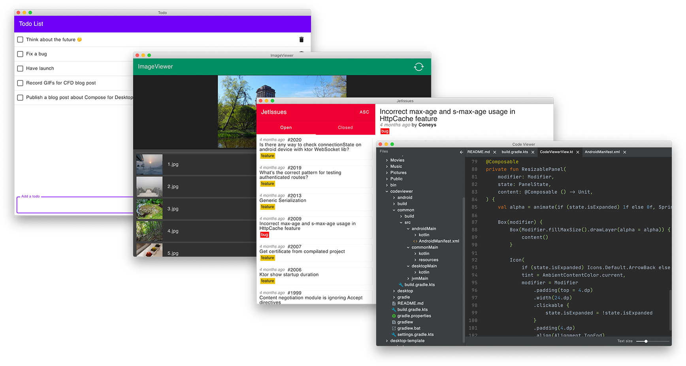

<a href="https://jb.gg/cmp">
    <picture>
        <source srcset="artwork/compose-logo-name-white.svg"  width="400" media="(prefers-color-scheme: dark)">
        
    </picture>
</a>

[Compose Multiplatform](https://jb.gg/cmp) is a declarative framework for sharing UI code across multiple platforms with Kotlin. 
It is based on [Jetpack Compose](https://developer.android.com/jetpack/compose) and developed by [JetBrains](https://www.jetbrains.com/) and open-source contributors.

You can choose the platforms across which to share your UI code using Compose Multiplatform:

* [iOS](https://jb.gg/start-cmp)
* [Android](https://jb.gg/start-cmp) 
* [Desktop](https://jb.gg/start-cmp) (Windows, MacOS, and Linux)
* [Web](https://jb.gg/start-cmp) (Beta)

For example, you can share UIs between iOS and Android or Windows and MacOS.

## iOS

Compose Multiplatform shares most of its API with Jetpack Compose, the Android UI framework developed by Google. 
You can use the same APIs to build user interfaces for both Android and iOS.

Since Compose is built on top of [Kotlin Multiplatform](https://jb.gg/kmp), 
you can easily access native APIs, such as the [Camera API](https://developer.apple.com/documentation/avfoundation/capture_setup/avcam_building_a_camera_app), 
and embed complex native UI views, such as [MKMapView](https://developer.apple.com/documentation/mapkit/mkmapview).

**[Get started with Compose Multiplatform](https://jb.gg/start-cmp)**

## Android

When Android is one of your targets, you get the same experience for Android as if you were developing an Android app 
using [Jetpack Compose](https://developer.android.com/jetpack/compose).

**[Get started with Compose Multiplatform](https://jb.gg/start-cmp)**

## Desktop

Compose Multiplatform targets the JVM and supports high-performance hardware-accelerated UI rendering on all major desktop
platforms – macOS, Windows, and Linux.

It has desktop extensions for menus, keyboard shortcuts, window manipulation, and notification management.

**[Get started with Compose Multiplatform](https://jb.gg/start-cmp)**

## Web

> Web support is in Beta, making it a great time to give it a try. Check out our [blog post](https://blog.jetbrains.com/kotlin/2025/09/compose-multiplatform-1-9-0-compose-for-web-beta/) to learn more about the progress made to reach this milestone.
> We would appreciate your feedback on it in the public Slack channel [#compose-web](https://kotlinlang.slack.com/archives/C01F2HV7868/p1678887590205449). 
> If you face any issues, please report them on [YouTrack](https://youtrack.jetbrains.com/newIssue?project=CMP).

You can experiment with sharing your mobile or desktop UIs with the web. Compose Multiplatform for web is based on [Kotlin/Wasm](https://kotl.in/wasm), 
the newest target for Kotlin Multiplatform projects. It allows Kotlin developers to run their code in the browser with 
all the benefits that WebAssembly has to offer, such as good and predictable performance for your applications.

**[Get started with Compose Multiplatform for web](https://jb.gg/start-cmp)**

## Libraries

### Compose HTML

Compose HTML is a library targeting [Kotlin/JS](https://kotlinlang.org/docs/js-overview.html) that provides Composable building blocks 
for creating web user interfaces with HTML and CSS.    

> Note that Compose HTML is not a multiplatform library. It can be used only with Kotlin/JS.

## Learn more

* [FAQ](https://jb.gg/cmp-faq)
* [Samples](https://jb.gg/cmp-samples)
* [Tutorials](tutorials/README.md)
* [Compatibility and versioning](https://jb.gg/cmp-versioning)
* [Changelog](CHANGELOG.md)

## Get help

There are dedicated public Slack channels for [#compose-ios](https://kotlinlang.slack.com/archives/C0346LWVBJ4/p1678888063176359), [#compose-desktop](https://kotlinlang.slack.com/archives/C01D6HTPATV) and [#compose-web](https://kotlinlang.slack.com/archives/C01F2HV7868/p1678887590205449), as well as the general [#compose](https://kotlinlang.slack.com/archives/CJLTWPH7S) channel.

If you encounter any issues, please report them on [YouTrack](https://youtrack.jetbrains.com/newIssue?project=CMP).

