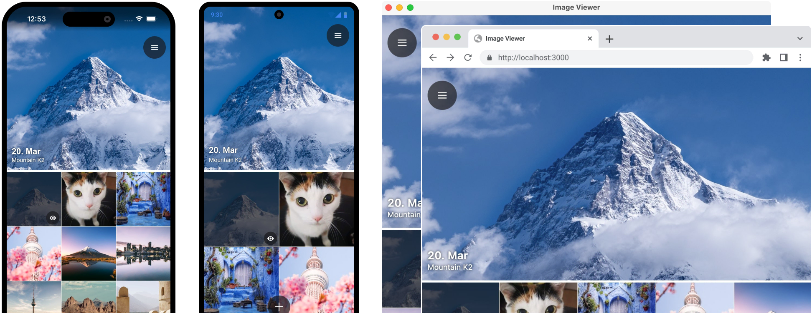

# Compose Multiplatform

**Compose Multiplatform** is a declarative framework for sharing UIs across multiple platforms with Kotlin. 
It is based on [Jetpack Compose](https://developer.android.com/jetpack/compose) and developed by [JetBrains](https://www.jetbrains.com/) and open-source contributors.

You can choose the platforms across which to share your UIs using Compose Multiplatform:

* [iOS](https://github.com/JetBrains/compose-multiplatform-ios-android-template/#readme) (Alpha)
* [Android](https://developer.android.com/jetpack/compose) (via Jetpack Compose)
* [Desktop](https://github.com/JetBrains/compose-multiplatform-desktop-template/#readme) (Windows, MacOS, Linux)
* [Web](https://kotl.in/wasm-compose-example) (Experimental)

For example, you can share UIs between iOS and Android or Windows and MacOS.

## iOS

> iOS support is in Alpha. It may change incompatibly and require manual migration in the future. 
> We would appreciate your feedback on it in the public Slack channel [#compose-ios](https://kotlinlang.slack.com/archives/C0346LWVBJ4/p1678888063176359). 
> If you face any issues, please report them on [GitHub](https://github.com/JetBrains/compose-multiplatform/issues).

Compose Multiplatform shares most of its API with Jetpack Compose, the Android UI framework developed by Google. 
You can use the same APIs to build user interfaces for both Android and iOS.

Since Compose is built on top of [Kotlin Multiplatform](https://kotlinlang.org/lp/multiplatform/), 
you can easily access native APIs, such as the [Camera API](https://developer.apple.com/documentation/avfoundation/capture_setup/avcam_building_a_camera_app), 
and embed complex native UI views, such as [MKMapView](https://developer.apple.com/documentation/mapkit/mkmapview).

**[Get started with Compose for iOS](https://github.com/JetBrains/compose-multiplatform-ios-android-template#readme)**

## Android

When Android is one of your targets, you can get the same experience for Android as if you were developing an Android app 
using [Jetpack Compose](https://developer.android.com/jetpack/compose).

## Desktop

Compose Multiplatform targets the JVM and supports high-performance hardware-accelerated UI rendering on all major desktop
platforms – macOS, Windows, and Linux.

It has desktop extensions for menus, keyboard shortcuts, window manipulation, and notification management.

**[Get started with Compose for Desktop](https://github.com/JetBrains/compose-multiplatform-desktop-template#readme)**

## Web

> Web support is Experimental and may be changed at any time. Use it only for evaluation purposes. 
> We would appreciate your feedback on it in the public Slack channel [#compose-web](https://kotlinlang.slack.com/archives/C01F2HV7868/p1678887590205449). 
> If you face any issues, please report them on [GitHub](https://github.com/JetBrains/compose-multiplatform/issues).

You can experiment with sharing your mobile or desktop UIs with the web. Compose for Web is based on [Kotlin/Wasm](https://kotl.in/wasm), 
the newest target for Kotlin Multiplatform projects. It allows Kotlin developers to run their code in the browser with 
all the benefits that WebAssembly has to offer, such as good and predictable performance for your applications.

**[Get started with Compose for Web](https://kotl.in/wasm-compose-example)**

## All platforms at once

If you want to share UIs across all supported platforms at once, you can start with [this template](https://github.com/JetBrains/compose-multiplatform-template#readme).

> Note that this template currently doesn’t support the web. It will be added later.
> 
> We would appreciate your feedback on Compose Multiplatform in the public Slack channel [#compose](https://kotlinlang.slack.com/archives/CJLTWPH7S/p1678882768039969).

## Learn more

* [FAQ](docs/FAQ.md)
* [Samples](examples/README.md)
* [Tutorials](tutorials/README.md)
* [Changelog](CHANGELOG.md)
* [Compatibility and versioning](VERSIONING.md)

