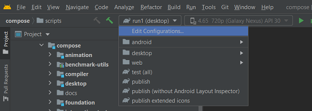

Composite build of [Compose-jb sources](https://github.com/JetBrains/androidx)

## Download submodules after downloading the main project:
```bash
git submodule update --init --recursive
```
Set this property to always update submodules on git checkout/pull/reset:
```bash
git config --global submodule.recurse true
```

## General requirements
- Java 11 (should be specified in JAVA_HOME)
- [macOs/Linux] Android SDK downloaded via `./compose/frameworks/support/jbdeps/android-sdk/downloadAndroidSdk`
- [Windows] Android SDK downloaded from Android Studio and specified in ANDROID_SDK_ROOT
- [Optional, macOs] For AppCode IDE, specify environment variable ANDROID_SDK_ROOT=[YOUR_PATH]/compose-jb/compose/frameworks/support/jbdeps/android-sdk/darwin (in ~/.zshrc)

## Developing in IDE
1. Download Android Studio from [the official site](https://developer.android.com/studio/archive) (it is mandatory to use the version, written [here](https://github.com/JetBrains/androidx/blob/jb-main/gradle/libs.versions.toml#L11)). As an alternative you can use IDEA, which is compatible with [this AGP version](https://github.com/JetBrains/androidx/blob/jb-main/gradle/libs.versions.toml#L5), or you can disable Android plugin in IDEA plugins, to develop non-Android targets.
2. [macOs/Linux] Download Android SDK via `./compose/frameworks/support/jbdeps/android-sdk/downloadAndroidSdk`
2. [Windows] Download Android SDK via [Android Studio](https://developer.android.com/studio/intro/update#sdk-manager) and specify it in ANDROID_SDK_ROOT environment variable. Components, their versions and folder structure should be the same as in downloaded via script `./compose/frameworks/support/jbdeps/android-sdk/downloadAndroidSdk` SDK for other platforms.
3. Open `compose/frameworks/support` folder either in Android Studio or in IDEA or in AppCode with KMM plugin.
4. Specify Gradle JVM to use JDK 11 in InteliJ IDEA Preferences (`Build, Execution, Deployment -> Build Tools -> Gradle`)

## Scripts
Publish artifacts to the local directory `out/androidx/build/support_repo/org/jetbrains/compose`:
```
export COMPOSE_CUSTOM_VERSION=0.0.0-custom
./scripts/publish
```
(on Windows it doesn't build at the moment, the issue is in the line `packageInspector(project, project(":compose:ui:ui-inspection")` in `compose/frameworks/support/compose/ui/ui/build.gradle`)

Publish extended icons:
```bash
./scripts/publishExtendedIcons
```

### Run tests

Run tests for Desktop:
```bash
./scripts/testDesktop
```

Run tests for Web:
```bash
./scripts/testWeb
```

Run tests for Android:
```bash
./scripts/testAndroidUnit.sh
```
```bash
./scripts/testAndroidInEmulator.sh # first run android simulator or connect device
```

### Run samples
Run jvm desktop sample:
```bash
./scripts/runGradle run
```
another jvm desktop samples: 
```bash
./scripts/runGradle run1 run2 run3 run4 runWindowApi runVsync runLayout
```

Run wasm sample:
```bash
./scripts/runGradle runMppJs
```

Run native macos sample:
```bash
./scripts/runGradle runMppMacos
```

## Multiplatform build to mavenLocal

```bash
export COMPOSE_CUSTOM_VERSION=0.0.0-custom-version &&\
./scripts/publishToMavenLocal -Pcompose.platforms=all &&\
./scripts/publishGradlePluginToMavenLocal &&\
./scripts/publishWebComponentsToMavenLocal
```
`-Pcompose.platforms=all` could be replace with comma-separated list of platforms, such as `js,jvm,androidDebug,androidRelease,macosx64,uikit`.

