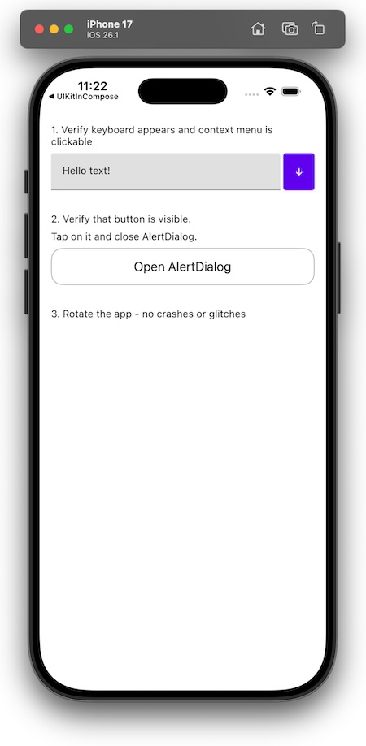

# Basic iOS Tests for Compose Multiplatform

This is a test application that ensures that very basic features of Compose Multiplatform work.
Deployment target: iOS 13.0
Pay attention to file [main.ios.kt](shared%2Fsrc%2FiosMain%2Fkotlin%2Fmain.ios.kt)

