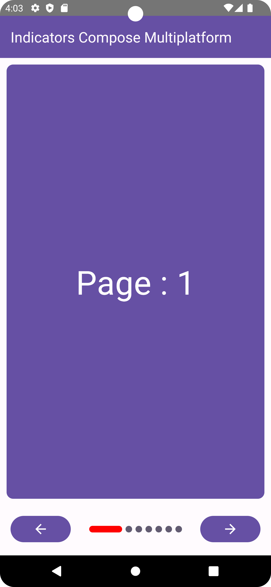
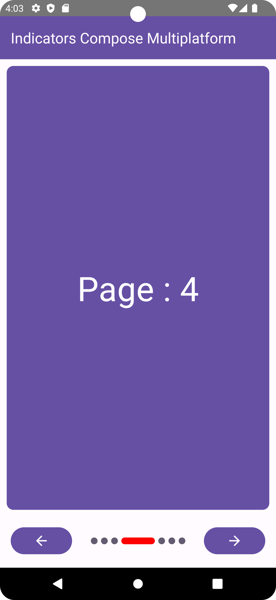
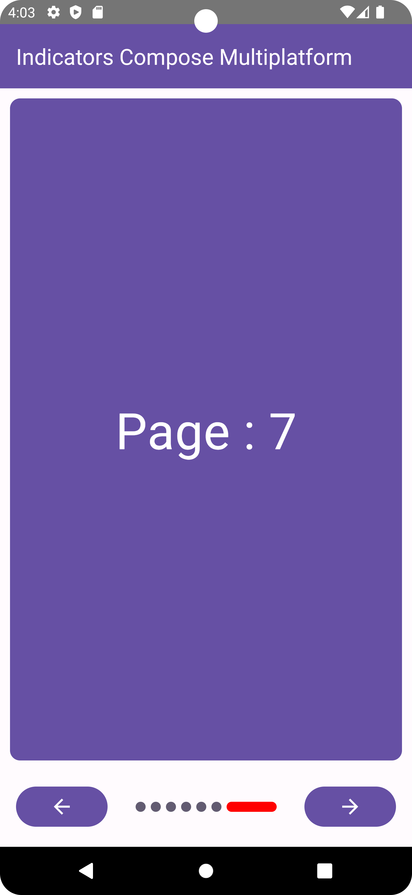
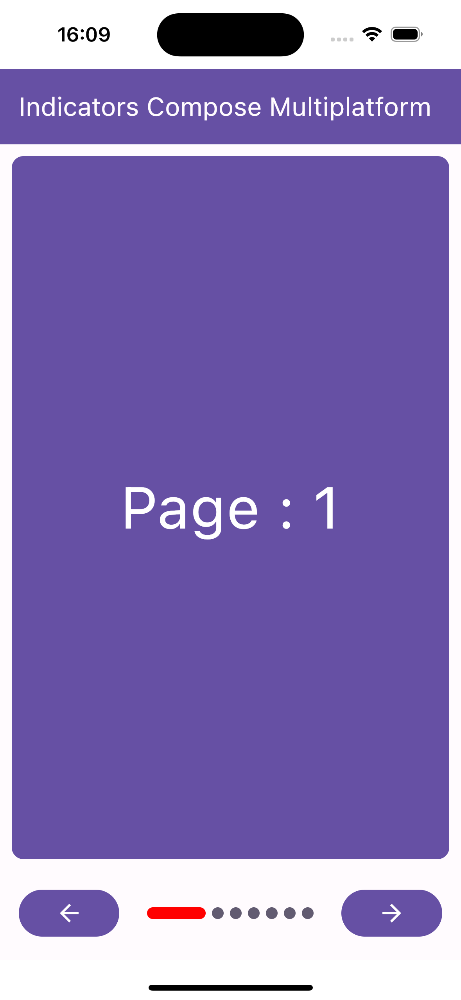
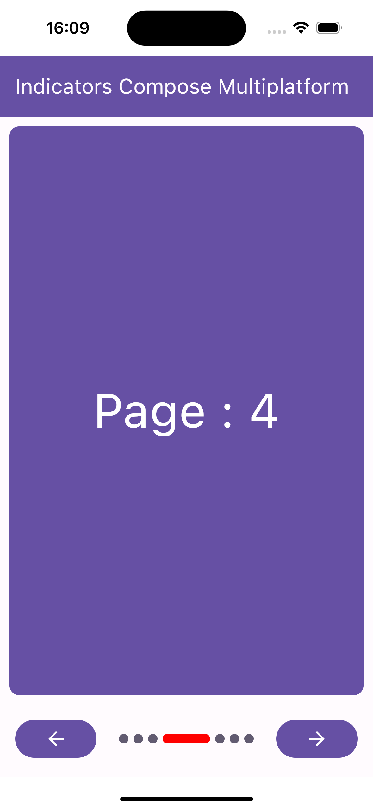
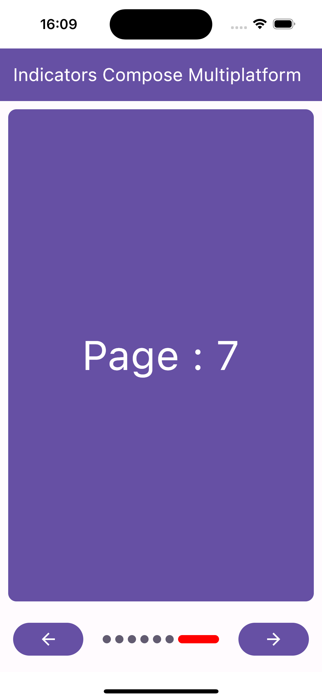

# Indicators Compose Multiplatform

This is a sample project that demonstrates the use of the Compose Multiplatform UI framework with Kotlin Multiplatform (KMP), targeting Android and iOS. The application displays a pager with a progress indicator in the pages.

## Screenshots (Android & iOS)

| First Android                                                                 | Second Android                                                                | Third Android                                                                 |
|-------------------------------------------------------------------------------|-------------------------------------------------------------------------------|-------------------------------------------------------------------------------|
|  |  |  |

| First iOS                                                             | Second iOS                                                            | Third iOS                                                             |
|-----------------------------------------------------------------------|-----------------------------------------------------------------------|-----------------------------------------------------------------------|
|  |  |  | 

## Demo


## Prerequisites

To run this project, you'll need the following:

- [Android Studio](https://developer.android.com/studio)
- [Xcode](https://apps.apple.com/us/app/xcode/id497799835)
- [JDK](https://www.oracle.com/java/technologies/downloads/)
- [Kotlin Multiplatform Mobile](https://kotlinlang.org/docs/multiplatform-plugin-releases.html#release-details) [plugin](https://plugins.jetbrains.com/plugin/14936-kotlin-multiplatform-mobile)
- [Kotlin](https://kotlinlang.org/docs/releases.html)
- [Compose Multiplatform](https://www.jetbrains.com/lp/compose-multiplatform/)


## Getting Started

1. Clone this repository to your local machine.
    ```text
    git clone https://github.com/ibenabdallah/indicators-compose-multiplatform.git
    ```

2. Open the project in Android Studio.

3. Set up your Android and iOS device/emulator/simulator.

4. Build and run the project.


## Project Structure

The project follows the standard Kotlin Multiplatform (KMP) structure, with the following notable files and directories:

- `composeApp`: Contains the Android project configuration.
    - `src/commonMain`: Contains the common code, including the Compose-based UI implementation.
    - `src/androidMain`: Contains the Android-specific code and specific configuration files.
    - `src/iosMain`: Contains the iOS-specific code.

- `iosApp`: Contains the iOS-specific configuration files.

- `build.gradle.kts`: The main Gradle build script for the project.

## Run project on Different Platforms 🚀

### Android
To run the application on android device/emulator:
- open project in Android Studio and run imported android run configuration

To build the application bundle:
- run `./gradlew :composeApp:assembleDebug`
- find `.apk` file in `composeApp/build/outputs/apk/debug/composeApp-debug.apk`

### iOS
To run the application on iPhone device/simulator:
- Open `iosApp/iosApp.xcproject` in Xcode and run standard configuration
- Or use [Kotlin Multiplatform Mobile plugin](https://plugins.jetbrains.com/plugin/14936-kotlin-multiplatform-mobile) for Android Studio


## Resources

This project is based on the concepts and frameworks provided by Kotlin Multiplatform Mobile (KMM), Jetpack Compose, and Compose Multiplatform. Here are some resources that might be helpful in learning more about Compose Multiplatform UI and KMM

- [Kotlin Multiplatform Mobile Documentation](https://kotlinlang.org/docs/mobile/)
- [Jetpack Compose Documentation](https://developer.android.com/jetpack/compose/documentation)se)
- [Compose Multiplatform](https://www.jetbrains.com/lp/compose-multiplatform/)


## Contributing

Contributions are welcome! If you find any issues or have suggestions for improvements, please open an issue or submit a pull request. Please ensure that your contributions adhere to the project's coding style and guidelines.


## Contributors 📢

<a href="https://github.com/ibenabdallah/indicators-compose-multiplatform/graphs/contributors">
    
</a>

## License

This project is licensed under the [MIT License](LICENSE).

## Connect with me

[](https://www.linkedin.com/in/ibenabdallah/)
[](https://twitter.com/Ingbaismail)