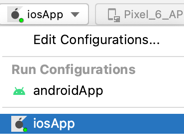

# [Compose Multiplatform](https://github.com/JetBrains/compose-multiplatform) iOS CocoaPods example

This example showcases using Kotlin Multiplatform shared module in Swift as a CocoaPods framework.

The official Kotlin documentation provides more information on working with CocoaPods:
* [CocoaPods overview and setup](https://kotlinlang.org/docs/native-cocoapods.html);
* [Add dependencies on a Pod library](https://kotlinlang.org/docs/native-cocoapods-libraries.html);
* [Use a Kotlin Gradle project as a CocoaPods dependency](https://kotlinlang.org/docs/native-cocoapods-xcode.html);

## Setting up your development environment

To setup the environment, please consult these [instructions](https://www.jetbrains.com/help/kotlin-multiplatform-dev/compose-multiplatform-setup.html).

## How to run

Choose a run configuration for an appropriate target in IDE and run it.

