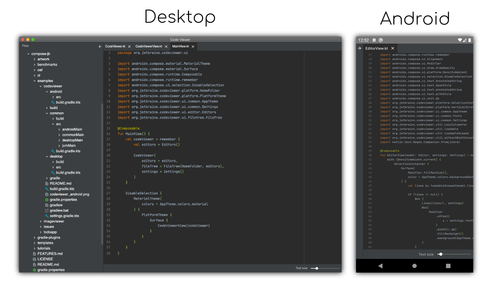

# Code Viewer
Code Viewer example for Desktop, Android, iOS, and Web written in Compose Multiplatform.

The project is built with the [Kotlin Toolchain](https://github.com/JetBrains/kotlin-toolchain).

## Setting up your development environment

To set up the environment, please consult these [instructions](https://www.jetbrains.com/help/kotlin-multiplatform-dev/compose-multiplatform-setup.html).

Open the project in IntelliJ IDEA with the Kotlin Toolchain plugin and use the run gutter icons or run configurations
to launch the app on the target of your choice.

## Run desktop app

`./kotlin run -m desktopApp`

## Run Android app

`./kotlin run -m androidApp`

## Run iOS app

`./kotlin run -m iosApp`

or open `iosApp/module.xcodeproj` in Xcode.

## Run web app

`./kotlin run -m webApp`

and open the printed URL in a browser that supports [Wasm GC](https://kotl.in/wasm-help).

