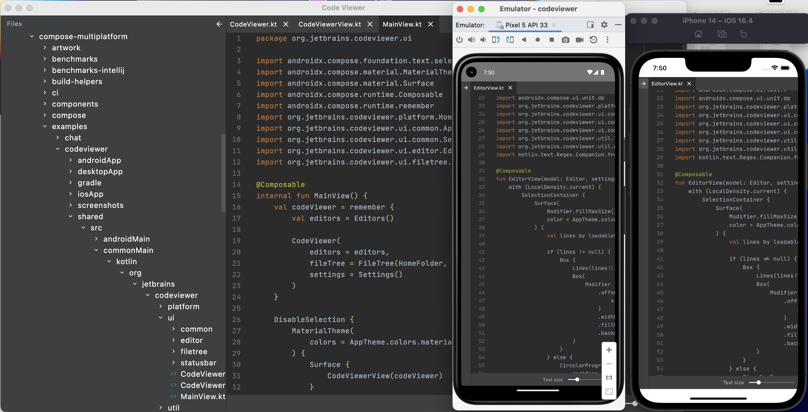

# Code Viewer
Code Viewer example for Desktop, Android and iOS written in Compose Multiplatform.

## Setting up your development environment

To setup the environment, please consult these [instructions](https://github.com/JetBrains/compose-multiplatform-template#setting-up-your-development-environment).

## How to run

Choose a run configuration for an appropriate target in Android Studio and run it.


## Run desktop via Gradle

`./gradlew desktopApp:run`

### Building native desktop distribution
```
./gradlew :desktop:packageDistributionForCurrentOS
# outputs are written to desktop/build/compose/binaries
```

