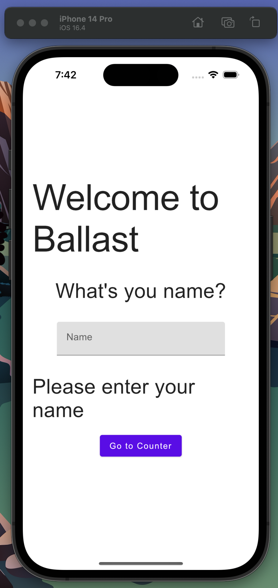

This is an example of a Kotlin Multiplatform project that targets Android, iOS, Web, and Desktop platforms. The project follows a modular approach, with each feature being represented as a Ballast component. The Compose UI code is located in the shared module. For the web UI, you can find it in the web module, which is built using [Kobweb](https://github.com/varabyte/kobweb).

## Run projects:

### Android
- Run `androidsApp` from the _Run Configuration_

### iOS
- Run `iosApp` from the _Run Configuration_
- or open `iosApp/iosApp.xcodeproj` in Xcode and Run

### Web
- Run `./gradlew :web:kobwebStart -t`

### Desktop
- Run `./gradlew :shared:run`

## Screenshots

