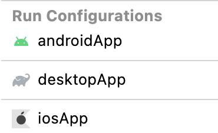

# Graphics2D

Example can run on Android, iOS, desktop or in a browser.

## Setting up your development environment

To setup the environment, please consult
these [instructions](https://www.jetbrains.com/help/kotlin-multiplatform-dev/compose-multiplatform-setup.html).

## How to run

Choose a run configuration for an appropriate target in Android Studio and run it.

## Run on desktop via Gradle

`./gradlew desktopApp:run`

## Run experimental native on MacOS

`./gradlew runDebugExecutableMacosX64` (Works on Intel processors)
`./gradlew runDebugExecutableMacosArm64` (Works on Arm processors)

