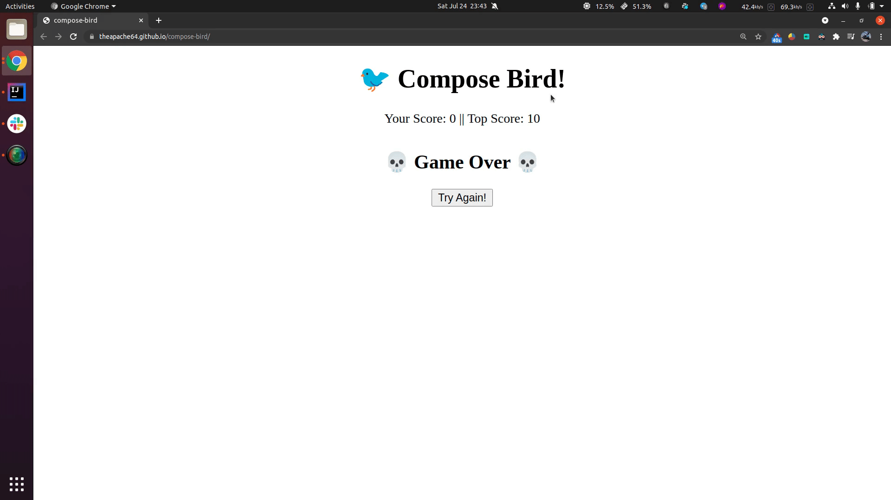

# 🐦 Compose Bird




<a href="https://twitter.com/theapache64" target="_blank">

</a>

> A game about a bird using Compose HTML Library and radio buttons

## ▶️ Play

- https://theapache64.github.io/compose-bird/
- Use arrow **Up** key to fly

## 🏃 Run

* To run, launch command: `./gradlew jsBrowserRun`
* Or choose **browser** configuration in IDE and run it.  
  

## 📦 Distribute

```
./gradlew jsBrowserDistribution // and then open index.html (build/distributions)
```

## ✍️ Author

👤 **theapache64**

* Twitter: <a href="https://twitter.com/theapache64" target="_blank">@theapache64</a>
* Email: theapache64@gmail.com

Feel free to ping me 😉
