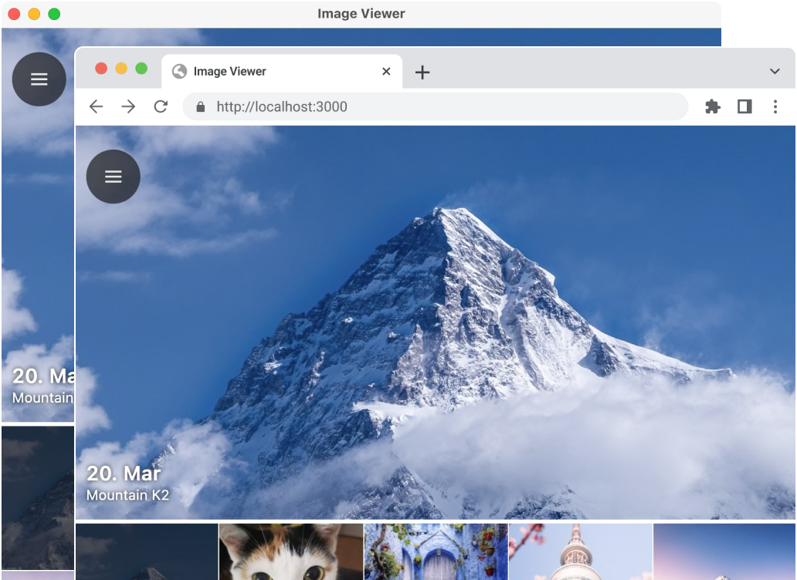
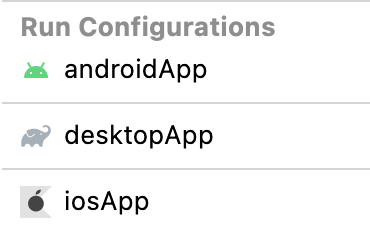

# Imageviewer

An example of an image gallery with camera and map support
based on Compose Multiplatform (desktop, Web, Android and iOS).

[](https://zal.im/wasm/iv).



## Setting up your development environment

To setup the environment, please consult these [instructions](https://www.jetbrains.com/help/kotlin-multiplatform-dev/compose-multiplatform-setup.html).

## How to run

If you already ran this sample before, then you need to execute command at least once: 
`/gradlew podInstall`

Choose a run configuration for an appropriate target in IDE and run it.



## Run on desktop via Gradle

`./gradlew desktopApp:run`

### Building native desktop distribution

```
./gradlew :desktop:packageDistributionForCurrentOS
# outputs are written to desktopApp/build/compose/binaries
```

## Run on Web via Gradle

> **Note:**
> Web support is in [Alpha](https://kotlinlang.org/docs/components-stability.html). It may be changed at any time. You can use it in scenarios before production.
> We would appreciate your feedback in [GitHub](https://github.com/JetBrains/compose-multiplatform/issues).

`./gradlew :webApp:wasmJsRun`

### Running Android application

- Get a [Google Maps API key](https://developers.google.com/maps/documentation/android-sdk/get-api-key)
- Add to `local.properties` file located in the root directory (create if it doesn't exist):
  - `MAPS_API_KEY=YOUR_KEY` where `YOUR_KEY` is your key from previous step;
  - `sdk.dir=YOUR_SDK_PATH` where `YOUR_SDK_PATH` is a path to Android SDK in your system.
- Open project in IntelliJ IDEA or Android Studio and run `androidApp` configuration.
