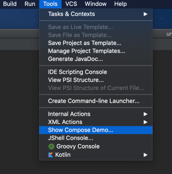
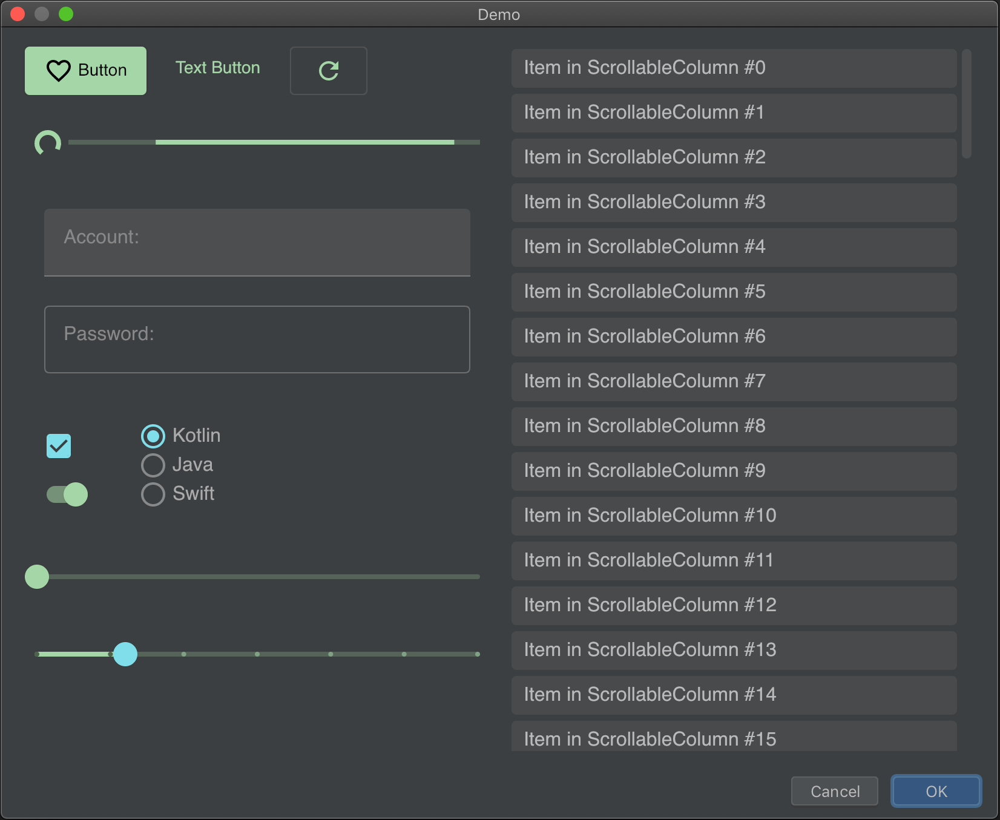

## Example CFD based plugin for IntelliJ Idea.

To run the example:

1. from directory `compose-jb/examples/intelliJPlugin` run command in terminal: `./gradlew runIde`
2. create project or open any existing
3. from menu `Tools` select `Show Compose Demo...`

