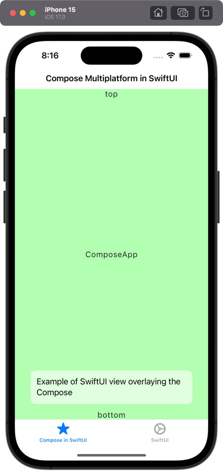

# Compose Multiplatform in SwiftUI

This example shows how to use Compose Multiplatform inside an iOS Application written in SwiftUI.

Entry point is `struct ContentView` in file [ContentView.swift](iosApp%2FiosApp%2FContentView.swift).

Compose entry point is `fun ComposeEntryPoint(): UIViewController` in file [main.ios.kt](shared%2Fsrc%2FiosMain%2Fkotlin%2Fmain.ios.kt).

