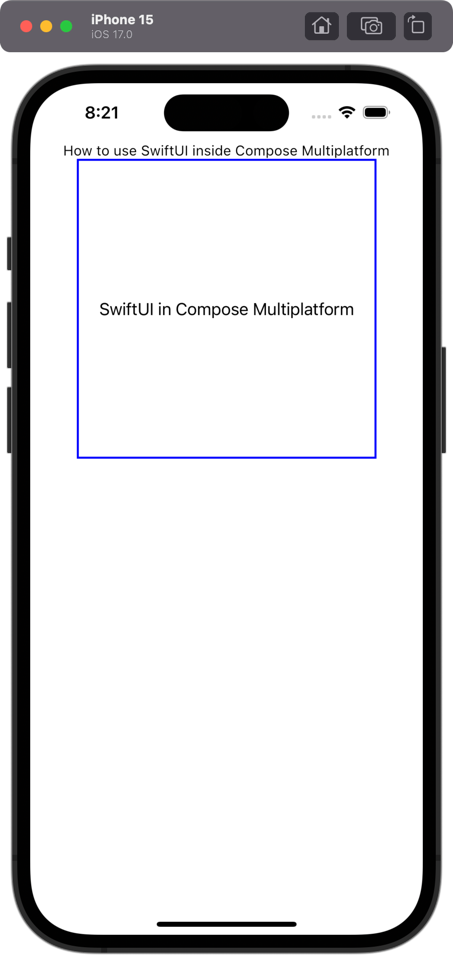

# SwiftUI in Compose Multiplatform

This example shows how to use a SwiftUI view in a Compose Multiplatform application.
Pay attention to file [main.ios.kt](shared%2Fsrc%2FiosMain%2Fkotlin%2Fmain.ios.kt) and [ComposeViewControllerRepresentable.swift](iosApp%2FiosApp%2FComposeViewControllerRepresentable.swift)

