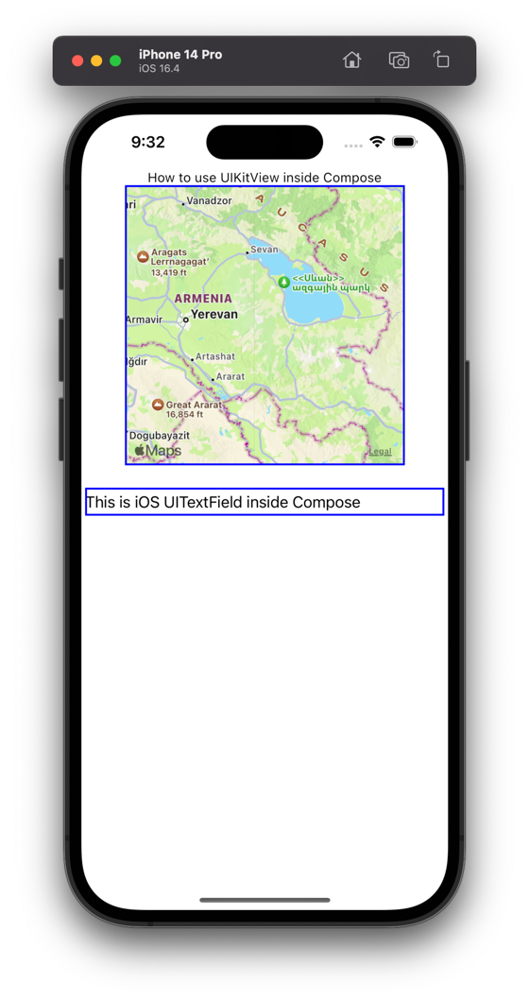

# UIKit in Compose Multiplatform

This example shows how to use a UIKitView in a Compose Multiplatform application.
Pay attention to file [main.ios.kt](shared%2Fsrc%2FiosMain%2Fkotlin%2Fmain.ios.kt)

