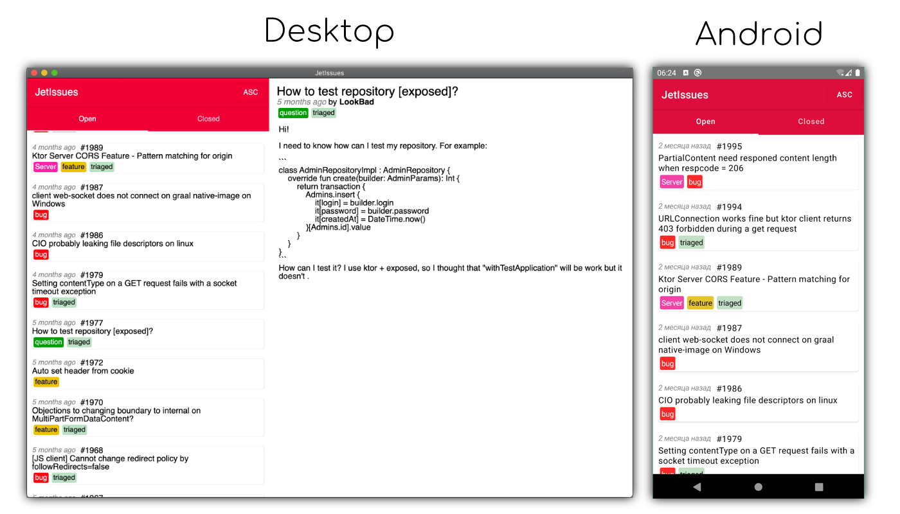

Github Issues viewer example written in Jetpack Compose UI library.


### Running desktop application
* To run, launch command: `./gradlew :desktop:run`
* Or choose **desktop** configuration in IDE and run it.  
  

### Building native desktop distribution
```
./gradlew :desktop:packageDistributionForCurrentOS
# outputs are written to desktop/build/compose/binaries
```

