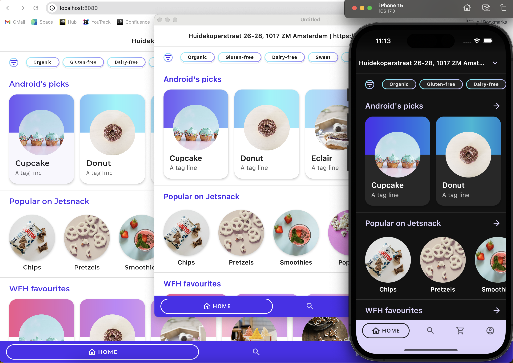

# Kotlin/Wasm Jetsnack example

This example showcases a web version of the [Jetsnack application](https://github.com/android/compose-samples/tree/main/Jetsnack) built with [Compose Multiplatform for web](#compose-multiplatform-for-web) and [Kotlin/Wasm](#kotlinwasm).

Check it out:

.

> **Note:**
> To learn more about the Jetsnack application, visit the [Jetsnack README.md](https://github.com/android/compose-samples/tree/main/Jetsnack).

## Kotlin/Wasm

> **Note:**
> Kotlin/Wasm is an [Alpha](https://kotlinlang.org/docs/components-stability.html) feature. It may be changed at any time. You can use it in scenarios before production.
> We would appreciate your feedback in [YouTrack](https://youtrack.jetbrains.com/issue/KT-56492).
> 
> [Join the Kotlin/Wasm community](https://slack-chats.kotlinlang.org/c/webassembly).

Kotlin/Wasm is a new target that enables you to compile Kotlin code to [WebAssembly (Wasm)](https://webassembly.org/). 

By compiling Kotlin code to WebAssembly, you can run it on any WebAssembly-compatible environment that meets Kotlin's requirements, including web browsers.

With Kotlin/Wasm, you gain the capability to develop high-performance web applications and serverless functions, opening up a wide range of potential projects.

## Compose Multiplatform for web

> **Note:**
> Web support is an [Alpha](https://kotlinlang.org/docs/components-stability.html) feature. It may be changed at any time. 
> You can use it in scenarios before production.
> We would appreciate your feedback in [GitHub](https://github.com/JetBrains/compose-multiplatform/issues).
>
> [Join the compose-web community](https://slack-chats.kotlinlang.org/c/compose-web).

Compose Multiplatform for web enables sharing your mobile or desktop UIs on the web.

Compose Multiplatform for web is based on [Kotlin/Wasm](https://kotl.in/wasm), the newest target for Kotlin Multiplatform projects.
This enables running your code in the browser, leveraging WebAssembly's advantages like high and consistent application performance.

Follow the instructions in the sections below to try out this Jetsnack application built with Compose Multiplatform for web and Kotlin/Wasm.

## Set up the environment

Before starting, ensure you have the necessary IDE and browser setup to run the application.

### IDE

We recommend using [IntelliJ IDEA 2023.1 or later](https://www.jetbrains.com/idea/) to work with the project.
It supports Kotlin/Wasm out of the box.

### Browser (for Kotlin/Wasm target)

To run Kotlin/Wasm applications in a browser, you need a browser supporting the [Wasm Garbage Collection (GC) feature](https://github.com/WebAssembly/gc):

**Chrome and Chromium-based**

* **For version 119 or later:**

  Works by default.

**Firefox**

* **For version 120 or later:**

  Works by default.

**Safari/WebKit**

Wasm GC support is currently under
[active development](https://bugs.webkit.org/show_bug.cgi?id=247394).

> **Note:**
> For more information about the browser versions, see the [Troubleshooting documentation](https://kotl.in/wasm_help/).

## Build and run

To build and run the Jetsnack application with Compose Multiplatform for web and Kotlin/Wasm:

1. In IntelliJ IDEA, open the repository.
2. Navigate to the `compose-jetsnack` project folder.
3. Run the application by typing one of the following Gradle commands in the terminal:

* **Web version:**

  `./gradlew :web:wasmJsRun`
   &nbsp; 

  Once the application starts, open the following URL in your browser: 

  `http://localhost:8080`

  > **Note:**
  > The port number can vary. If the port 8080 is unavailable, you can find the corresponding port number printed in the console
  > after building the application.
 &nbsp; 

* **Desktop version:**

  `./gradlew :desktop:run`
   &nbsp; 

* **Android application:**

   `./gradlew :android:installDebug`
* 
* **iOS application:**

To setup the environment, please consult these [instructions](https://www.jetbrains.com/help/kotlin-multiplatform-dev/compose-multiplatform-setup.html).

## Feedback and questions

Give it a try and share your feedback or questions in our [#compose-web](https://slack-chats.kotlinlang.org/c/compose-web) Slack channel.
[Get a Slack invite](https://surveys.jetbrains.com/s3/kotlin-slack-sign-up).
You can also share your comments with [@bashorov](https://twitter.com/bashorov) on X (Twitter).

## Learn more

* [Compose Multiplatform](https://github.com/JetBrains/compose-multiplatform/#compose-multiplatform)
* [Kotlin/Wasm](https://kotl.in/wasm/)
* [Other Kotlin/Wasm examples](https://github.com/Kotlin/kotlin-wasm-examples/tree/main)
