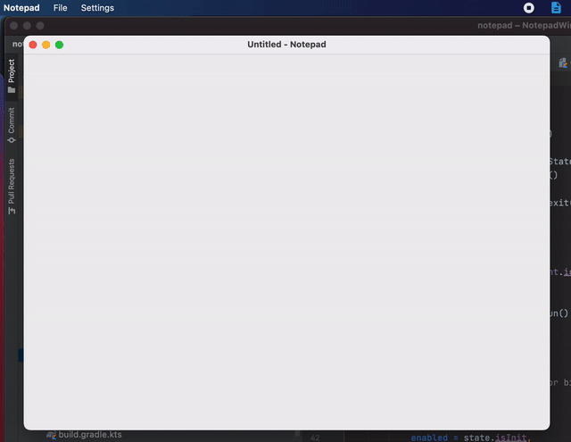

Notepad example for desktop written in Compose for Desktop library, using Composable Window API

### Running desktop application
* To run, launch command: `./gradlew run`
* Or choose **desktop** configuration in IDE and run it.  
  

### Building native desktop distribution
```
./gradlew packageDistributionForCurrentOS
# outputs are written to build/compose/binaries
```
