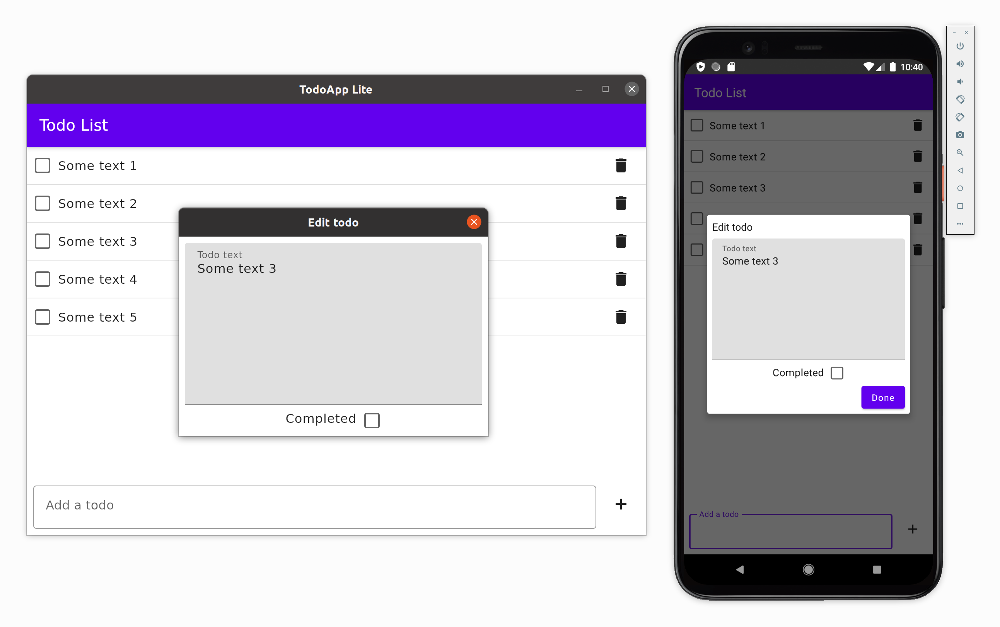

# TodoApp (lite version)

A simplified version of the [TodoApp example](https://github.com/JetBrains/compose-jb/tree/master/examples/todoapp), fully based on Jetpack Compose and without using any third-party libraries.

Supported targets: Android, Desktop and iOS.

## Setting up your development environment

To setup the environment, please consult these [instructions](https://www.jetbrains.com/help/kotlin-multiplatform-dev/compose-multiplatform-setup.html).

## How to run

Choose a run configuration for an appropriate target in Android Studio and run it.


## Run on desktop via Gradle

`./gradlew desktopApp:run`

## Building native desktop distribution
```
./gradlew :desktopApp:packageDistributionForCurrentOS
# outputs are written to desktopApp/build/compose/binaries
```

