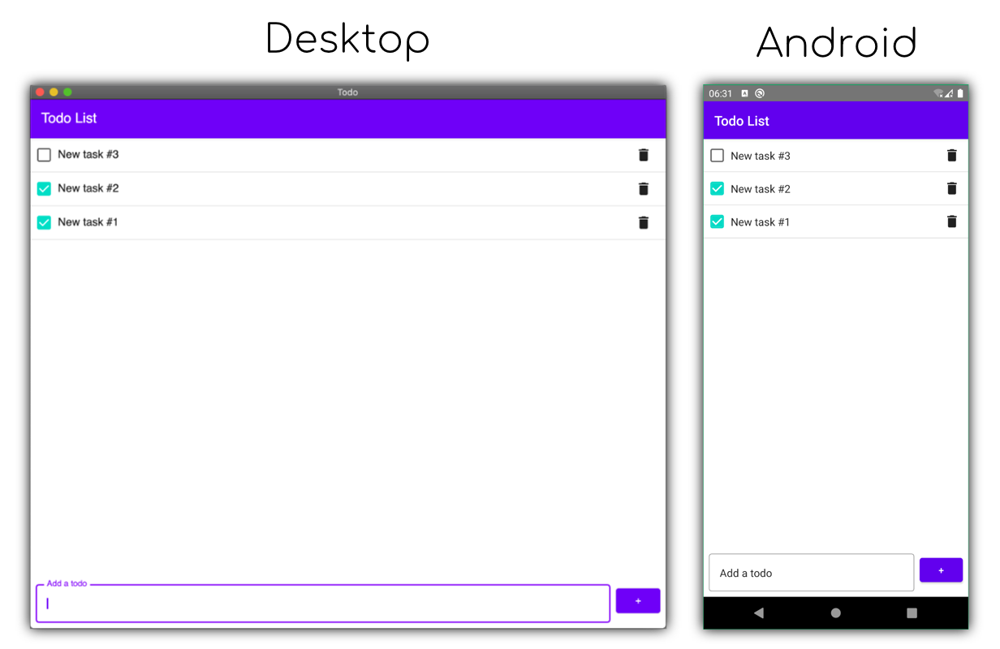

An example of Kotlin Multiplatform todo app with shared Android/Desktop Compose UI and SwiftUI (not Compose) iOS.

This example supports the following targets: 
- `Android` (Compose)
- `Desktop/JVM` (Compose)
- `Web/JavaScript` (Compose)
- `iOS` (SwiftUI, not Compose)

Libraries used:
- Jetpack Compose - shared UI
- [Decompose](https://github.com/arkivanov/Decompose) - navigation and lifecycle
- [MVIKotlin](https://github.com/arkivanov/MVIKotlin) - presentation and business logic
- [Reaktive](https://github.com/badoo/Reaktive) - background processing and data transformation
- [SQLDelight](https://github.com/cashapp/sqldelight) - data storage

There are multiple modules:
- `:common:utils` - just some useful helpers
- `:common:database` - SQLDelight database definition
- `:common:main` - displays a list of todo items and a text field
- `:common:edit` - accepts an item id and allows editing
- `:common:root` - navigates between `main` and `edit` screens
- `:common:compose-ui` - Shared Compose UI for Android and Desktop
- `:android` - Android application
- `:desktop` - Desktop application
- `:web` - Web browser application + Compose Web UI 
- `ios` - iOS Xcode project

The root module is integrated into Android, Desktop and iOS (non-Compose) apps.

Features:
- 99% of the code is shared: data, business logic, presentation, navigation and UI
- View state is preserved when navigating between screens, Android configuration change, etc.
- Model-View-Intent (aka MVI) architectural pattern
- Pluggable UI - Compose UI for Android, Desktop and Web, SwiftUI (not Compose) for iOS

### Running desktop application
```
./gradlew :desktop:run
```

#### Building native desktop distribution
```
./gradlew :desktop:package
# outputs are written to desktop/build/compose/binaries
```

### Running Android application

Open project in Intellij IDEA or Android Studio and run "android" configuration.

### Running Web browser application
```
./gradlew :web:jsBrowserDevelopmentRun
```

### Running iOS application

Open and build the Xcode project located in `ios` folder.


