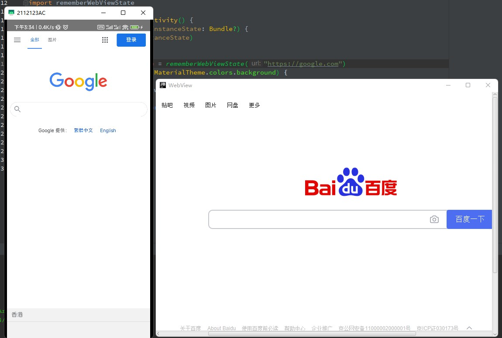

An example of Kotlin Multiplatform WebView app with shared Android/Desktop 

Libraries used:
- [JavaFx](https://openjfx.io) - JavaFX is an open source, next generation client application platform for desktop, mobile and embedded systems built on Java


development environment 
- Android Studio Chipmunk | 2021.2.1 Patch 1
- Java 11
- kotlin.version=1.6.10
- compose.version=1.1.1

There are multiple modules:
- `:webview` - - Shared WebView Compose UI for Android( Android WebView) and Desktop(JavaFX WebView)
- `:android` - Android application
- `:desktop` - Desktop application

use in Android And Desktop

```kotlin
implementation(project(":webview"))
```

1. load url
```kotlin
val webViewState = rememberWebViewState("https://example.com")
WebView(
    state = webViewState,
    modifier = Modifier.fillMaxSize(),
    navigator = rememberWebViewNavigator()

)
```
2. load data
```kotlin
val webViewState = rememberWebViewStateWithHTMLData("test")
WebView(
    state = webViewState,
    modifier = Modifier.fillMaxSize(),
    navigator = rememberWebViewNavigator()
)
```


thanks https://google.github.io/accompanist/web/

