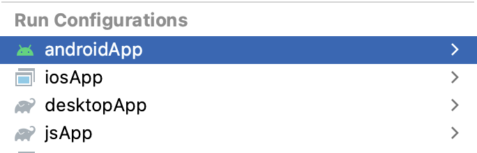

# Chat example app

Example can run on Android, iOS, desktop or in a browser.

*Prerequisites*: to run on iOS and Android, you should have "Kotlin Multiplatform Mobile" plugin installed either 
                 in Android Studio or in AppCode with [installed CocoaPods](https://kotlinlang.org/docs/native-cocoapods.html).

## How to run 

Choose a run configuration for an appropriate target in IDE and run it.

To run on iOS device, please correct `iosApp/Configuration/TeamId.xcconfig` with your Apple Team ID. 
Alternatively, you may setup signing within XCode opening `iosApp/iosApp.xcworkspace` and then 
using "Signing & Capabilities" tab of `iosApp` target.

Then choose **iosApp** configuration in IDE and run it. 

## Run on desktop via Gradle

`./gradlew desktopApp:run`

## Run JS in browser with WebAssembly Skia via Gradle

`./gradlew jsApp:jsBrowserDevelopmentRun`
