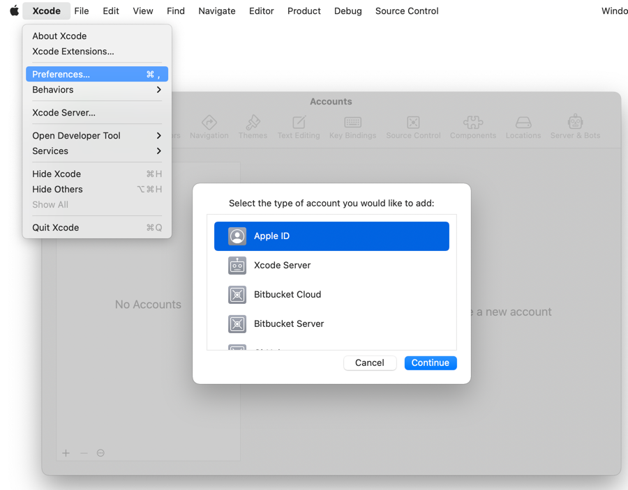
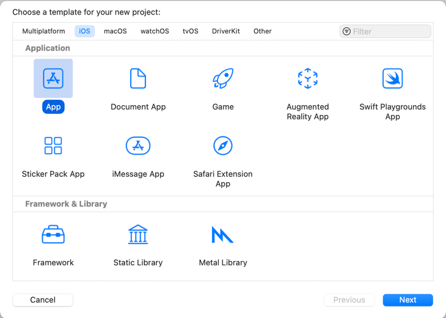

## Run native on MacOS
  `./gradlew runDebugExecutableMacosX64` (Works on Intel processors)

## Run web assembly in browser
  `./gradlew jsBrowserDevelopmentRun`

## Run on iOS simulator
  `./gradlew iosDeployIPhone8Debug`
  `./gradlew iosDeployIPadDebug`

## Prepare Xcode to launch on iOS device
1) **Add your Apple ID.**  
Xcode -> Preferences... -> Accounts  
  

2) **Create certificates with XCode in temporary project.**  
You can create a certificate in Xcode. Create a new iOS app in Xcode.  
File -> New -> Project  
Choose iOS, App:  
  

3) **In next dialog set any product name and choose your teamID.**  

4) **Run project on iOS Device.**  
Xcode prompts you to install the certificate. Require password from login.keychain  

5) **Done**
After a successful launch on the device - you can delete this temporary project.  
Certificates will remain in login.keychain  

## Run on iOS device
 - set teamId in local.properties  
 - In build.gradle.kts  
add block `connectedDevice("Device") {  }` to compose.experimental.uikit.application.deployConfigurations  
 - `./gradlew iosDeployDeviceRelease`  
 - During the build, you will be prompted to access login.keychain  
