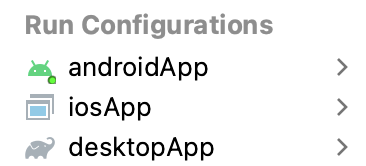

# Imageviewer

An example of image gallery for remote server image viewing,
based on Compose Multiplatform UI library (desktop, android and iOS).

## How to run

Choose a run configuration for an appropriate target in IDE and run it.



To run on iOS device, please correct `iosApp/Configuration/TeamId.xcconfig` with your Apple Team ID.
Alternatively, you may setup signing within XCode opening `iosApp/iosApp.xcworkspace` and then
using "Signing & Capabilities" tab of `iosApp` target.

Then choose **iosApp** configuration in IDE and run it.

## Run on desktop via Gradle

`./gradlew desktopApp:run`

### Building native desktop distribution

```
./gradlew :desktop:packageDistributionForCurrentOS
# outputs are written to desktop/build/compose/binaries
```

### Running Android application

Open project in IntelliJ IDEA or Android Studio and run "android" configuration.


