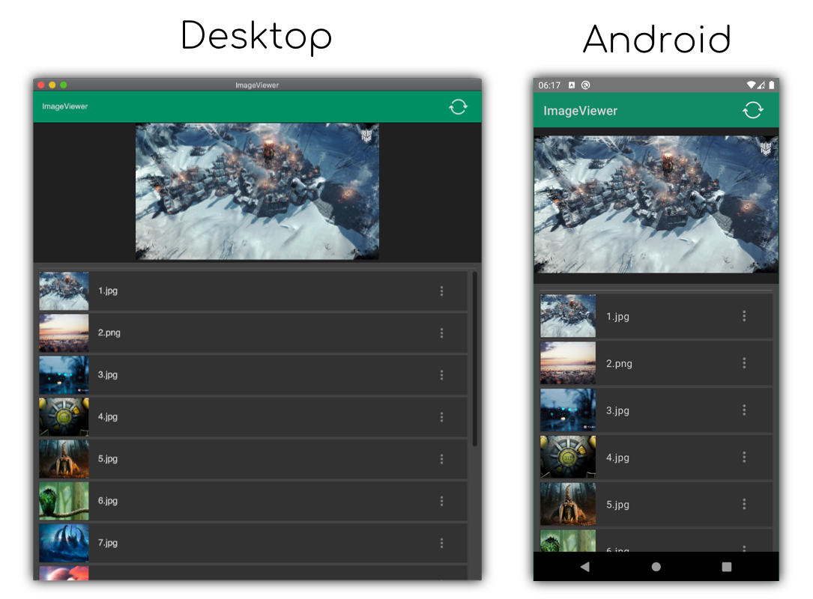

An example of image gallery for remote server image viewing, based on Jetpack Compose UI library (desktop and android).

### Running desktop application
 * To run, launch command: `./gradlew :desktopApp:run`
 * Or choose **desktop** configuration in IDE and run it.  
  

### Building native desktop distribution
```
./gradlew :desktop:packageDistributionForCurrentOS
# outputs are written to desktop/build/compose/binaries
```

### Running Android application

Open project in IntelliJ IDEA or Android Studio and run "android" configuration.


