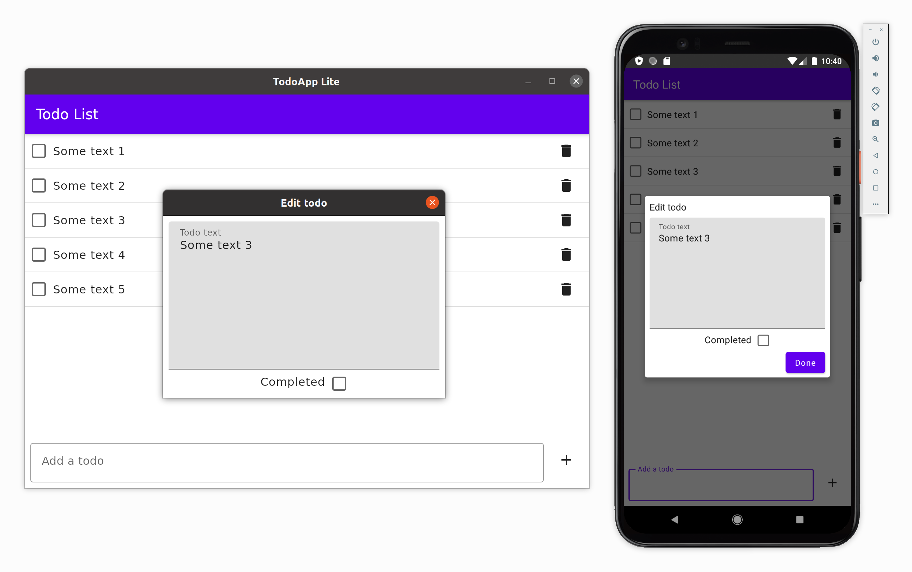

# TodoApp (lite version)

A simplified version of the [TodoApp example](https://github.com/JetBrains/compose-jb/tree/master/examples/todoapp), fully based on Jetpack Compose and without using any third-party libraries.

Supported targets: Android, Desktop and iOS.

## How to run

Choose a run configuration for an appropriate target in IDE and run it.


To run on iOS device, please correct `iosApp/Configuration/TeamId.xcconfig` with your Apple Team ID.
Alternatively, you may setup signing within XCode opening `iosApp/iosApp.xcworkspace` and then
using "Signing & Capabilities" tab of `iosApp` target.

Then choose **iosApp** configuration in IDE and run it.


## Run on desktop via Gradle

`./gradlew desktopApp:run`

## Building native desktop distribution
```
./gradlew :desktopApp:packageDistributionForCurrentOS
# outputs are written to desktopApp/build/compose/binaries
```

