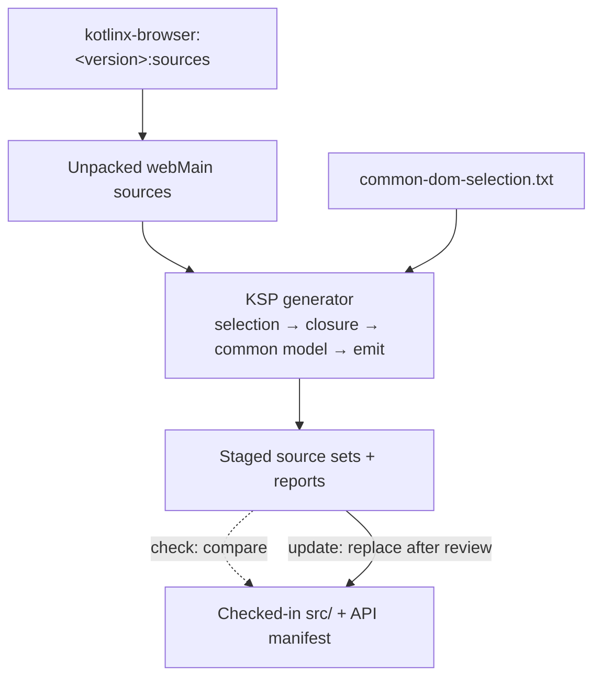
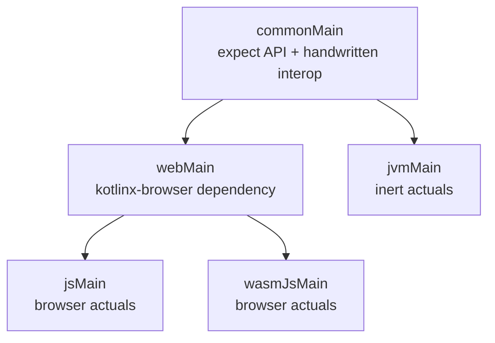

# kotlinx-browser common subset

This module generates a multiplatform DOM facade from the published `kotlinx-browser` sources.
Common code receives the generated `expect` declarations, web targets keep browser identity through
typealiases, and the JVM receives stubs.

The generator resolves
`org.jetbrains.kotlinx:kotlinx-browser:<version>:sources`, unpacks its `webMain` sources under the
KSP runner's `build/`, and feeds the source set to KSP. Fresh output is staged
under `generator/ksp-runner/build/generated/kotlinxBrowserCommonSubset`. Reviewed source output is
checked in under `src/`, so compiling the library does not run KSP or require the sources JAR.
Generator checks and tests do run KSP and resolve the pinned sources artifact.

## Run

Run all commands in this section from this directory. Generate staged output without changing 
checked-in sources:

```shell
../gradlew generateKotlinxBrowserCommonSubset
```

Check that staged output matches `src/` and `api/dom-api-manifest.txt`:

```shell
../gradlew checkKotlinxBrowserCommonSubset
```

After reviewing a deliberate generated API change, replace the checked-in files explicitly:

```shell
../gradlew updateKotlinxBrowserCommonSubset
```

Run the generator tests and the library's multiplatform checks:

```shell
../gradlew check
```

See the [verification module README](generator/verification/README.md) for focused compilation and
ledger-test tasks.

## How generation works



1. Gradle resolves and unpacks the pinned kotlinx-browser sources artifact. KSP reads the browser
   files named in
   [`common-dom-selection.txt`](generator/src/main/resources/common-dom-selection.txt).
2. `SelectionPolicy`, `ClosureResolver`, `SignatureAnalyzer`, `CommonTypeMapper`, and
   `MemberScanner` select declarations, close their dependencies, build the common model, and
   record every decision.
3. `FacadeSourceEmitter` renders KotlinPoet files and reports into the staging directory.
4. Gradle compares staged output with checked-in generated sources, or replaces those sources only
   through the explicit update task. Handwritten interop files are never synchronized.

## Input boundary

The selection policy names these generated browser declaration files:

- `org.w3c.dom.kt` contains the main DOM, HTML,
  canvas, network, and worker declarations.
- `org.w3c.dom.css.kt` contains stylesheets,
  CSS rules, and the inline-style `CSSStyleDeclaration` API.
- `org.w3c.dom.events.kt` contains the event
  types, listeners, and option dictionaries.
- `org.w3c.dom.clipboard.kt` contains clipboard events, dictionaries, and the
  asynchronous clipboard API.

KSP reads their `expect` declarations from `webMain`. The corresponding JS and Wasm/JS files are
target implementations. Generated web typealiases must compile
against both.

## Selection policy

The source selection policy supports:

- `input <file>`: inspect every top-level classifier in a browser source file.
- `signature-only-package <package>`: allow referenced classifiers as bare identities.
- `defer <reason> <classifier>`: keep a classifier outside the current facade with an explicit
  manifest reason.

Input classifiers are emitted by default. An explicit `defer` decision also prevents signature
discovery from adding the classifier back indirectly.

The selection file decides which packages may join the closure. `Names.kt` only converts selected
browser package names to facade names. Signature-only packages emit bare identities when reached
only through a signature. When a mapped classifier is an actual supertype, the closure emits it
normally instead and preserves the inheritance edge.

## Source sets



| Source set | Role |
| --- | --- |
| `commonMain` | Generated `expect` declarations, dictionaries, and values; handwritten interop contracts |
| `webMain` | Shared browser dependency only; no generated actuals |
| `jsMain` | Generated browser facade typealiases and bridges, plus handwritten JS interop implementations |
| `wasmJsMain` | Generated browser facade typealiases and bridges, plus handwritten Wasm/JS interop implementations |
| `jvmMain` | Generated inert stubs, dictionaries, constants, and values; handwritten JVM interop implementations |

The JVM output is a compatibility stub, not a DOM implementation.

## Modeling rules

Classifiers preserve their source modality and mapped inheritance edges. Behavioral interfaces
remain interfaces. If an inheritance edge cannot join the closure, generation fails.

A member is emitted only when its complete signature maps recursively. Generic arguments, callback
parameters and results, nullability, projections, and varargs are checked structurally. A failure is
reported against the unsupported leaf type rather than the surrounding shape.

Constructors follow the same signature rules as functions. The JVM emitter chooses a primary
constructor for delegation and adds a protected no-argument path when subclasses require one.

Top-level operator extensions are emitted as wrapper functions on every target, so their facade
parameters are always explicit. Browser `definedExternally` defaults cannot be copied safely into
the common wrapper contract because common code must also compile for the JVM.

Option dictionaries keep mutable properties and inheritance. Their factories use
target-independent inert defaults.

KSP exposes numeric companion constant names and types but not their initializer expressions. JVM
actuals therefore receive deterministic inert values derived only from the selected source model.

Browser string enums are emitted as classifier identities plus companion extension values. Web
targets forward to the browser values; JVM getters return stable private singletons.

Companion functions in the common model retain their complete signatures. Web typealiases call the
browser companion directly, while JVM companions provide inert, type-correct bodies.

Common interop types cover browser signatures involving `JsAny`, `JsString`, `JsNumber`,
`JsDouble`, `JsArray`, and `Promise`. Their declarations and target implementations are handwritten
because they do not depend on the `kotlinx-browser` source model.

## Reports and validation

Generation writes these reports beside the generated sources:

- `model.txt`: emitted classifiers, shapes, members, constructors, factories, and values.
- `coverage.txt`: every port or skip decision made while building the closure.
- `api-manifest.txt`: every declaration in the selected browser input files, marked `EMITTED` or
  `EXCLUDED` with a structured reason.

The API manifest is checked in at
[`api/dom-api-manifest.txt`](api/dom-api-manifest.txt). Generation fails for unaccounted
declarations or stale exclusions, and `GeneratedApiManifestTest` fails when generated output differs
from the checked-in baseline.

[`dom-api-exclusions.txt`](generator/src/main/resources/dom-api-exclusions.txt) is reserved for
specific declaration-level decisions that cannot be expressed by classifier selection.
