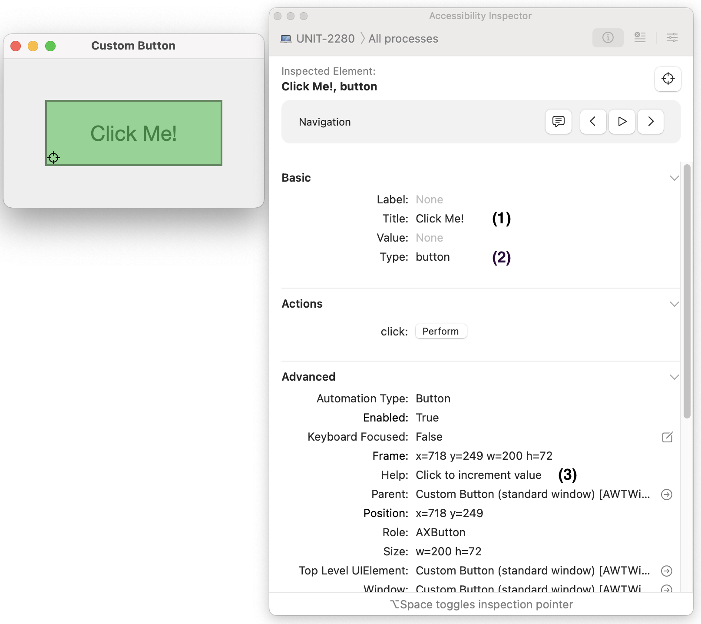

# Accessibility support

## Platform Support

| Platform | Status                            |
|----------|-----------------------------------|
| MacOS    | Supported                         |
| Windows  | Supported with Java Access Bridge |
| Linux    | Not supported                     |

## Custom widget with semantic rules

```kotlin
import androidx.compose.foundation.*
import androidx.compose.foundation.layout.*
import androidx.compose.material.Text
import androidx.compose.runtime.*
import androidx.compose.ui.*
import androidx.compose.ui.graphics.Color
import androidx.compose.ui.semantics.*
import androidx.compose.ui.unit.*
import androidx.compose.ui.window.*

fun main() = singleWindowApplication(
    title = "Custom Button", state = WindowState(size = DpSize(300.dp, 200.dp))
) {
    var count by remember { mutableStateOf(0) }

    Box(modifier = Modifier.padding(50.dp)) {
        Box(modifier = Modifier
            .background(Color.LightGray)
            .fillMaxSize()
            .clickable { count += 1 }
            .semantics(mergeDescendants = true /* Use text from the contents (1) */) {
                // This is a button (2)
                role = Role.Button
                // Add some help text to button (3)
                contentDescription = "Click to increment value"
            }
        ) {
            val text = when (count) {
                0 -> "Click Me!"
                1 -> "Clicked"
                else -> "Clicked $count times"
            }
            Text(text, modifier = Modifier.align(Alignment.Center), fontSize = 24.sp)
        }
    }
}
```



# Windows
Accessibility on Windows is provided by Java Access Bridge and is disabled by default. To enable it, run the following command in Command Prompt.

```cmd
%JAVA_HOME%\bin\jabswitch.exe /enable
```

There are some issues with HiDPI display support on windows, see [Desktop Accessibility on Windows](Windows.md) for details.
