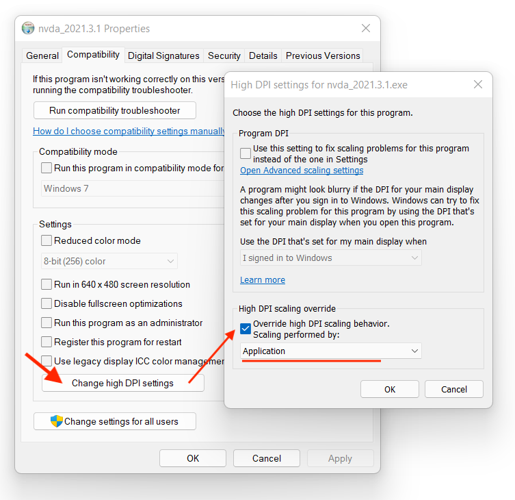

# Desktop Accessibility on Windows

## Enabling Java Accessibility on Windows
Java Access Bridge is disabled by default. To enable it, run

```cmd
%JAVA_HOME%\bin\jabswitch.exe /enable
```

## HiDPI issues
### JDK support
HiDPI support in Access Bridge was landed in [JDK-8279227](https://bugs.openjdk.java.net/browse/JDK-8279227). As for Feb/01/2022 this feature is not included in any released JDK, OpenJDK 17.0.4 release with this feature is planned for May 2022.

### NVDA workaround
NVDA 2021.3.1 does not handle widget position properly. Until they fix it we can override DPI awareness in NVDA compatibility settings as shown:



