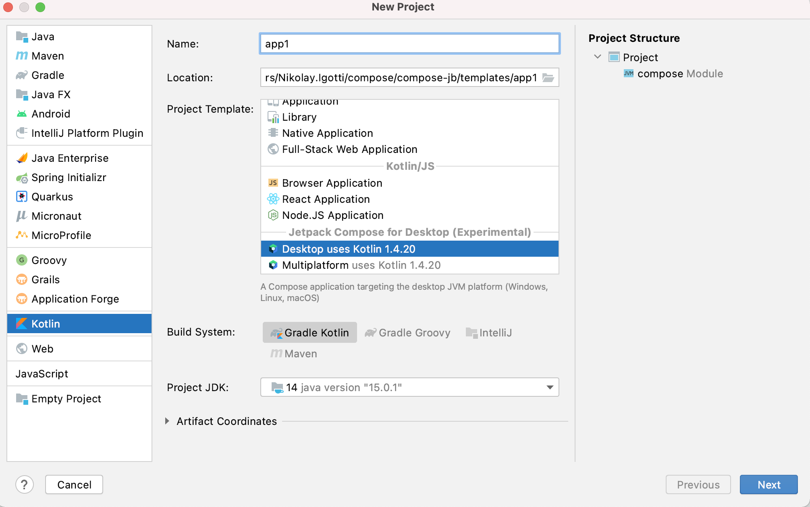
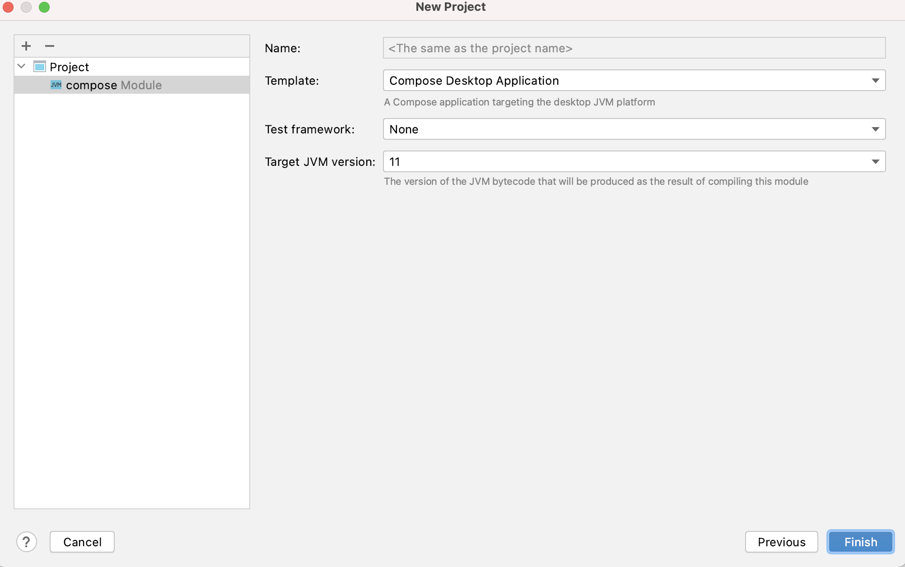
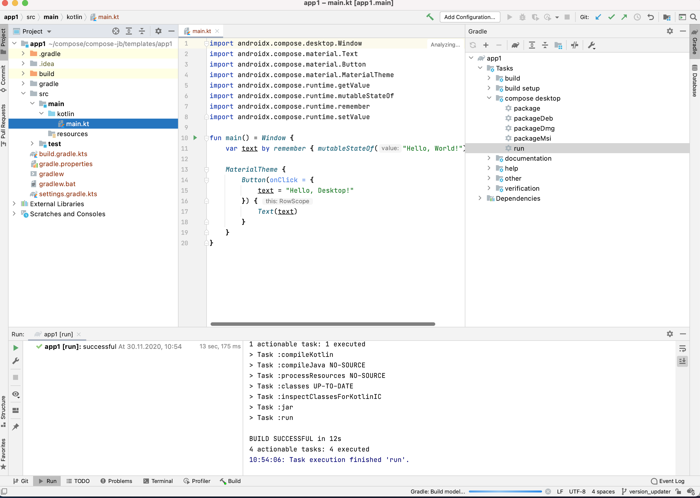
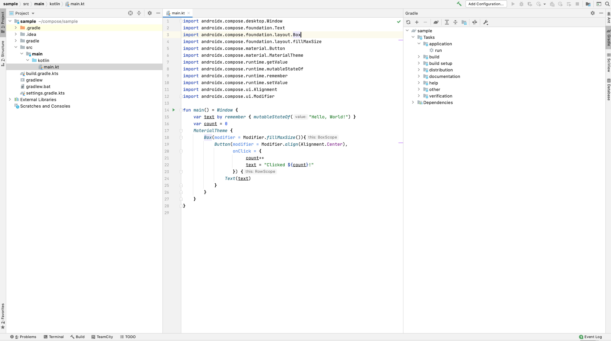
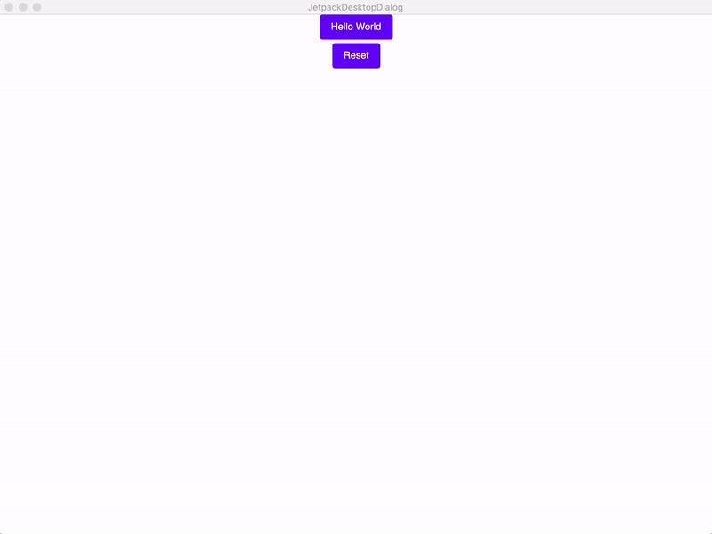

# Getting Started with Compose for Desktop

## What is covered

In this tutorial we will create a simple desktop UI application
using the Compose UI framework.

## Prerequisites

 Compose for Desktop can produce applications for macOS, Linux and Windows platforms,
and so any of these platforms can be used for this tutorial.

The following software has to be preinstalled:
   * JDK 11 or later
   * IntelliJ IDEA Community Edition or Ultimate Edition 20.2 or later (other editors could be used, but we assume you are using IntelliJ IDEA in this tutorial)

## Creating a new project

### New project wizard

Kotlin support in IDEA IDE starting with the version 2020.3 comes with the new project wizard
capable to create a Compose application automatically.

Note that JDK must be at least JDK 11, and to use the native distribution
packaging JDK 15 or later must be used.







### Update the wizard plugin

The Сompose plugin version used in the wizard above may be not the last. Update the version of the plugin to the latest available by editing the `build.gradle.kts` file, finding and updating the version information as shown below. In this example the latest version of the plugin was 1.0.0-alpha1-rc1 and a compatible version of kotlin was 1.5.21. For the latest versions, see the [latest versions](https://github.com/JetBrains/compose-jb/releases) site and the [Kotlin](https://kotlinlang.org/) site.
```
plugins {
    kotlin("jvm") version "1.5.21"
    id("org.jetbrains.compose") version "1.0.0-alpha1-rc1"
}
```

### Create new Compose project without the wizard

It is also possible to create Compose project manually.

The recommended way of building Compose for Desktop projects is by using Gradle.
JetBrains provides a simple way of building Compose for Desktop projects
using a special Gradle plugin.

One could clone an existing template for a [desktop](https://github.com/JetBrains/compose-jb/tree/master/templates/desktop-template) or
[multiplatform](https://github.com/JetBrains/compose-jb/tree/master/templates/multiplatform-template) application, or create it from scratch.

First create a new directory, named `sample`.
```shell script
mkdir sample
cd sample
```

Create `settings.gradle.kts` as follows:
``` kotlin
pluginManagement {
    repositories {
        gradlePluginPortal()
        maven("https://maven.pkg.jetbrains.space/public/p/compose/dev")
    }
}
```
Then create `build.gradle.kts` with the following content:
``` kotlin
import org.jetbrains.compose.compose

plugins {
    kotlin("jvm") version "1.5.21"
    id("org.jetbrains.compose") version "1.0.0-alpha1-rc1"
}

repositories {
    mavenCentral()
    maven("https://maven.pkg.jetbrains.space/public/p/compose/dev")
    google()
}

dependencies {
    implementation(compose.desktop.currentOs)
}

compose.desktop {
    application {
        mainClass = "MainKt"
    }
}
```
Then create `src/main/kotlin/main.kt` and put the following code in there:
```kotlin
import androidx.compose.foundation.layout.Arrangement
import androidx.compose.foundation.layout.Column
import androidx.compose.foundation.layout.fillMaxSize
import androidx.compose.material.Button
import androidx.compose.material.MaterialTheme
import androidx.compose.material.Text
import androidx.compose.runtime.mutableStateOf
import androidx.compose.runtime.remember
import androidx.compose.ui.Alignment
import androidx.compose.ui.Modifier
import androidx.compose.ui.unit.dp
import androidx.compose.ui.window.Window
import androidx.compose.ui.window.application
import androidx.compose.ui.window.rememberWindowState

fun main() = application {
    Window(
        onCloseRequest = ::exitApplication,
        title = "Compose for Desktop",
        state = rememberWindowState(width = 300.dp, height = 300.dp)
    ) {
        val count = remember { mutableStateOf(0) }
        MaterialTheme {
            Column(Modifier.fillMaxSize(), Arrangement.spacedBy(5.dp)) {
                Button(modifier = Modifier.align(Alignment.CenterHorizontally),
                    onClick = {
                        count.value++
                    }) {
                    Text(if (count.value == 0) "Hello World" else "Clicked ${count.value}!")
                }
                Button(modifier = Modifier.align(Alignment.CenterHorizontally),
                    onClick = {
                        count.value = 0
                    }) {
                    Text("Reset")
                }
            }
        }
    }
}
```
## Running the project

Open `build.gradle.kts` as a project in IntelliJ IDEA.



After you download the Compose for Desktop dependencies from the Maven repositories your new project is ready
to go. Open the Gradle toolbar on the right, and select `sample/Tasks/compose desktop/run`.
The first run may take some time, but afterwards the following dialog will be shown:



You can click on the button several times and see that the application reacts and
updates the UI.
