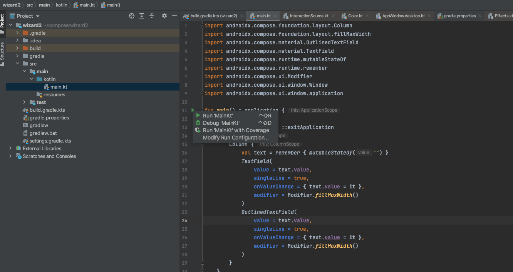

# Getting Started with Compose Multiplatform

## What is covered

In this tutorial we will create a simple desktop UI application
using the Compose Multiplatform UI framework.

## Prerequisites

 Compose for Desktop can produce applications for macOS, Linux and Windows platforms.
So any of these platforms can be used for this tutorial.

The following software must be preinstalled:
   * JDK 11 or later
   * IntelliJ IDEA Community Edition or Ultimate Edition 2020.3 or later (other editors could be used, but we assume you are using IntelliJ IDEA in this tutorial)

## Creating a new project

### New project wizard

Starting with the version 2020.3, Kotlin support in IDEA comes with the new project wizard,
which creates a Compose application automatically.

Note that JDK must be at least JDK 11, and to use the native distribution
packaging, JDK 15 or later must be used.


### IDE plugin

Compose Multiplatform [IDEA plugin](https://plugins.jetbrains.com/plugin/16541-compose-multiplatform-ide-support)
can simplify compose development by adding support for the `@Preview` annotation on argument-less
`@Composable` functions. You can see how a particular composable function looks
directly in the IDE panel. This plugin can also be installed via the plugins marketplace.
Just search for "Compose Multiplatform".

### Update the wizard plugin

The Compose plugin version used in the wizard above might not be the latest. Update to the latest plugin version by editing the `build.gradle.kts` file and updating the version information as shown below. 
For the latest versions, see the [latest versions](https://github.com/JetBrains/compose-jb/releases) site and the [Kotlin](https://kotlinlang.org/) site.
```
plugins {
    kotlin("jvm") version "1.7.20"
    id("org.jetbrains.compose") version "1.2.0"
}
```

### Create a new Compose project without the wizard

It is also possible to create a Compose project manually.

The recommended way to build Compose for Desktop projects is with Gradle.
JetBrains provides a simple way of building Compose for Desktop projects
using a special Gradle plugin.

You can clone an existing template for a [desktop](https://github.com/JetBrains/compose-jb/tree/master/templates/desktop-template) or
[multiplatform](https://github.com/JetBrains/compose-jb/tree/master/templates/multiplatform-template) application, or create it from scratch.

First create a new directory, named `sample`.
```shell script
mkdir sample
cd sample
```

Create `settings.gradle.kts` as follows:
``` kotlin
pluginManagement {
    repositories {
        gradlePluginPortal()
        maven("https://maven.pkg.jetbrains.space/public/p/compose/dev")
    }
}
```
Then create `build.gradle.kts` with the following content:
``` kotlin
plugins {
    kotlin("jvm") version "1.7.20"
    id("org.jetbrains.compose") version "1.2.0"
}

repositories {
    mavenCentral()
    maven("https://maven.pkg.jetbrains.space/public/p/compose/dev")
    google()
}

dependencies {
    implementation(compose.desktop.currentOs)
}

compose.desktop {
    application {
        mainClass = "MainKt"
    }
}
```
Then create `src/main/kotlin/main.kt` and put the following code in it:
```kotlin
import androidx.compose.foundation.layout.Arrangement
import androidx.compose.foundation.layout.Column
import androidx.compose.foundation.layout.fillMaxSize
import androidx.compose.material.Button
import androidx.compose.material.MaterialTheme
import androidx.compose.material.Text
import androidx.compose.runtime.mutableStateOf
import androidx.compose.runtime.remember
import androidx.compose.ui.Alignment
import androidx.compose.ui.Modifier
import androidx.compose.ui.unit.dp
import androidx.compose.ui.window.Window
import androidx.compose.ui.window.application
import androidx.compose.ui.window.rememberWindowState

fun main() = application {
    Window(
        onCloseRequest = ::exitApplication,
        title = "Compose for Desktop",
        state = rememberWindowState(width = 300.dp, height = 300.dp)
    ) {
        val count = remember { mutableStateOf(0) }
        MaterialTheme {
            Column(Modifier.fillMaxSize(), Arrangement.spacedBy(5.dp)) {
                Button(modifier = Modifier.align(Alignment.CenterHorizontally),
                    onClick = {
                        count.value++
                    }) {
                    Text(if (count.value == 0) "Hello World" else "Clicked ${count.value}!")
                }
                Button(modifier = Modifier.align(Alignment.CenterHorizontally),
                    onClick = {
                        count.value = 0
                    }) {
                    Text("Reset")
                }
            }
        }
    }
}
```
## Running the project

Open `build.gradle.kts` [as a project](https://www.jetbrains.com/help/idea/jetgradle-tool-window.html) in IntelliJ IDEA.


After you download the Compose for Desktop dependencies from the Maven repositories, your new project is ready
to go. Open the Gradle toolbar on the right and select `sample/Tasks/compose desktop/run`.
The first run may take some time. Afterwards, the following dialog will be shown:


You can click on the button several times and see that the application reacts and
updates the UI.

Running and debugging the `main()` function using run gutter is also supported.



## Next steps

Congratulations on getting your first Compose Multiplatform project working!  We encourage you to continue playing around with the areas that interest you, and look forward to seeing what you build!  When you're ready to continue learning, we have many more great tutorials available here: [Compose Multiplatform Tutorials](https://github.com/JetBrains/compose-jb#tutorials).

We also have some more advanced [Compose Multiplatorm Example Projects](https://github.com/JetBrains/compose-jb#examples) that you can learn from.
