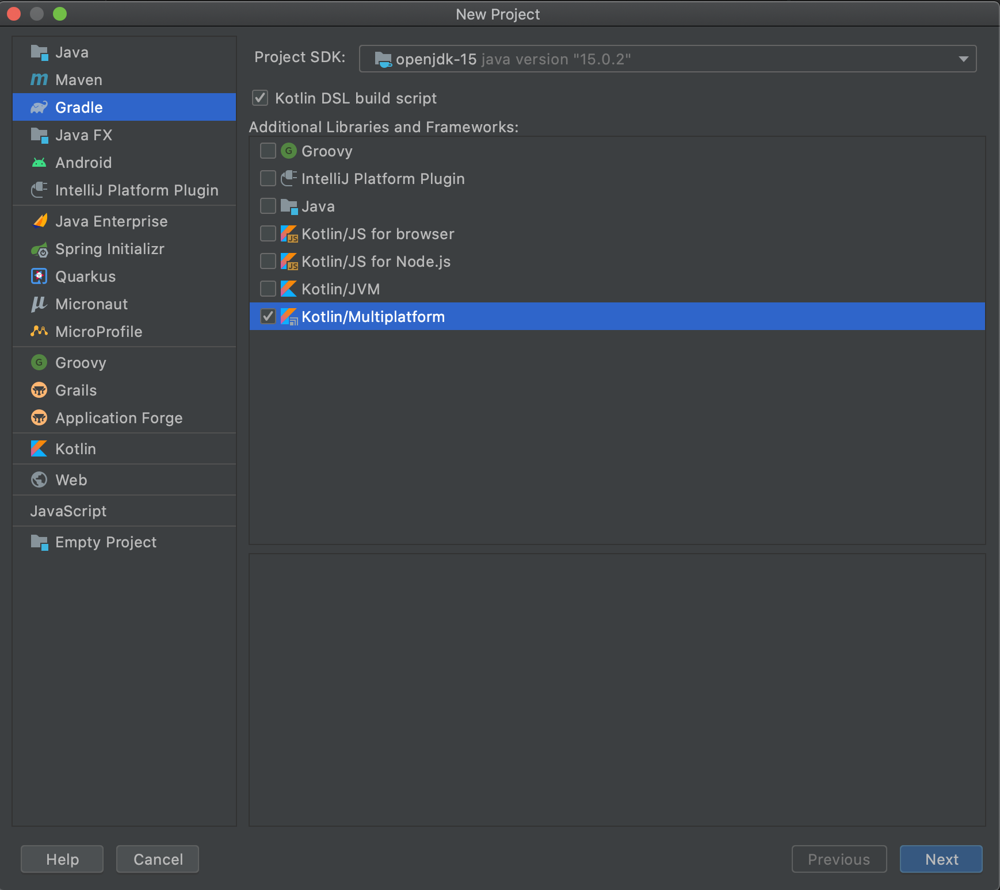
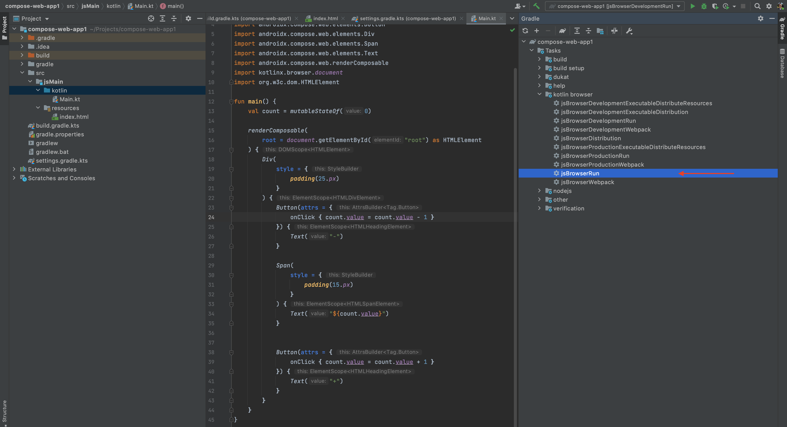
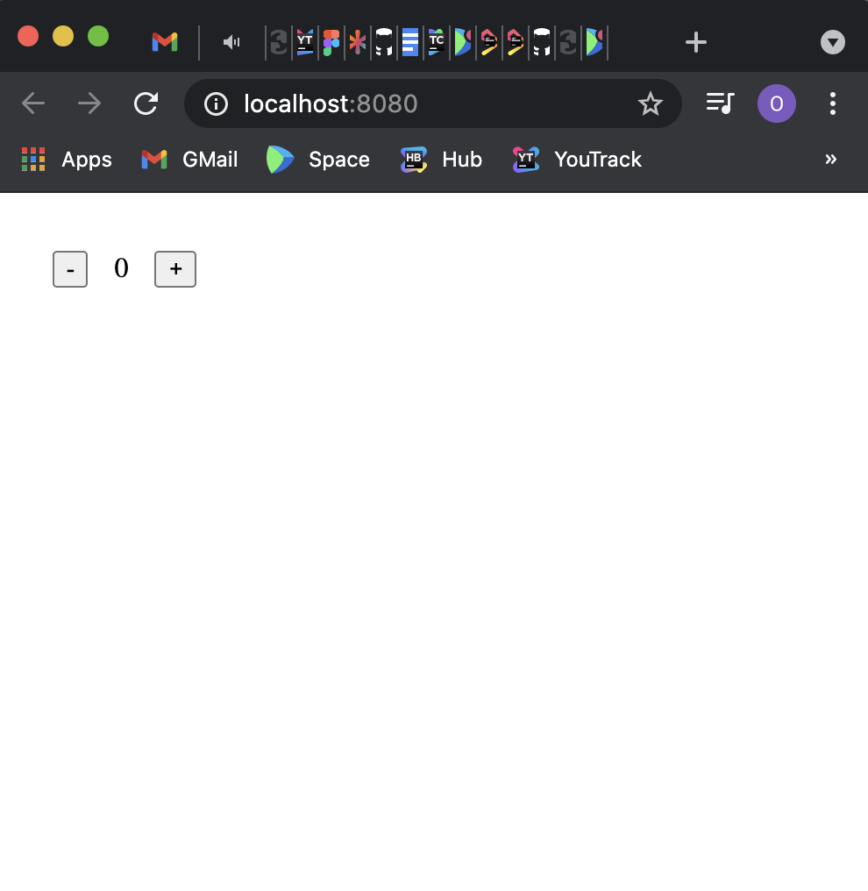

# Getting started with the Compose HTML library

In this tutorial, we will create a simple web UI application using the Compose HTML Library.

## Prerequisites

You need to have the following software installed before you begin:
* JDK 11 or later
* IntelliJ IDEA Community Edition or Ultimate Edition 2020.2 or later (you can use other editors, but for this tutorial we assume you are using IntelliJ IDEA)

## Creating a new project

You can create the project by [downloading the template here](https://github.com/JetBrains/compose-multiplatform-html-library-template).

If you want to create the project manually, perform the following steps:

#### 1. Create a Kotlin Multiplatform project:
- Select `Gradle` on the left menu
- Tick `Kotlin DSL build script`
- Tick `Kotlin/Multiplatform`




#### 2. Update `settings.gradle.kts`:
``` kotlin
pluginManagement {
    repositories {
        gradlePluginPortal()
        maven("https://maven.pkg.jetbrains.space/public/p/compose/dev")
    }
}
```

#### 3. Update `build.gradle.kts`:
``` kotlin
// Add compose gradle plugin
plugins {
    kotlin("multiplatform") version "2.2.21"
    id("org.jetbrains.compose") version "1.9.0"
}

// Add maven repositories
repositories {
    mavenCentral()
    maven("https://maven.pkg.jetbrains.space/public/p/compose/dev")
    google()
}

// Enable JS(IR) target and add dependencies
kotlin {
    js(IR) {
        browser()
        binaries.executable()
    }
    sourceSets {
        val jsMain by getting {
            dependencies {
                implementation("org.jetbrains.compose.html:html-core:1.9.0")
                implementation("org.jetbrains.compose:compose-runtime:1.9.0")
            }
        }
    }
}
```

#### 5. Add the following directories to the project:
- src/jsMain/kotlin
- src/jsMain/resources

#### 6. Add the `index.html` file to the `resources`:
```html
<!DOCTYPE html>
<html lang="en">
<head>
    <meta charset="UTF-8">
    <title>Sample</title>
</head>
<body>
  <div id="root"></div>
  <script src="REPLACE_WITH_YOUR_MODULE_NAME.js"></script>
</body>
</html>
```

#### 7. Add the `Main.kt` file to the `kotlin`:
```kotlin
import androidx.compose.runtime.mutableStateOf
import androidx.compose.runtime.getValue
import androidx.compose.runtime.setValue
import androidx.compose.runtime.Composable
import org.jetbrains.compose.web.attributes.*
import org.jetbrains.compose.web.css.*
import org.jetbrains.compose.web.dom.*
import org.jetbrains.compose.web.renderComposable

fun main() {
    var count: Int by mutableStateOf(0)

    renderComposable(rootElementId = "root") {
        Div({ style { padding(25.px) } }) {
            Button(attrs = {
                onClick { count -= 1 }
            }) {
                Text("-")
            }

            Span({ style { padding(15.px) } }) {
                Text("$count")
            }

            Button(attrs = {
                onClick { count += 1 }
            }) {
                Text("+")
            }
        }
    }
}
```

## Running the project

Use the command line to run:

```shell
./gradlew jsBrowserRun
```

Instead of manually compiling and executing a Kotlin/JS project every time you want to see the changes you made, you can use the continuous compilation mode:
```shell
./gradlew jsBrowserRun --continuous
```

Or run it from the IDE:



The browser will open `localhost:8080`:



## Common issues when running the project

#### [webpack-cli] Unable to load '@webpack-cli/serve' command
https://youtrack.jetbrains.com/issue/KT-49124
```
[webpack-cli] Unable to load '@webpack-cli/serve' command
[webpack-cli] TypeError: options.forEach is not a function
...
```
There is a temporary workaround:
```
In build.gradle.kts:

// a temporary workaround for a bug in jsRun invocation - see https://youtrack.jetbrains.com/issue/KT-48273
afterEvaluate {
    rootProject.extensions.configure<org.jetbrains.kotlin.gradle.targets.js.nodejs.NodeJsRootExtension> {
        versions.webpackDevServer.version = "4.0.0"
        versions.webpackCli.version = "4.9.0"
    }
}
```
