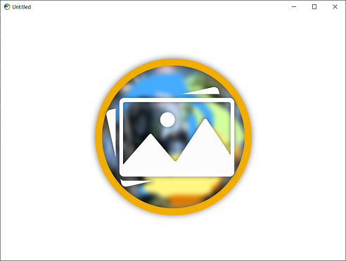

# Image and in-app icons manipulations

## What is covered

In this tutorial we will show you how to work with images using Compose for Desktop.

## Loading images from resources

Using images from application resources is very simple. Suppose we have a PNG image that is placed in the `resources` directory in our project. For this tutorial we will use the image sample:


```kotlin
import androidx.compose.foundation.Image
import androidx.compose.foundation.layout.fillMaxSize
import androidx.compose.ui.Modifier
import androidx.compose.ui.res.painterResource
import androidx.compose.ui.window.singleWindowApplication

fun main() = singleWindowApplication {
    Image(
        painter = painterResource("sample.png"),
        contentDescription = "Sample",
        modifier = Modifier.fillMaxSize()
    )
}
```

`painterResource` supports raster (BMP, GIF, HEIF, ICO, JPEG, PNG, WBMP, WebP) and vector formats (SVG, [XML vector drawable](https://developer.android.com/guide/topics/graphics/vector-drawable-resources)).


## Loading images from device storage asynchronously

To load an image stored in the device memory you can use `loadImageBitmap`, `loadSvgPainter` or `loadXmlImageVector`. The example below shows how to use them to load an image asynchronously.

```kotlin
import androidx.compose.foundation.Image
import androidx.compose.foundation.layout.Column
import androidx.compose.foundation.layout.width
import androidx.compose.runtime.Composable
import androidx.compose.runtime.getValue
import androidx.compose.runtime.produceState
import androidx.compose.runtime.remember
import androidx.compose.ui.Modifier
import androidx.compose.ui.graphics.ImageBitmap
import androidx.compose.ui.graphics.painter.BitmapPainter
import androidx.compose.ui.graphics.painter.Painter
import androidx.compose.ui.graphics.vector.ImageVector
import androidx.compose.ui.graphics.vector.rememberVectorPainter
import androidx.compose.ui.layout.ContentScale
import androidx.compose.ui.platform.LocalDensity
import androidx.compose.ui.res.loadImageBitmap
import androidx.compose.ui.res.loadSvgPainter
import androidx.compose.ui.res.loadXmlImageVector
import androidx.compose.ui.unit.Density
import androidx.compose.ui.unit.dp
import androidx.compose.ui.window.singleWindowApplication
import kotlinx.coroutines.Dispatchers
import kotlinx.coroutines.withContext
import org.xml.sax.InputSource
import java.io.File
import java.io.IOException

fun main() = singleWindowApplication {
    val density = LocalDensity.current
    Column {
        AsyncImage(
            load = { loadImageBitmap(File("sample.png")) },
            painterFor = { remember { BitmapPainter(it) } },
            contentDescription = "Sample",
            modifier = Modifier.width(200.dp)
        )
        AsyncImage(
            load = { loadSvgPainter(File("idea-logo.svg"), density) },
            painterFor = { it },
            contentDescription = "Idea logo",
            contentScale = ContentScale.FillWidth,
            modifier = Modifier.width(200.dp)
        )
        AsyncImage(
            load = { loadXmlImageVector(File("compose-logo.xml"), density) },
            painterFor = { rememberVectorPainter(it) },
            contentDescription = "Compose logo",
            contentScale = ContentScale.FillWidth,
            modifier = Modifier.width(200.dp)
        )
    }
}

@Composable
fun <T> AsyncImage(
    load: suspend () -> T,
    painterFor: @Composable (T) -> Painter,
    contentDescription: String,
    modifier: Modifier = Modifier,
    contentScale: ContentScale = ContentScale.Fit,
) {
    val image: T? by produceState<T?>(null) {
        value = withContext(Dispatchers.IO) {
            try {
                load()
            } catch (e: IOException) {
                e.printStackTrace()
                null
            }
        }
    }

    if (image != null) {
        Image(
            painter = painterFor(image!!),
            contentDescription = contentDescription,
            contentScale = contentScale,
            modifier = modifier
        )
    }
}

fun loadImageBitmap(file: File): ImageBitmap =
    file.inputStream().buffered().use(::loadImageBitmap)

fun loadSvgPainter(file: File, density: Density): Painter =
    file.inputStream().buffered().use { loadSvgPainter(it, density) }

fun loadXmlImageVector(file: File, density: Density): ImageVector =
    file.inputStream().buffered().use { loadXmlImageVector(InputSource(it), density) }
```


[PNG](sample.png)

[SVG](../../artwork/idea-logo.svg)

[XML vector drawable](../../artwork/compose-logo.xml)

## Drawing images using Canvas
```kotlin
import androidx.compose.foundation.Canvas
import androidx.compose.foundation.layout.fillMaxSize
import androidx.compose.runtime.remember
import androidx.compose.ui.Modifier
import androidx.compose.ui.geometry.Offset
import androidx.compose.ui.geometry.Size
import androidx.compose.ui.graphics.Paint
import androidx.compose.ui.graphics.drawscope.drawIntoCanvas
import androidx.compose.ui.graphics.vector.rememberVectorPainter
import androidx.compose.ui.graphics.withSave
import androidx.compose.ui.platform.LocalDensity
import androidx.compose.ui.res.loadImageBitmap
import androidx.compose.ui.res.loadSvgPainter
import androidx.compose.ui.res.loadXmlImageVector
import androidx.compose.ui.res.useResource
import androidx.compose.ui.window.singleWindowApplication
import org.xml.sax.InputSource

fun main() = singleWindowApplication {
    val density = LocalDensity.current // to calculate the intrinsic size of vector images (SVG, XML)

    val sample = remember {
        useResource("sample.png", ::loadImageBitmap)
    }
    val ideaLogo = remember {
        useResource("idea-logo.svg") { loadSvgPainter(it, density) }
    }
    val composeLogo = rememberVectorPainter(
        remember {
            useResource("compose-logo.xml") { loadXmlImageVector(InputSource(it), density) }
        }
    )

    Canvas(
        modifier = Modifier.fillMaxSize()
    ) {
        drawIntoCanvas { canvas ->
            canvas.withSave {
                canvas.drawImage(sample, Offset.Zero, Paint())
                canvas.translate(sample.width.toFloat(), 0f)
                with(ideaLogo) {
                    draw(ideaLogo.intrinsicSize)
                }
                canvas.translate(ideaLogo.intrinsicSize.width, 0f)
                with(composeLogo) {
                    draw(Size(100f, 100f))
                }
            }
        }
    }
}
```

[PNG](sample.png)

[SVG](../../artwork/idea-logo.svg)

[XML vector drawable](../../artwork/compose-logo.xml)

## Setting the application window icon

You can set the icon for the window via parameter in the `Window` function.

Note that to change the icon on the taskbar on some OS (macOs), you should change icon in [build.gradle](https://github.com/JetBrains/compose-jb/tree/sync/2021-07-23/tutorials/Native_distributions_and_local_execution#app-icon)

```kotlin
import androidx.compose.foundation.layout.Box
import androidx.compose.foundation.layout.fillMaxSize
import androidx.compose.ui.Modifier
import androidx.compose.ui.draw.paint
import androidx.compose.ui.res.painterResource
import androidx.compose.ui.window.Window
import androidx.compose.ui.window.application

fun main() = application {
    val icon = painterResource("sample.png")
    Window(
        onCloseRequest = ::exitApplication,
        icon = icon
    ) {
        Box(Modifier.paint(icon).fillMaxSize())
    }
}
```



## Setting the application tray icon

You can create a tray icon for your application:

```kotlin
import androidx.compose.foundation.Image
import androidx.compose.foundation.layout.fillMaxSize
import androidx.compose.ui.Modifier
import androidx.compose.ui.res.painterResource
import androidx.compose.ui.window.Tray
import androidx.compose.ui.window.Window
import androidx.compose.ui.window.application

fun main() = application {
    val icon = painterResource("sample.png")

    Tray(
        icon = icon,
        menu = {
            Item("Quit App", onClick = ::exitApplication)
        }
    )

    Window(onCloseRequest = ::exitApplication, icon = icon) {
        Image(
            painter = icon,
            contentDescription = "Icon",
            modifier = Modifier.fillMaxSize()
        )
    }
}
```


