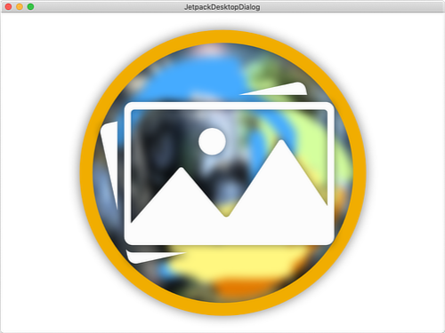

# Image and in-app icons manipulations

## What is covered

In this tutorial we will show you how to work with images using Compose for Desktop.

## Loading images from resources

Using images from application resources is very simple. Suppose we have a PNG image that is placed in the `resources/images` directory in our project. For this tutorial we will use the image sample:


```kotlin
import androidx.compose.desktop.Window
import androidx.compose.foundation.Image
import androidx.compose.foundation.layout.fillMaxSize
import androidx.compose.ui.Modifier
import androidx.compose.ui.res.imageResource

fun main() {
    Window {
        Image(
            asset = imageResource("images/sample.png"), // ImageAsset
            modifier = Modifier.fillMaxSize()
        )
    }
}
```



## Loading images from device storage

To create `ImageAsset` from a loaded image stored in device memory you can use skija `Image`:

```kotlin
import androidx.compose.desktop.Window
import androidx.compose.foundation.Image
import androidx.compose.foundation.layout.fillMaxSize
import androidx.compose.runtime.Composable
import androidx.compose.runtime.remember
import androidx.compose.ui.graphics.asImageAsset
import androidx.compose.ui.graphics.ImageAsset
import androidx.compose.ui.Modifier
import java.io.File
import org.jetbrains.skija.Image

fun main() {
    Window {
        val image = remember { imageFromFile(File("sample.png")) }
        Image(
            asset = image,
            modifier = Modifier.fillMaxSize()
        )
    }
}

fun imageFromFile(file: File): ImageAsset {
    return Image.makeFromEncoded(file.readBytes()).asImageAsset()
}

@Composable
fun imageFile(file: File): ImageAsset {
    return remember(file) { imageFromFile(file) }
}
```


## Drawing raw image data using native canvas

Sometimes you may want to draw raw image data, in which case you can use `Canvas` and` drawIntoCanvas`.

```kotlin
import androidx.compose.desktop.Window
import androidx.compose.foundation.Canvas
import androidx.compose.foundation.layout.fillMaxSize
import androidx.compose.runtime.remember
import androidx.compose.ui.graphics.drawscope.drawIntoCanvas
import androidx.compose.ui.graphics.nativeCanvas
import androidx.compose.ui.Modifier
import java.awt.image.BufferedImage
import java.io.ByteArrayOutputStream
import java.io.File
import javax.imageio.ImageIO
import org.jetbrains.skija.ColorAlphaType
import org.jetbrains.skija.Bitmap
import org.jetbrains.skija.ImageInfo
import org.jetbrains.skija.IRect

fun main() {
    Window {
        val bitmap = remember { bitmapFromByteArray() }
        Canvas(
            modifier = Modifier.fillMaxSize()
        ) {
            drawIntoCanvas { canvas ->
                canvas.nativeCanvas.drawBitmapRect(
                    bitmap,
                    IRect(0, 0, bitmap.getWidth(), bitmap.getHeight()).toRect()
                )
            }
        }
    }
}

fun bitmapFromByteArray(): Bitmap {
    var image: BufferedImage? = null
    try {
        image = ImageIO.read(File("sample.png"))
    } catch (e: Exception) {
        // image file does not exist
    }

    if (image == null) {
        image = BufferedImage(1, 1, BufferedImage.TYPE_INT_RGB)
    }
    val pixels = getBytes(image) // assume we only have raw pixels

    // allocate and fill skija Bitmap
    val bitmap = Bitmap()
    bitmap.allocPixels(ImageInfo.makeS32(image.width, image.height, ColorAlphaType.PREMUL))
    bitmap.installPixels(bitmap.getImageInfo(), pixels, (image.width * 4).toLong())

    return bitmap
}

// creating byte array from BufferedImage
private fun getBytes(image: BufferedImage): ByteArray {
    val width = image.width
    val height = image.height

    val buffer = IntArray(width * height)
    image.getRGB(0, 0, width, height, buffer, 0, width)

    val pixels = ByteArray(width * height * 4)

    var index = 0
    for (y in 0 until height) {
        for (x in 0 until width) {
            val pixel = buffer[y * width + x]
            pixels[index++] = ((pixel and 0xFF)).toByte() // Blue component
            pixels[index++] = (((pixel shr 8) and 0xFF)).toByte() // Green component
            pixels[index++] = (((pixel shr 16) and 0xFF)).toByte() // Red component
            pixels[index++] = (((pixel shr 24) and 0xFF)).toByte() // Alpha component
        }
    }

    return pixels
}
```


## Setting the application window icon

You have 2 ways to set icon for window:
1. Via parameter in `Window` function (or in `AppWindow` constructor)

```kotlin
import androidx.compose.desktop.Window
import androidx.compose.foundation.Image
import androidx.compose.foundation.layout.fillMaxSize
import androidx.compose.runtime.remember
import androidx.compose.ui.graphics.asImageAsset
import androidx.compose.ui.graphics.ImageAsset
import androidx.compose.ui.Modifier
import java.awt.image.BufferedImage
import java.io.ByteArrayOutputStream
import java.io.File
import javax.imageio.ImageIO
import org.jetbrains.skija.Image

fun main() {
    val image = getWindowIcon()
    Window(
        icon = image
    ) {
        val imageAsset = remember { asImageAsset(image) }
        Image(
            asset = imageAsset,
            modifier = Modifier.fillMaxSize()
        )
    }
}

fun getWindowIcon(): BufferedImage {
    var image: BufferedImage? = null
    try {
        image = ImageIO.read(File("sample.png"))
    } catch (e: Exception) {
        // image file does not exist
    }

    if (image == null) {
        image = BufferedImage(1, 1, BufferedImage.TYPE_INT_RGB)
    }

    return image
}

fun asImageAsset(image: BufferedImage): ImageAsset {
    val baos = ByteArrayOutputStream()
    ImageIO.write(image, "png", baos)
    
    return Image.makeFromEncoded(baos.toByteArray()).asImageAsset()
}
```

2. Using `setIcon()` method

```kotlin
import androidx.compose.desktop.AppManager
import androidx.compose.desktop.Window
import androidx.compose.foundation.Image
import androidx.compose.foundation.layout.fillMaxSize
import androidx.compose.runtime.remember
import androidx.compose.ui.graphics.asImageAsset
import androidx.compose.ui.graphics.ImageAsset
import androidx.compose.ui.Modifier
import java.awt.image.BufferedImage
import java.io.ByteArrayOutputStream
import java.io.File
import javax.imageio.ImageIO
import org.jetbrains.skija.Image

fun main() {
    val image = getWindowIcon()
    Window {
        val imageAsset = remember { asImageAsset(image) }
        Image(
            asset = imageAsset,
            modifier = Modifier.fillMaxSize()
        )
    }

    val current = AppManager.focusedWindow
    if (current != null) {
        current.setIcon(image)
    }
}

fun getWindowIcon(): BufferedImage {
    var image: BufferedImage? = null
    try {
        image = ImageIO.read(File("sample.png"))
    } catch (e: Exception) {
        // image file does not exist
    }

    if (image == null) {
        image = BufferedImage(1, 1, BufferedImage.TYPE_INT_RGB)
    }

    return image
}

fun asImageAsset(image: BufferedImage): ImageAsset {
    val baos = ByteArrayOutputStream()
    ImageIO.write(image, "png", baos)
    
    return Image.makeFromEncoded(baos.toByteArray()).asImageAsset()
}
```


## Setting the application tray icon

You can create tray icon for your application:

```kotlin
import androidx.compose.desktop.AppManager
import androidx.compose.desktop.Window
import androidx.compose.foundation.Image
import androidx.compose.foundation.layout.fillMaxSize
import androidx.compose.runtime.onActive
import androidx.compose.runtime.onDispose
import androidx.compose.ui.graphics.asImageAsset
import androidx.compose.ui.graphics.ImageAsset
import androidx.compose.ui.Modifier
import androidx.compose.ui.window.Tray
import androidx.compose.ui.window.MenuItem
import java.awt.image.BufferedImage
import java.io.ByteArrayOutputStream
import java.io.File
import javax.imageio.ImageIO
import org.jetbrains.skija.Image

fun main() {
    val image = getWindowIcon()
    Window {
        onActive {
            val tray = Tray().apply {
                icon(getWindowIcon())
                menu(
                    MenuItem(
                        name = "Quit App",
                        onClick = { AppManager.exit() }
                    )
                )
            }
            onDispose {
                tray.remove()
            }
        }

        val imageAsset = asImageAsset(image)
        Image(
            asset = imageAsset,
            modifier = Modifier.fillMaxSize()
        )
    }

    val current = AppManager.focusedWindow
    if (current != null) {
        current.setIcon(image)
    }
}

fun getWindowIcon(): BufferedImage {
    var image: BufferedImage? = null
    try {
        image = ImageIO.read(File("sample.png"))
    } catch (e: Exception) {
        // image file does not exist
    }

    if (image == null) {
        image = BufferedImage(1, 1, BufferedImage.TYPE_INT_RGB)
    }

    return image
}

fun asImageAsset(image: BufferedImage): ImageAsset {
    val baos = ByteArrayOutputStream()
    ImageIO.write(image, "png", baos)
    
    return Image.makeFromEncoded(baos.toByteArray()).asImageAsset()
}
```


