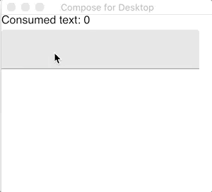
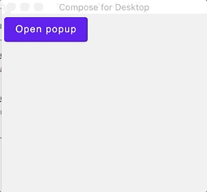

# Keyboard events handling

## Prerequisites

This tutorial expects that you have already set up the Compose project as described in the [Getting Started tutorial](../Getting_Started)

## What is covered

In this tutorial, we will look at two different ways of handling keyboard events in Compose for Desktop as well as the utilities that we have to do this.

## Event handlers

There are two ways to handle key events in Compose for Desktop:

- By setting up an event handler based on the element that is in focus
- By setting up an event handler in the scope of the window

## Focus related events

It works the same as Compose for Android, for details see [API Reference](https://developer.android.com/reference/kotlin/androidx/compose/ui/input/key/package-summary#keyinputfilter)

The most common use case is to define keyboard handlers for active controls like `TextField`. You can use both `onKeyEvent` and `onPreviewKeyEvent` but the last one is usually preferable to define shortcuts while it guarantees you that key events will not be consumed by children components. Here is an example:

```kotlin
import androidx.compose.foundation.layout.Arrangement
import androidx.compose.foundation.layout.Column
import androidx.compose.foundation.layout.fillMaxSize
import androidx.compose.material.MaterialTheme
import androidx.compose.material.Text
import androidx.compose.material.TextField
import androidx.compose.runtime.getValue
import androidx.compose.runtime.mutableStateOf
import androidx.compose.runtime.remember
import androidx.compose.runtime.setValue
import androidx.compose.ui.ExperimentalComposeUiApi
import androidx.compose.ui.Modifier
import androidx.compose.ui.input.key.Key
import androidx.compose.ui.input.key.isCtrlPressed
import androidx.compose.ui.input.key.key
import androidx.compose.ui.input.key.onPreviewKeyEvent
import androidx.compose.ui.unit.dp
import androidx.compose.ui.window.singleWindowApplication

@OptIn(ExperimentalComposeUiApi::class)
fun main() = singleWindowApplication {
    MaterialTheme {
        var consumedText by remember { mutableStateOf(0) }
        var text by remember { mutableStateOf("") }
        Column(Modifier.fillMaxSize(), Arrangement.spacedBy(5.dp)) {
            Text("Consumed text: $consumedText")
            TextField(
                value = text,
                onValueChange = { text = it },
                modifier = Modifier.onPreviewKeyEvent {
                    when {
                        (it.isCtrlPressed && it.key == Key.Minus) -> {
                            consumedText -= text.length
                            text = ""
                            true
                        }
                        (it.isCtrlPressed && it.key == Key.Equals) -> {
                            consumedText += text.length
                            text = ""
                            true
                        }
                        else -> false
                    }
                }
            )
        }
    }
}
```

Note the annotation `@OptIn(ExperimentalComposeUiApi::class)`. Some keys related APIs are still an experimental feature of Compose, and later API changes are possible. So it requires the use of a special annotation to emphasize the experimental nature of the code.



## Window-scoped events

`Window`,`singleWindowApplication` and `Dialog` functions have a `onPreviewKeyEvent` and a `onKeyEvent` properties. It is possible to use them to define keyboard event handlers that are always active in the current window. You possibly want to use `onPreviewKeyEvent` here to intercept events. Here is an example:

``` kotlin
import androidx.compose.foundation.layout.Arrangement
import androidx.compose.foundation.layout.Column
import androidx.compose.foundation.layout.fillMaxSize
import androidx.compose.foundation.layout.padding
import androidx.compose.material.Button
import androidx.compose.material.MaterialTheme
import androidx.compose.material.Text
import androidx.compose.runtime.Composable
import androidx.compose.runtime.getValue
import androidx.compose.runtime.mutableStateOf
import androidx.compose.runtime.remember
import androidx.compose.runtime.setValue
import androidx.compose.ui.ExperimentalComposeUiApi
import androidx.compose.ui.Modifier
import androidx.compose.ui.input.key.Key
import androidx.compose.ui.input.key.KeyEventType
import androidx.compose.ui.input.key.isCtrlPressed
import androidx.compose.ui.input.key.isShiftPressed
import androidx.compose.ui.input.key.key
import androidx.compose.ui.input.key.type
import androidx.compose.ui.unit.dp
import androidx.compose.ui.window.Dialog
import androidx.compose.ui.window.singleWindowApplication

private var cleared by mutableStateOf(false)

@OptIn(ExperimentalComposeUiApi::class)
fun main() = singleWindowApplication(
    onKeyEvent = {
        if (
            it.isCtrlPressed &&
            it.isShiftPressed &&
            it.key == Key.C &&
            it.type == KeyEventType.KeyDown
        ) {
            cleared = true
            true
        } else {
            false
        }
    }
) {
    MaterialTheme {
        if (cleared) {
            Text("The App was cleared!")
        } else {
            App()
        }
    }
}

@OptIn(ExperimentalComposeUiApi::class)
@Composable
fun App() {
    var isDialogOpen by remember { mutableStateOf(false) }

    if (isDialogOpen) {
        Dialog(
            onCloseRequest = { isDialogOpen = false },
            onPreviewKeyEvent = {
                if (it.key == Key.Escape && it.type == KeyEventType.KeyDown) {
                    isDialogOpen = false
                    true
                } else {
                    false
                }
            }) {
            Text("I'm dialog!")
        }
    }

    Column(Modifier.fillMaxSize(), Arrangement.spacedBy(5.dp)) {
        Button(
            modifier = Modifier.padding(4.dp),
            onClick = { isDialogOpen = true }
        ) {
            Text("Open dialog")
        }
    }
}
```


