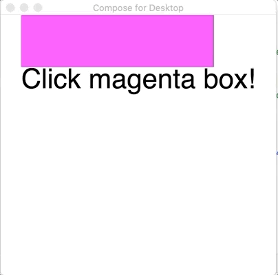
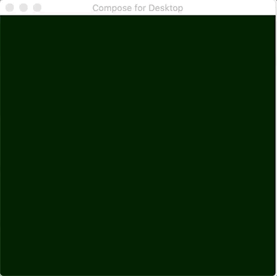
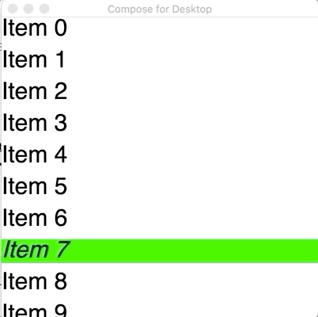
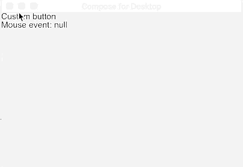

# Getting Started with Compose for Desktop

## What is covered

In this tutorial we will see how to install mouse event listeners on components
in Compose for Desktop.

## Mouse event listeners

### Click listeners

Click listeners are available in both Compose on Android and Compose for Desktop,
so code like this will work on both platforms:

```kotlin
import androidx.compose.foundation.ExperimentalFoundationApi
import androidx.compose.foundation.background
import androidx.compose.foundation.combinedClickable
import androidx.compose.foundation.layout.Box
import androidx.compose.foundation.layout.Column
import androidx.compose.foundation.layout.fillMaxHeight
import androidx.compose.foundation.layout.fillMaxWidth
import androidx.compose.material.Text
import androidx.compose.runtime.getValue
import androidx.compose.runtime.mutableStateOf
import androidx.compose.runtime.remember
import androidx.compose.runtime.setValue
import androidx.compose.ui.Alignment
import androidx.compose.ui.Modifier
import androidx.compose.ui.graphics.Color
import androidx.compose.ui.unit.sp
import androidx.compose.ui.window.singleWindowApplication

fun main() = singleWindowApplication {
    var count by remember { mutableStateOf(0) }
    Box(contentAlignment = Alignment.Center, modifier = Modifier.fillMaxWidth()) {
        var text by remember { mutableStateOf("Click magenta box!") }
        Column {
            @OptIn(ExperimentalFoundationApi::class)
            Box(
                modifier = Modifier
                    .background(Color.Magenta)
                    .fillMaxWidth(0.7f)
                    .fillMaxHeight(0.2f)
                    .combinedClickable(
                        onClick = {
                            text = "Click! ${count++}"
                        },
                        onDoubleClick = {
                            text = "Double click! ${count++}"
                        },
                        onLongClick = {
                            text = "Long click! ${count++}"
                        }
                    )
            )
            Text(text = text, fontSize = 40.sp)
        }
    }
}
```



### Mouse move listeners

As typically mouse and other positional pointers are only available on desktop platforms,
the following code will only work with Compose for Desktop.
Let's create a window and install a pointer move filter on it that changes the background
color according to the mouse pointer position:
```kotlin
import androidx.compose.foundation.background
import androidx.compose.foundation.layout.Box
import androidx.compose.foundation.layout.fillMaxSize
import androidx.compose.foundation.layout.wrapContentSize
import androidx.compose.runtime.getValue
import androidx.compose.runtime.mutableStateOf
import androidx.compose.runtime.remember
import androidx.compose.runtime.setValue
import androidx.compose.ui.Alignment
import androidx.compose.ui.Modifier
import androidx.compose.ui.graphics.Color
import androidx.compose.ui.input.pointer.pointerMoveFilter
import androidx.compose.ui.window.singleWindowApplication

fun main() = singleWindowApplication {
    var color by remember { mutableStateOf(Color(0, 0, 0)) }
    Box(
        modifier = Modifier
            .wrapContentSize(Alignment.Center)
            .fillMaxSize()
            .background(color = color)
            .pointerMoveFilter(
                onMove = {
                    color = Color(it.x.toInt() % 256, it.y.toInt() % 256, 0)
                    false
                }
            )
    )
}
```



### Mouse enter listeners

Compose for Desktop also supports pointer enter and exit handlers, like this:
```kotlin
import androidx.compose.foundation.background
import androidx.compose.foundation.layout.Arrangement
import androidx.compose.foundation.layout.Column
import androidx.compose.foundation.layout.fillMaxWidth
import androidx.compose.material.Text
import androidx.compose.runtime.getValue
import androidx.compose.runtime.mutableStateOf
import androidx.compose.runtime.remember
import androidx.compose.runtime.setValue
import androidx.compose.ui.Modifier
import androidx.compose.ui.graphics.Color
import androidx.compose.ui.input.pointer.pointerMoveFilter
import androidx.compose.ui.text.font.FontStyle
import androidx.compose.ui.unit.dp
import androidx.compose.ui.unit.sp
import androidx.compose.ui.window.singleWindowApplication

fun main() = singleWindowApplication {
    Column(
        Modifier.background(Color.White),
        verticalArrangement = Arrangement.spacedBy(10.dp)
    ) {
        repeat(10) { index ->
            var active by remember { mutableStateOf(false) }
            Text(
                modifier = Modifier
                    .fillMaxWidth()
                    .background(color = if (active) Color.Green else Color.White)
                    .pointerMoveFilter(
                        onEnter = {
                            active = true
                            false
                        },
                        onExit = {
                            active = false
                            false
                        }
                    ),
                fontSize = 30.sp,
                fontStyle = if (active) FontStyle.Italic else FontStyle.Normal,
                text = "Item $index"
            )
        }
    }
}
```


### Mouse right/middle clicks and keyboard modifiers

Compose for Desktop contains desktop-only `Modifier.mouseClickable`, where data about pressed mouse buttons and keyboard modifiers is available. This is an experimental API, which means that it's likely to be changed before release.

```kotlin
import androidx.compose.foundation.ExperimentalDesktopApi
import androidx.compose.foundation.mouseClickable
import androidx.compose.material.Text
import androidx.compose.runtime.getValue
import androidx.compose.runtime.mutableStateOf
import androidx.compose.runtime.remember
import androidx.compose.runtime.setValue
import androidx.compose.ui.Modifier
import androidx.compose.ui.window.singleWindowApplication

@OptIn(ExperimentalDesktopApi::class)
fun main() = singleWindowApplication {
    var clickableText by remember { mutableStateOf("Click me!") }

    Text(
        modifier = Modifier.mouseClickable(
            onClick = {
                clickableText = buildString {
                    append("Buttons pressed:\n")
                    append("primary: ${buttons.isPrimaryPressed}\t")
                    append("secondary: ${buttons.isSecondaryPressed}\t")
                    append("tertiary: ${buttons.isTertiaryPressed}\t")

                    append("\n\nKeyboard modifiers pressed:\n")

                    append("alt: ${keyboardModifiers.isAltPressed}\t")
                    append("ctrl: ${keyboardModifiers.isCtrlPressed}\t")
                    append("meta: ${keyboardModifiers.isMetaPressed}\t")
                    append("shift: ${keyboardModifiers.isShiftPressed}\t")
                }
            }
        ),
        text = clickableText
    )
}
```


If you need more information about events there is an available raw AWT mouse event object in `mouseEvent` property of `PointerEvent`