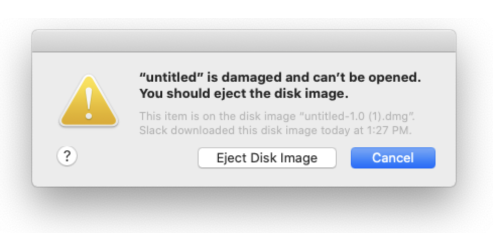

# Native distributions & local execution

## What is covered

In this tutorial, we'll show you how to create native distributions (installers/packages) for all the supported systems.
We will also demonstrate how to run an application locally with the same settings as for distributions.

## Available tools

There are two tools available for packaging Compose applications:

1. The Compose Multiplatform Gradle plugin which provides tasks for basic packaging, obfuscation and (macOS only) signing.
2. [Conveyor](https://www.hydraulic.software), which is a separate tool not made by JetBrains.

This tutorial covers how to use the built-in tasks. Conveyor has [its own tutorial](https://conveyor.hydraulic.dev/latest/tutorial/hare/jvm). The choice of which to use boils down to features/ease of use vs price. Conveyor provides support for online updates, cross-building and [various other features](packaging-tools-comparison.md) but requires [a license](https://hydraulic.software/pricing.html) for non-open source projects. The packaging tasks come with the Compose Desktop Gradle plugin, but the resulting packages don't support online updates and will require a multi-platform CI setup to create packages for each OS.

## Gradle plugin

`org.jetbrains.compose` Gradle plugin simplifies the packaging of applications into native distributions using `jpackage` and running an application locally.
Distributable applications are self-contained, installable binaries which include all the Java runtime components they need, 
without requiring an installed JDK on the target system.

[Jlink](https://openjdk.java.net/jeps/282) will take care of bundling only the necessary Java Modules in 
the distributable package to minimize package size, 
but you must still configure the Gradle plugin to tell it which modules you need 
(see the `Configuring included JDK modules` section).

## Basic usage

The basic unit of configuration in the plugin is an `application`.
An `application` defines a shared configuration for a set of final binaries. 
In other words, an `application` in DSL allows you to pack a bunch of files,
together with a JDK distribution, into a set of compressed binary installers
in various formats (`.dmg`, `.deb`, `.msi`, `.exe`, etc).

``` kotlin
import org.jetbrains.compose.compose
import org.jetbrains.compose.desktop.application.dsl.TargetFormat

plugins {
    kotlin("jvm")
    id("org.jetbrains.compose")
}

dependencies {
    implementation(compose.desktop.currentOS)
}

compose.desktop {
    application {
        mainClass = "example.MainKt"

        nativeDistributions {
            targetFormats(TargetFormat.Dmg, TargetFormat.Msi, TargetFormat.Deb)
        }
    }
}
```

The plugin creates the following tasks:
* `package<FormatName>` (e.g. `packageDmg` or `packageMsi`) are used for packaging the app into the corresponding format.
Note, that there is no cross-compilation support available at the moment,
so the formats can only be built using the specific OS (e.g. to build `.dmg` you have to use macOS).
Tasks that are not compatible with the current OS are skipped by default.
* `packageDistributionForCurrentOS` is a [lifecycle](https://docs.gradle.org/current/userguide/more_about_tasks.html#sec:lifecycle_tasks) task,
aggregating all package tasks for an application.
* `packageUberJarForCurrentOS` is used to create a single jar file, containing all dependencies for current OS. 
The task is available starting from the M2 release.
The task expects `compose.desktop.currentOS` to be used as a `compile`/`implementation`/`runtime` dependency.
* `run` is used to run an app locally. You need to define a `mainClass` — an fq-name of a class, 
containing the `main` function.
Note, that `run` starts a non-packaged JVM application with full runtime.
This is faster and easier to debug, than creating a compact binary image with minified runtime.
To run a final binary image, use `runDistributable` instead.
* `createDistributable` is used to create a prepackaged application image a final application image without creating an installer.
* `runDistributable` is used to run a prepackaged application image. 
  
Note, that the tasks are created only if the `application` block/property is used in a script.

After a build, output binaries can be found in `${project.buildDir}/compose/binaries`.

## Configuring included JDK modules

The Gradle plugin uses [jlink](https://openjdk.java.net/jeps/282) to minimize a distributable size by
including only necessary JDK modules.

At this time, the Gradle plugin does not automatically determine necessary JDK Modules. 
Failure to provide the necessary modules will not cause compilation issues, 
but will lead to `ClassNotFoundException` at runtime. 

If you encounter `ClassNotFoundException` when running a packaged application or
`runDistributable` task, you can include additional JDK modules using 
`modules` DSL method (see example below).

You can determine, which modules are necessary either by hand or by running
`suggestModules` task. `suggestModules` uses the [jdeps](https://docs.oracle.com/javase/9/tools/jdeps.htm) 
static analysis tool to determine possible missing modules. Note, that the output of the tool 
might be incomplete or list unnecessary modules.

If a distributable size is not critical, you may simply include all runtime modules as an alternative
by using `includeAllModules` DSL property.

``` kotlin
compose.desktop {
    application {
        nativeDistributions {
            modules("java.sql")
            // alternatively: includeAllModules = true
        }
    }
}
```

## Available formats

The following formats available for the supported operating systems:
* macOS — `.dmg` (`TargetFormat.Dmg`), `.pkg` (`TargetFormat.Pkg`)
* Windows — `.exe` (`TargetFormat.Exe`), `.msi` (`TargetFormat.Msi`)
* Linux — `.deb` (`TargetFormat.Deb`), `.rpm` (`TargetFormat.Rpm`)

## Signing & notarization on macOS

By default, Apple does not allow users to execute unsigned applications downloaded from the internet.  Users attempting
to run such applications will be faced with an error like this:



See [our tutorial](/tutorials/Signing_and_notarization_on_macOS/README.md) on how to sign and notarize your application. 

## Specifying package version

You must specify a package version for native distribution packages.

You can use the following DSL properties (in order of descending priority):
* `nativeDistributions.<os>.<packageFormat>PackageVersion` specifies a version for a single package format;
* `nativeDistributions.<os>.packageVersion` specifies a version for a single target OS;
* `nativeDistributions.packageVersion` specifies a version for all packages;

For macOS you can also specify the build version using the following DSL properties (in order of descending priority):
* `nativeDistributions.macOS.<packageFormat>PackageBuildVersion` specifies a build version for a single package format;
* `nativeDistributions.macOS.packageBuildVersion` specifies a build version for all macOS packages;

If the build version is not specified, the package version is used.
See [CFBundleShortVersionString](https://developer.apple.com/documentation/bundleresources/information_property_list/cfbundleshortversionstring) (package version)
and [CFBundleVersion](https://developer.apple.com/documentation/bundleresources/information_property_list/cfbundleversion) (build version)
for more information about versions on macOS.

``` kotlin
compose.desktop {
    application {
        nativeDistributions {
            // a version for all distributables
            packageVersion = "..." 
            
            linux {
              // a version for all Linux distributables
              packageVersion = "..." 
              // a version only for the deb package
              debPackageVersion = "..." 
              // a version only for the rpm package
              rpmPackageVersion = "..." 
            }
            macOS {
              // a version for all macOS distributables
              packageVersion = "..."
              // a version only for the dmg package
              dmgPackageVersion = "..." 
              // a version only for the pkg package
              pkgPackageVersion = "..." 
              
              // a build version for all macOS distributables
              packageBuildVersion = "..."
              // a build version only for the dmg package
              dmgPackageBuildVersion = "..." 
              // a build version only for the pkg package
              pkgPackageBuildVersion = "..." 
            }
            windows {
              // a version for all Windows distributables
              packageVersion = "..."  
              // a version only for the msi package
              msiPackageVersion = "..."
              // a version only for the exe package
              exePackageVersion = "..." 
            }
        }
    }
}
```

Versions must follow the rules:
  * For `dmg` and `pkg`: 
    * The format is `MAJOR[.MINOR][.PATCH]`, where:
      * `MAJOR` is an integer > 0;
      * `MINOR` is an optional non-negative integer;
      * `PATCH` is an optional non-negative integer;
  * For `msi` and `exe`: 
    * The format is `MAJOR.MINOR.BUILD`, where:
      * `MAJOR` is a non-negative integer with a maximum value of 255;
      * `MINOR` is a non-negative integer with a maximum value of 255;
      * `BUILD` is a non-negative integer with a maximum value of 65535;
  * For `deb`:
    * The format is `[EPOCH:]UPSTREAM_VERSION[-DEBIAN_REVISION]`, where:
      * `EPOCH` is an optional non-negative integer;
      * `UPSTREAM_VERSION` 
         * may contain only alphanumerics and the characters `.`, `+`, `-`, `~`;
         * must start with a digit;
      * `DEBIAN_REVISION` 
        * is optional;
        * may contain only alphanumerics and the characters `.`, `+`, `~`;
    * See [Debian documentation](https://www.debian.org/doc/debian-policy/ch-controlfields.html#version) for more details;
  * For `rpm`:
    * A version must not contain the `-` (dash) character.

## Customizing JDK version

The plugin uses `jpackage`, for which you should be using at least [JDK 17](https://openjdk.java.net/projects/jdk/17/).
Make sure you meet at least one of the following requirements:
* `JAVA_HOME` environment variable points to the compatible JDK version.
* `javaHome` is set via DSL:
``` kotlin
compose.desktop {
    application {
        javaHome = System.getenv("JDK_17")
    }
}
``` 

## Customizing output dir

``` kotlin
compose.desktop {
    application {
        nativeDistributions {
            outputBaseDir.set(project.buildDir.resolve("customOutputDir"))
        }
    }
}
```

## Customizing launcher

The following properties are available for customizing the application startup:
* `mainClass` — a fully-qualified name of a class, containing the main method;
* `args` — arguments for the application's main method;
* `jvmArgs` — arguments for the application's JVM.

``` kotlin
compose.desktop {
    application {
        mainClass = "MainKt"
        jvmArgs += listOf("-Xmx2G") 
        args += listOf("-customArgument") 
    }
}
```

## Customizing metadata

The following properties are available in the `nativeDistributions` DSL block:
* `packageName` — application's name (default value: Gradle project's [name](https://docs.gradle.org/current/javadoc/org/gradle/api/Project.html#getName--));
* `packageVersion` — application's version (default value: Gradle project's [version](https://docs.gradle.org/current/javadoc/org/gradle/api/Project.html#getVersion--));
* `description` — application's description (default value: none);
* `copyright` — application's copyright (default value: none);
* `vendor` — application's vendor (default value: none);
* `licenseFile` — application's license (default value: none).

``` kotlin
compose.desktop {
    application {
        nativeDistributions {
            packageName = "ExampleApp"
            packageVersion = "0.1-SNAPSHOT"
            description = "Compose Example App"
            copyright = "© 2020 My Name. All rights reserved."
            vendor = "Example vendor"
            licenseFile.set(project.file("LICENSE.txt"))
        }
    }
}
```

## Packaging resources

There are multiple ways to package and load resources with Compose for Desktop.

### JVM resource loading

Since Compose for Desktop uses JVM platform, you can load resources from a jar file using `java.lang.Class` API. Put a file under `src/main/resources`, 
then access it using [Class::getResource](https://docs.oracle.com/en/java/javase/15/docs/api/java.base/java/lang/Class.html#getResource(java.lang.String))
or [Class::getResourceAsStream](https://docs.oracle.com/en/java/javase/15/docs/api/java.base/java/lang/Class.html#getResourceAsStream(java.lang.String)).

### Adding files to packaged application

In some cases putting and reading resources from jar files might be inconvenient.
Or you may want to include a target specific asset (e.g. a file, that is included only 
into a macOS package, but not into a Windows one).

Compose Gradle plugin can be configured to put additional
resource files under an installation directory.

To do so, specify a root resource directory via DSL:
```
compose.desktop {
    application {
        mainClass = "MainKt"
        nativeDistributions {
            targetFormats(TargetFormat.Dmg, TargetFormat.Msi, TargetFormat.Deb)
            packageVersion = "1.0.0"

            appResourcesRootDir.set(project.layout.projectDirectory.dir("resources"))
        }
    }
}
```
In the example above a root resource directory is set to `<PROJECT_DIR>/resources`.

Compose Gradle plugin will include all files under the following subdirectories:
1. Files from `<RESOURCES_ROOT_DIR>/common` will be included into all packages.
2. Files from `<RESOURCES_ROOT_DIR>/<OS_NAME>` will be included only into packages for 
a specific OS. Possible values for `<OS_NAME>` are: `windows`, `macos`, `linux`.
3. Files from `<RESOURCES_ROOT_DIR>/<OS_NAME>-<ARCH_NAME>` will be included only into packages for
   a specific combination of OS and CPU architecture. Possible values for `<ARCH_NAME>` are: `x64` and `arm64`.
For example, files from `<RESOURCES_ROOT_DIR>/macos-arm64` will be included only into packages built for Apple Silicon
Macs.

Included resources can be accessed via `compose.application.resources.dir` system property:
```
import java.io.File

val resourcesDir = File(System.getProperty("compose.application.resources.dir"))

fun main() {
    println(resourcesDir.resolve("resource.txt").readText())
}
```

## Customizing content

The plugin can configure itself, when either `org.jetbrains.kotlin.jvm` or `org.jetbrains.kotlin.multiplatform` plugins 
are used.

* With `org.jetbrains.kotlin.jvm` the plugin includes content from the `main` [source set](https://docs.gradle.org/current/userguide/java_plugin.html#source_sets).
* With `org.jetbrains.kotlin.multiplatform` the plugin includes content a single [jvm target](https://kotlinlang.org/docs/reference/mpp-dsl-reference.html#targets).
The default configuration is disabled if multiple JVM targets are defined. In this case, the plugin should be configured
manually, or a single target should be specified (see below).

If the default configuration is ambiguous or not sufficient, the plugin can be configured:
* Using a Gradle [source set](https://docs.gradle.org/current/userguide/java_plugin.html#source_sets)
``` kotlin
plugins {
    kotlin("jvm")
    id("org.jetbrains.compose")
} 

val customSourceSet = sourceSets.create("customSourceSet")
compose.desktop {
    application {
        from(customSourceSet)
    }
}
```
* Using a Kotlin [JVM target](https://kotlinlang.org/docs/reference/mpp-dsl-reference.html#targets):
``` kotlin
plugins {
    kotlin("multiplatform")
    id("org.jetbrains.compose")
} 

kotlin {
    jvm("customJvmTarget") {}
}

compose.desktop {
    application {
        from(kotlin.targets["customJvmTarget"])
    }
}
```
* manually:
     * `disableDefaultConfiguration` can be used to disable the default configuration;
     * `dependsOn` can be used to add task dependencies to all plugin's tasks;
     * `fromFiles` can be used to specify files to include;
     * `mainJar` file property can be specified to point to a jar, containing a main class.
``` kotlin
compose.desktop {
    application {
        disableDefaultConfiguration()
        fromFiles(project.fileTree("libs/") { include("**/*.jar") })
        mainJar.set(project.file("main.jar"))
        dependsOn("mainJarTask")
    }
}
```


## Platform-specific options

Platform-specific options should be set using the corresponding DSL blocks:
``` kotlin
compose.desktop {
    application {
        nativeDistributions {
            macOS {
                // macOS specific options
            }
            windows {
                // Windows specific options
            }
            linux {
                // Linux specific options
            }
        }
    }
}
```

The following platform-specific options are available 
(the usage of non-documented properties **is not recommended**):
* All platforms:
    * `iconFile.set(File("PATH_TO_ICON"))` — a path to a platform-specific icon for the application.
       (see the section `App icon` for details);
    * `packageVersion = "1.0.0"` — a platform-specific package version
      (see the section `Specifying package version` for details);
    * `installationPath = "PATH_TO_INSTALL_DIR"` — an absolute or relative path to the default installation directory;
         * On Windows `dirChooser = true` may be used to enable customizing the path during installation.
* Linux:
    * `packageName = "custom-package-name"` overrides the default application name;
    * `debMaintainer = "maintainer@example.com"` — an email of the deb package's maintainer;
    * `menuGroup = "my-example-menu-group"` — a menu group for the application;
    * `appRelease = "1"` — a release value for the rpm package, or a revision value for the deb package;
    * `appCategory = "CATEGORY"` — a group value for the rpm package, or a section value for the deb package;
    * `rpmLicenseType = "TYPE_OF_LICENSE"` — a type of license for the rpm package;
    * `debPackageVersion = "DEB_VERSION"` — a deb-specific package version 
      (see the section `Specifying package version` for details);
    * `rpmPackageVersion = "RPM_VERSION"` — a rpm-specific package version
      (see the section `Specifying package version` for details);
* macOS:
    * `bundleID` — a unique application identifier;
        * May only contain alphanumeric characters (`A-Z`,`a-z`,`0-9`), hyphen (`-`) and period (`.`) characters;
        * Use of a reverse DNS notation (e.g. `com.mycompany.myapp`) is recommended;
    * `packageName` — a name of the application;
    * `dockName` — a name of the application displayed in the menu bar, the "About <App>" menu item, in the dock, etc. 
      Equals to `packageName` by default.
    * `signing`, `notarization`, `provisioningProfile`, and `runtimeProvisioningProfile` — see
      [the corresponding tutorial](/tutorials/Signing_and_notarization_on_macOS/README.md) 
      for details;
    * `appStore = true` — build and sign for the Apple App Store. Requires at least JDK 17;
    * `appCategory` — category of the app for the Apple App Store. 
      Default value is `public.app-category.utilities` when building for the App Store, `Unknown` otherwise. 
      See [LSApplicationCategoryType](https://developer.apple.com/documentation/bundleresources/information_property_list/lsapplicationcategorytype) for a list of valid categories;
    * `entitlementsFile.set(File("PATH_TO_ENTITLEMENTS"))` — a path to file containing entitlements to use when signing.
      When a custom file is provided, make sure to add the entitlements that are required for Java apps.
      See [sandbox.plist](https://github.com/openjdk/jdk/blob/master/src/jdk.jpackage/macosx/classes/jdk/jpackage/internal/resources/sandbox.plist) for the default file that is used when building for the App Store. It can be different depending on your JDK version.
      If no file is provided the default entitlements provided by jpackage are used.
      See [the corresponding tutorial](/tutorials/Signing_and_notarization_on_macOS/README.md#configuring-entitlements)
    * `runtimeEntitlementsFile.set(File("PATH_TO_RUNTIME_ENTITLEMENTS"))` — a path to file containing entitlements to use when signing the JVM runtime.
      When a custom file is provided, make sure to add the entitlements that are required for Java apps.
      See [sandbox.plist](https://github.com/openjdk/jdk/blob/master/src/jdk.jpackage/macosx/classes/jdk/jpackage/internal/resources/sandbox.plist) for the default file that is used when building for the App Store. It can be different depending on your JDK version.
      If no file is provided then `entitlementsFile` is used. If that was also not provided, the default entitlements provided by jpackage are used.
      See [the corresponding tutorial](/tutorials/Signing_and_notarization_on_macOS/README.md#configuring-entitlements)
    * `dmgPackageVersion = "DMG_VERSION"` — a dmg-specific package version
      (see the section `Specifying package version` for details);
    * `pkgPackageVersion = "PKG_VERSION"` — a pkg-specific package version
      (see the section `Specifying package version` for details);
    * `packageBuildVersion = "DMG_VERSION"` — a package build version
      (see the section `Specifying package version` for details);
    * `dmgPackageBuildVersion = "DMG_VERSION"` — a dmg-specific package build version
      (see the section `Specifying package version` for details);
    * `pkgPackageBuildVersion = "PKG_VERSION"` — a pkg-specific package build version
      (see the section `Specifying package version` for details);
    * `infoPlist` — see the section `Customizing Info.plist on macOS` for details;
* Windows:
    * `console = true` adds a console launcher for the application;
    * `dirChooser = true` enables customizing the installation path during installation;
    * `perUserInstall = true` enables installing the application on a per-user basis 
    * `menuGroup = "start-menu-group"` adds the application to the specified Start menu group;
    * `upgradeUuid = "UUID"` — a unique ID, which enables users to update an app via installer, 
      when an updated version is newer, than an installed version. The value must remain constant for a single application.
      See [the link](https://wixtoolset.org/documentation/manual/v3/howtos/general/generate_guids.html) 
      for details on generating a UUID.
    * `msiPackageVersion = "MSI_VERSION"` — a msi-specific package version
          (see the section `Specifying package version` for details);
    * `exePackageVersion = "EXE_VERSION"` — a pkg-specific package version
    (see the section `Specifying package version` for details);

## App icon

The app icon needs to be provided in OS-specific formats:
* `.icns` for macOS;
* `.ico` for Windows;
* `.png` for Linux.

``` kotlin
compose.desktop {
    application {
        nativeDistributions {
            macOS {
                iconFile.set(project.file("icon.icns"))
            }
            windows {
                iconFile.set(project.file("icon.ico"))
            }
            linux {
                iconFile.set(project.file("icon.png"))
            }
        }
    }
}
```

## Customizing Info.plist on macOS

We aim to support important platform-specific customization use-cases via declarative DSL.
However, the provided DSL is not enough sometimes. If you need to specify `Info.plist`
values, that are not modeled in the DSL, you can work around by specifying a piece
of raw XML, that will be appended to the application's `Info.plist`.

### Example: deep linking into macOS apps

1. Specify a custom URL scheme:
``` kotlin
// build.gradle.kts
compose.desktop {
    application {
        mainClass = "MainKt"
        nativeDistributions {
            targetFormats(TargetFormat.Dmg)
            packageName = "Deep Linking Example App"
            macOS {
                bundleID = "org.jetbrains.compose.examples.deeplinking"
                infoPlist {
                    extraKeysRawXml = macExtraPlistKeys
                }
            }
        }
    }
}

val macExtraPlistKeys: String
    get() = """
      <key>CFBundleURLTypes</key>
      <array>
        <dict>
          <key>CFBundleURLName</key>
          <string>Example deep link</string>
          <key>CFBundleURLSchemes</key>
          <array>
            <string>compose</string>
          </array>
        </dict>
      </array>
    """
```

2. Use `java.awt.Desktop` to set up a URI handler:
``` kotlin 
// src/main/main.kt

import androidx.compose.material.MaterialTheme
import androidx.compose.material.Text
import androidx.compose.runtime.getValue
import androidx.compose.runtime.mutableStateOf
import androidx.compose.runtime.setValue
import androidx.compose.ui.window.singleWindowApplication
import java.awt.Desktop

fun main() {
    var text by mutableStateOf("Hello, World!")

    try {
        Desktop.getDesktop().setOpenURIHandler { event ->
            text = "Open URI: " + event.uri
        }
    } catch (e: UnsupportedOperationException) {
        println("setOpenURIHandler is unsupported")
    }

    singleWindowApplication {
        MaterialTheme {
            Text(text)
        }
    }
}
```
3. Run `./gradlew runDistributable`.
4. Links like `compose://foo/bar` are now redirected from a browser to your application.

## Minification & obfuscation

Starting from 1.2 the Compose Gradle plugin supports [ProGuard](https://www.guardsquare.com/proguard) out-of-the-box.
ProGuard is a well known [open source](https://github.com/Guardsquare/proguard) tool for minification and obfuscation,
that is developed by [Guardsquare](https://www.guardsquare.com/).

The Gradle plugin provides a *release* task for each corresponding *default* packaging task:

Default task (w/o ProGuard)| Release task (w. ProGuard)       |Description
---------------------------|----------------------------------|-----------
`createDistributable`      | `createReleaseDistributable`     |Creates an application image with bundled JDK & resources
`runDistributable`         | `runReleaseDistributable`        |Runs an application image with bundled JDK & resources
`run`                      | `runRelease`                     |Runs a non-packaged application `jar` using Gradle JDK
`package<FORMAT_NAME>`     | `packageRelease<FORMAT_NAME>`    |Packages an application image into a `<FORMAT_NAME>` file
`packageForCurrentOS`      | `packageReleaseForCurrentOS`     |Packages an application image into a format compatible with current OS
`notarize<FORMAT_NAME>`    | `notarizeRelease<FORMAT_NAME>`   |Uploads a `<FORMAT_NAME>` application image for notarization (macOS only)
`checkNotarizationStatus`  | `checkReleaseNotarizationStatus` |Checks if notarization succeeded (macOS only)

The default configuration adds a few ProGuard rules:
* an application image is minified, i.e. non-used classes are removed;
* `compose.desktop.application.mainClass` is used as an entry point;
* a few `keep` rules to avoid breaking Compose runtime.

In many cases getting a minified Compose application will not require any additional configuration.
However, sometimes ProGuard might be unable to track certain usages in bytecode
(for example, this might happen if a class is used via reflection).
If you encounter an issue, which happens only after ProGuard processing,
you might want to add custom rules.
To do so, specify a configuration file via DSL:
```
compose.desktop {
    application {
        buildTypes.release.proguard {
            configurationFiles.from(project.file("compose-desktop.pro"))
        }
    }
}
```
See the Guardsquare's [comprehensive manual](https://www.guardsquare.com/manual/configuration/usage)
on ProGuard's rules & configuration options.

Obfuscation is disabled by default. To enable it, set the following property via Gradle DSL:
```
compose.desktop {
    application {
        buildTypes.release.proguard {
            obfuscate.set(true)
        }
    }
}
```

ProGuard's optimizations are enabled by default. To disable them, set the following property via Gradle DSL:
```
compose.desktop {
    application {
        buildTypes.release.proguard {
            optimize.set(false)
        }
    }
}
```
