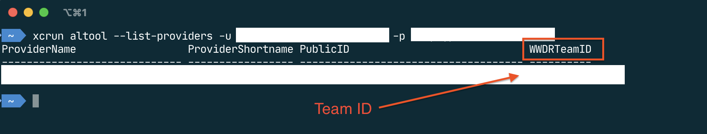

# Signing and notarizing distributions for macOS

Apple [requires](https://developer.apple.com/documentation/xcode/notarizing_macos_software_before_distribution) 
all 3rd party apps to be signed and notarized (checked by Apple) 
for running on recent versions of macOS. 

## What is covered
 
In this tutorial, we'll show you how to sign and notarize 
native distributions of Compose apps (in `dmg` or `pkg` formats) 
for distribution on macOS.

## Prerequisites

* [Xcode](https://developer.apple.com/xcode/). The tutorial was checked with Xcode 12.3.
* JDK 15+. The tutorial was checked with OpenJDK 15.0.1.

## Preparing a certificate

You will need a certificate for signing your app.

#### Checking existing certificates

Open https://developer.apple.com/account/resources/certificates

#### Creating a new certificate
1. [Create a certificate signing request](https://developer.apple.com/help/account/create-certificates/create-a-certificate-signing-request):
    * Open `Keychain Access`.
    * Open the menu dialog
        ```
        Keychain Access > Certificate Assistant > Request a Certificate from a Certificate Authority
        ```
    * Enter your certificate email and common name.
    * Check `Save to disk` option.
2. Create and install a new certificate using your [Apple Developer account](https://developer.apple.com/account/):
    * Open https://developer.apple.com/account/resources/certificates/add
    * For publishing outside the App Store, choose the `Developer ID Application` certificate type.
      For publishing on the App Store, you need two certificates. First select the `Mac App Distribution`
      certificate type, and once you have completed the steps in this section, repeat them again for
      the `Mac Installer Distribution` certificate type.
    * Upload your Certificate Signing Request from the previous step.
    * Download and install the certificate (drag & drop the certificate into the `Keychain Access` application).

#### Viewing installed certificates

You can find all installed certificates and their keychains by running the following command:
```
/usr/bin/security find-certificate -c "Developer ID Application"
```
or the following commands when publishing on the App Store:
```
/usr/bin/security find-certificate -c "3rd Party Mac Developer Application"
/usr/bin/security find-certificate -c "3rd Party Mac Developer Installer"
```

If you have multiple developer certificates of the same type installed,
you will need to specify the path to the keychain, containing
the certificate intended for signing.

## Preparing an App ID

An App ID represents one or more applications in Apple's ecosystem.

#### Viewing existing App IDs

Open [the page](https://developer.apple.com/account/resources/identifiers/list) on Apple's developer portal.

#### Creating a new App ID

1. Open [the page](https://developer.apple.com/account/resources/identifiers/add/bundleId) on Apple's developer portal.
2. Choose `App ID` option.
3. Choose `App` type.
4. Fill the `Bundle ID` field.
    * A [bundle ID](https://developer.apple.com/documentation/bundleresources/information_property_list/cfbundleidentifier)
      uniquely identifies an application in Apple's ecosystem.
    * You can use an explicit bundle ID a wildcard, matching multiple bundle IDs.
    * It is recommended to use the reverse DNS notation (e.g.`com.yoursitename.yourappname`).

## Preparing a Provisioning Profile
For testing on TestFlight (when publishing to the App Store), you need to add a provisioning
profile. You can skip this step otherwise.

First make sure you have created two app IDs, one for your app, and another one for the JVM runtime.
They should look like this:
* App ID for app: `com.yoursitename.yourappname` (format: `YOURBUNDLEID`)
* App ID for runtime: `com.oracle.java.com.yoursitename.yourappname` (format: `com.oracle.java.YOURBUNDLEID`)

#### Checking existing provisioning profiles

Open https://developer.apple.com/account/resources/profiles/list

#### Creating a new provisioning profile

1. Open [the page](https://developer.apple.com/account/resources/profiles/add) on Apple's developer portal.
2. Choose `Mac App Store` option under `Distribution`.
3. Select Profile Type `Mac`.
4. Select the App ID which you created earlier.
5. Select the Mac App Distribution certificate you created earlier.
6. Enter a name.
7. Click generate and download the provisioning profile.

Note that you need to create two of these profiles, one for your app and another one for the JVM runtime.
   
## Creating an app-specific password

To be able to upload an app for notarization,
you will need an app-specific password associated with your Apple ID. Notarization is only required for apps outside the App Store.

Follow these steps to generate a new password:
1. Sign in to your [Apple ID](https://appleid.apple.com/account/home) account page.
2. In the Security section, click Generate Password below App-Specific Passwords.

See [this Apple support page](https://support.apple.com/en-us/HT204397) for more information
on the app-specific passwords.

## Adding an app-specific password to a keychain

To avoid remembering your one-time password, or writing it in scripts,
you can add it to the keychain by running:
```
# Any name can be used instead of NOTARIZATION_PASSWORD

xcrun altool --store-password-in-keychain-item "NOTARIZATION_PASSWORD"
             --username <apple_id>
             --password <password>
```

Then you'll be able to refer to the password like `@keychain:NOTARIZATION_PASSWORD`
without the need to write the password itself.

## Configuring Gradle

### Gradle DSL

DSL properties should be specified in `macOS` DSL block of Compose Desktop DSL:
``` kotlin
import org.jetbrains.compose.compose
import org.jetbrains.compose.desktop.application.dsl.TargetFormat

plugins {
    kotlin("jvm")
    id("org.jetbrains.compose")
}

dependencies {
    implementation(compose.desktop.currentOS)
}

compose.desktop {
    application {
        mainClass = "example.MainKt"

        nativeDistributions {
            targetFormats(TargetFormat.Dmg)

            macOS {
                // macOS DSL settings
            }
        }
    }
}
```

### Gradle properties

Some properties can also be specified using 
[Gradle properties](https://docs.gradle.org/current/userguide/build_environment.html#sec:gradle_configuration_properties).

* Default Gradle properties (`compose.desktop.mac.*`) have lower priority, than DSL properties.
* Gradle properties can be specified (the items are listed in order of ascending priority):
    * In `gradle.properties` file in Gradle home;
    * In `gradle.properties` file in project's root;
    * In command-line
    ```
     ./gradlew packageDmg -Pcompose.desktop.mac.sign=true
    ```
* Note, that `local.properties` is not a standard Gradle file, so it is not supported by default.
You can load custom properties from it manually in a script, if you want.

### Configuring bundle ID

``` kotlin
macOS {
    bundleID = "com.example-company.example-app"
}
```

A [bundle ID](https://developer.apple.com/documentation/bundleresources/information_property_list/cfbundleidentifier)
uniquely identifies an application in Apple's ecosystem. 
* A bundle ID must be specified using the `bundleID` DSL property.
* Use only alphanumeric characters (`A-Z`, `a-z`, and `0-9`), hyphen (`-`) and period (`.`) characters.
* Use the reverse DNS notation of your domain (e.g.
  `com.yoursitename.yourappname`).
* The specified bundle ID must match one of your App IDs.

### Configuring signing settings

``` kotlin
macOS {
    signing { 
         sign.set(true)
         identity.set("John Doe")
         // keychain.set("/path/to/keychain") 
    }
}
```

* Set the `sign` DSL property or  to `true`.
    * Alternatively, the `compose.desktop.mac.sign` Gradle property can be used.
* Set the `identity` DSL property to the certificate's name, e.g. `"John Doe"`.
    *  Alternatively,  the `compose.desktop.mac.signing.identity` Gradle property can be  used.
* Optionally, set the `keychain` DSL property to the path to the specific keychain, containing your certificate.
    * Alternatively, the `compose.desktop.mac.signing.keychain` Gradle property can be used.
    * This step is only necessary, if multiple developer certificates of the same type are installed.
  
The following Gradle properties can be used instead of DSL properties:
* `compose.desktop.mac.sign` enables or disables signing. 
  Possible values: `true` or `false`.
* `compose.desktop.mac.signing.identity` overrides the `identity` DSL property.
* `compose.desktop.mac.signing.keychain` overrides the `keychain` DSL property.

Those properties could be stored in `$HOME/.gradle/gradle.properties` to use across multiple applications.

### Notarization

Distributing your macOS application outside the App Store 
requires notarization.
Notarization involves submitting your application to Apple for verification. 
If your software passes the verification, 
it's signed by Apple, stating that it has been notarized.

To notarize your app, you can use `notarize<PACKAGING_FORMAT>` task:
```
./gradlew notarizeDmg \
          -Pcompose.desktop.mac.notarization.appleID=<APPLE_ID> \
          -Pcompose.desktop.mac.notarization.password=<PASSWORD> \
          -Pcompose.desktop.mac.notarization.teamID=<TEAM_ID>
```
where:
* `<APPLE_ID>` — your Apple ID;
* `<PASSWORD>` — the app-specific password created previously;
* `<TEAM_ID>` — your Team. To get a table of team IDs associated with a given username and password, run:
```
xcrun altool --list-providers -u <Apple ID> -p <Notarization password>"
```




The following tasks can be used for notarization:
* `notarizeDmg` — build, sign and notarize `.dmg` installer;
* `notarizeReleaseDmg` — same as `notarizeDmg`, but with [ProGuard](tutorials/Native_distributions_and_local_execution/README.md).
* `notarizePkg` — build, sign and notarize `.pkg` installer;
* `notarizeReleasePkg` — same as `notarizePkg`, but with [ProGuard](tutorials/Native_distributions_and_local_execution/README.md).

The notarization settings can also be set using the DSL.
For example, it is possible to pass credentials using environment variables:
```
compose.desktop.application {
    nativeDistributions {
        macOS {
            notarization {
                val providers = project.providers
                appleID.set(providers.environmentVariable("NOTARIZATION_APPLE_ID"))
                password.set(providers.environmentVariable("NOTARIZATION_PASSWORD"))
                teamId.set(providers.environmentVariable("NOTARIZATION_TEAM_ID"))
            }
        }
    }
}
```

According to Apple, for 98 percent of software notarization completes within 15 minutes.
To learn more on how to avoid long response times, check [the official documentation](https://developer.apple.com/documentation/security/notarizing_macos_software_before_distribution/customizing_the_notarization_workflow#3561440).

### Configuring provisioning profile

For testing on TestFlight (when publishing to the App Store), you need to add a provisioning
profile. You can skip this step otherwise.

Note that this option requires JDK 18 due to [this issue](https://bugs.openjdk.java.net/browse/JDK-8274346).

``` kotlin
macOS {
    provisioningProfile.set(project.file("embedded.provisionprofile"))
    runtimeProvisioningProfile.set(project.file("runtime.provisionprofile"))
}
```

Make sure to rename your provisioning profile you created earlier to `embedded.provisionprofile`
and the provisioning profile for the JVM runtime to `runtime.provisionprofile`.

### Configuring entitlements

For TestFlight you need to set some special entitlements.

Create a file `entitlements.plist` with the following content:

```xml
<?xml version="1.0" encoding="UTF-8"?>
<!DOCTYPE plist PUBLIC "-//Apple//DTD PLIST 1.0//EN" "http://www.apple.com/DTDs/PropertyList-1.0.dtd">
<plist version="1.0">
<dict>
    <key>com.apple.security.app-sandbox</key>
    <true/>
    <key>com.apple.security.cs.allow-jit</key>
    <true/>
    <key>com.apple.security.cs.allow-unsigned-executable-memory</key>
    <true/>
    <key>com.apple.security.cs.disable-library-validation</key>
    <true/>
    <key>com.apple.security.cs.allow-dyld-environment-variables</key>
    <true/>
    <key>com.apple.security.cs.debugger</key>
    <true/>
    <key>com.apple.security.device.audio-input</key>
    <true/>
    <key>com.apple.application-identifier</key>
    <string>TEAMID.APPID</string>
    <key>com.apple.developer.team-identifier</key>
    <string>TEAMID</string>
    <!-- Add additional entitlements here, for example for network or hardware access. -->
</dict>
</plist>
```
These are the entitlements for your application. Set `TEAMID` to your team ID and `APPID` to your app bundle ID.

Then create another file called `runtime-entitlements.plist` with the following content:
```xml
<?xml version="1.0" encoding="UTF-8"?>
<!DOCTYPE plist PUBLIC "-//Apple//DTD PLIST 1.0//EN" "http://www.apple.com/DTDs/PropertyList-1.0.dtd">
<plist version="1.0">
<dict>
    <key>com.apple.security.app-sandbox</key>
    <true/>
    <key>com.apple.security.cs.allow-jit</key>
    <true/>
    <key>com.apple.security.cs.allow-unsigned-executable-memory</key>
    <true/>
    <key>com.apple.security.cs.disable-library-validation</key>
    <true/>
    <key>com.apple.security.cs.allow-dyld-environment-variables</key>
    <true/>
    <key>com.apple.security.cs.debugger</key>
    <true/>
    <key>com.apple.security.device.audio-input</key>
    <true/>
</dict>
</plist>
```

These are the entitlements for the JVM runtime.

Now configure the entitlements in Gradle like this:

``` kotlin
macOS {
    entitlementsFile.set(project.file("entitlements.plist"))
    runtimeEntitlementsFile.set(project.file("runtime-entitlements.plist"))
}
```

### TestFlight

Some special configuration is needed to get the app working in TestFlight. If something is
incorrect, the App Store will either send an email or show that your build is "Not Available for Testing".
The build could still work for the App Store but won't work in TestFlight.

If that is the case, make sure the following is configured correctly:

1. Provisioning profiles for both app and JVM runtime are provided.
2. Entitlement files for both app and JVM runtime are provided.
3. Both entitlement files contain at least the values provided [here](#configuring-entitlements).
4. Team ID and App ID are the same in the app entitlements file and the app provisioning profile.

Furthermore, make sure you follow the steps to get the app working on the App Store.
That means signing with the correct certificates, setting `appStore` to `true` in Gradle, etc.

Note that apps for both the App Store and TestFlight are sandboxed.

If you are loading native libraries from JVM code, they must be loaded directly from the app bundle (because of sandbox and signing).
That means they cannot first be extracted from a JAR and then loaded (what some libraries do).
You can include native libraries in the bundle using `fromFiles` (see [here](/tutorials/Native_distributions_and_local_execution#customizing-content))
and then you can load them in JVM code using `System.loadLibrary("LIBRARYNAME")`.
Note that the Skiko native library used by Compose is already loaded correctly if you are using the
default application configuration.

In case you are still experiencing issues with TestFlight, you could consider opening a TSI with
Apple, and they may be able to give you a more detailed error message.

## Using Gradle

The following tasks are available:
* Use `createDistributable`, `packageDmg`, or `packagePkg` to get a signed application
  (no separate step is required).
* Use `notarize<PACKAGING_FORMAT>` (e.g. `notarizeDmg`) to upload an application for notarization. 
  Notarization is only required for apps outside the App Store.
