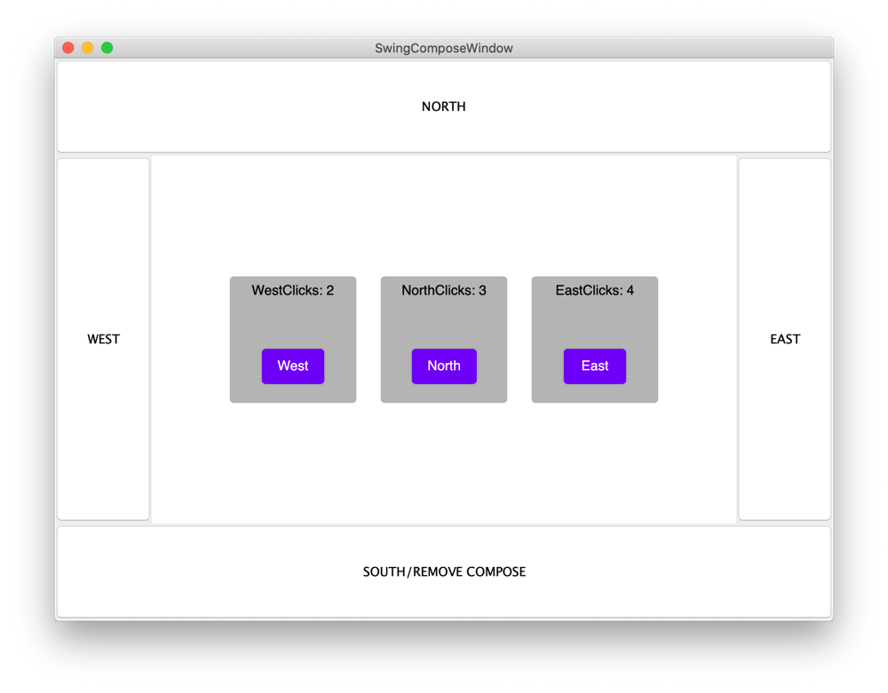

# Integration Compose for Desktop into Swing-based aplication

## What is covered

In this tutorial, we will show you how to use ComposePanel and SwingPanel in your application.

## Using ComposePanel

ComposePanel lets you create a UI using Compose for Desktop in a Swing-based UI. To achieve this you need to create an instance of ComposePanel, add it to your Swing layout, and describe the composition inside `setContent`. You may also need to clear the CFD application events via `AppManager.setEvents`.

```kotlin
import androidx.compose.desktop.AppManager
import androidx.compose.desktop.ComposePanel
import androidx.compose.foundation.layout.Box
import androidx.compose.foundation.layout.Column
import androidx.compose.foundation.layout.fillMaxSize
import androidx.compose.foundation.layout.fillMaxWidth
import androidx.compose.foundation.layout.height
import androidx.compose.foundation.layout.Row
import androidx.compose.foundation.layout.size
import androidx.compose.foundation.layout.Spacer
import androidx.compose.foundation.layout.width
import androidx.compose.material.Text
import androidx.compose.foundation.shape.RoundedCornerShape
import androidx.compose.material.Button
import androidx.compose.material.Surface
import androidx.compose.runtime.Composable
import androidx.compose.runtime.MutableState
import androidx.compose.runtime.mutableStateOf
import androidx.compose.ui.Alignment
import androidx.compose.ui.graphics.Color
import androidx.compose.ui.Modifier
import androidx.compose.ui.unit.dp
import java.awt.BorderLayout
import java.awt.Dimension
import java.awt.event.ActionEvent
import java.awt.event.ActionListener
import javax.swing.JFrame
import javax.swing.JButton
import javax.swing.WindowConstants

val northClicks = mutableStateOf(0)
val westClicks = mutableStateOf(0)
val eastClicks = mutableStateOf(0)

fun main() {
    // Explicitly clear the application events
    AppManager.setEvents(
        onAppStart = null,
        onAppExit = null,
        onWindowsEmpty = null
    )
    SwingComposeWindow()
}

fun SwingComposeWindow() {
    val window = JFrame()

    // Creating ComposePanel
    val composePanel = ComposePanel()
    window.defaultCloseOperation = WindowConstants.EXIT_ON_CLOSE
    window.title = "SwingComposeWindow"


    window.contentPane.add(actionButton("NORTH", { northClicks.value++ }), BorderLayout.NORTH)
    window.contentPane.add(actionButton("WEST", { westClicks.value++ }), BorderLayout.WEST)
    window.contentPane.add(actionButton("EAST", { eastClicks.value++ }), BorderLayout.EAST)
    window.contentPane.add(
        actionButton(
            text = "SOUTH/REMOVE COMPOSE",
            action = {
                window.contentPane.remove(composePanel)
            }
        ),
        BorderLayout.SOUTH
    )

    // Addind ComposePanel on JFrame
    window.contentPane.add(composePanel, BorderLayout.CENTER)

    // Setting the content
    composePanel.setContent {
        ComposeContent()
    }

    window.setSize(800, 600)
    window.setVisible(true)
}

fun actionButton(text: String, action: (() -> Unit)? = null): JButton {
    val button = JButton(text)
    button.setToolTipText("Tooltip for $text button.")
    button.setPreferredSize(Dimension(100, 100))
    button.addActionListener(object : ActionListener {
        public override fun actionPerformed(e: ActionEvent) {
            action?.invoke()
        }
    })

    return button
}

@Composable
fun ComposeContent() {
    Box(
        modifier = Modifier.fillMaxSize(),
        contentAlignment = Alignment.Center
    ) {
        Row {
            Counter("West", westClicks)
            Spacer(modifier = Modifier.width(25.dp))
            Counter("North", northClicks)
            Spacer(modifier = Modifier.width(25.dp))
            Counter("East", eastClicks)
        }
    }
}

@Composable
fun Counter(text: String, counter: MutableState<Int>) {
    Surface(
        modifier = Modifier.size(130.dp, 130.dp),
        color = Color(180, 180, 180),
        shape = RoundedCornerShape(4.dp)
    ) {
        Column {
            Box(
                modifier = Modifier.height(30.dp).fillMaxWidth(),
                contentAlignment = Alignment.Center
            ) {
                Text(text = "${text}Clicks: ${counter.value}")
            }
            Spacer(modifier = Modifier.height(25.dp))
            Box(
                modifier = Modifier.fillMaxSize(),
                contentAlignment = Alignment.Center
            ) {
                Button(onClick = { counter.value++ }) {
                    Text(text = text, color = Color.White)
                }
            }
        }
    }
}
```



## Adding a Swing component to CFD composition using SwingPanel.

SwingPanel lets you create a UI using Swing components in a Compose-based UI. To achieve this you need to create Swing component and pass it as a parameter to SwingPanel.

```kotlin
import androidx.compose.desktop.SwingPanel
import androidx.compose.desktop.Window
import androidx.compose.foundation.layout.Box
import androidx.compose.foundation.layout.Column
import androidx.compose.foundation.layout.fillMaxSize
import androidx.compose.foundation.layout.fillMaxWidth
import androidx.compose.foundation.layout.height
import androidx.compose.foundation.layout.padding
import androidx.compose.foundation.layout.Spacer
import androidx.compose.foundation.layout.size
import androidx.compose.material.Button
import androidx.compose.material.Text
import androidx.compose.runtime.Composable
import androidx.compose.runtime.mutableStateOf
import androidx.compose.runtime.remember
import androidx.compose.ui.Alignment
import androidx.compose.ui.Modifier
import androidx.compose.ui.graphics.Color
import androidx.compose.ui.unit.dp
import java.awt.Component
import java.awt.Dimension
import java.awt.event.ActionEvent
import java.awt.event.ActionListener
import javax.swing.BoxLayout
import javax.swing.JButton
import javax.swing.JPanel

fun main() {
    Window {
        val counter = remember { mutableStateOf(0) }

        val inc: () -> Unit = { counter.value++ }
        val dec: () -> Unit = { counter.value-- }

        Box(
            modifier = Modifier.fillMaxWidth().height(60.dp).padding(top = 20.dp),
            contentAlignment = Alignment.Center
        ) {
            Text("Counter: ${counter.value}")
        }
        
        Box(
            modifier = Modifier.fillMaxSize(),
            contentAlignment = Alignment.Center
        ) {
            Column(
                modifier = Modifier.padding(top = 80.dp, bottom = 20.dp)
            ) {
                Button("1. Compose Button: increment", inc)
                Spacer(modifier = Modifier.height(20.dp))

                Box(
                    modifier = Modifier.size(270.dp, 90.dp)
                ) {
                    SwingPanel(
                        component = swingBox(dec),
                        background = Color.White
                    )
                }

                Spacer(modifier = Modifier.height(20.dp))
                Button("2. Compose Button: increment", inc)
            }
        }
    }
}

@Composable
fun Button(text: String = "", action: (() -> Unit)? = null) {
    Button(
        modifier = Modifier.size(270.dp, 30.dp),
        onClick = { action?.invoke() }
    ) {
        Text(text)
    }
}

fun swingBox(action: (() -> Unit)? = null): Component {
    val box = JPanel()
    box.setLayout(BoxLayout(box, BoxLayout.Y_AXIS))

    box.add(actionButton("1. Swing Button: decrement", action))
    box.add(actionButton("2. Swing Button: decrement", action))
    box.add(actionButton("3. Swing Button: decrement", action))

    return box
}

fun actionButton(
    text: String,
    action: (() -> Unit)? = null
): JButton {
    val button = JButton(text)
    button.setAlignmentX(Component.CENTER_ALIGNMENT)
    button.addActionListener(object : ActionListener {
        public override fun actionPerformed(e: ActionEvent) {
            action?.invoke()
        }
    })

    return button
}
```


