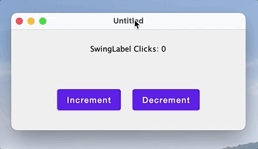

# Integration of Compose Multiplatform and Swing

## What is covered

In this tutorial, we'll show you how to make the `Swing/Compose` interop work in your application, what its limitations are, what you can achieve with it, in which cases you may use it and when you shouldn't do that.

The main goals of the interoperability between Compose Multiplatform and Swing are 
- make it easier and smoother to migrate Swing applications to to Compose 
- allow to enhance Compose application with Swing components that don't have 'Compose' analogues
 
In many cases it is more efficient to implement a missing Component in Compose (and contribute it to community) rather than using a Swing component in a Compose Application.

## Swing interop use cases and limitations

Before combining Compose Multiplatform and Swing, it's important to keep in mind that these two technologies have different approaches to the content rendering. Compose Multiplatform uses one heavyweight Swing component to render all its content and has logical rendering layers, while Swing operates on both heavyweight and lightweight components (`Component/JComponent`). For Swing logic Compose Multiplatform is just one more heavyweight component and it interacts with it the same way as with all other Swing components.

The first use-case is addition of a Compose part into a Swing application. It could be done use `ComposePanel` Swing component to render the "Compose" part of the application. From Swing perspective it will be just another Swing component, that should be treated accordingly. Important point, that all Compose components will be rendered inside the `ComposePanel`, including popups, tooltips, context menus, etc. They will be positioned and resized inside the `ComposePanel`. So probably it would be better to replace them with a Swing based implementation.

Below you can find several cases where the use of `ComposePanel` is justified:
- you want to embed animated objects or a whole panel of animated objects into your application (selection of emoticons, toolbar with animated reaction to events, etc.)
- you want to implement an interactive rendering area in your application, which is easier and more convenient to implement using Compose (for example, any type of graphics or infographics)
- you want to embed a complex rendering area (perhaps even animated) into your application - this is easier and more convenient to do using Compose
- you want to replace complex parts of the user interface of your Swing-based application - Compose has a convenient component layout system, and Compose offers a wide range of built-in components and options for quickly creating your own components

If your case is somewhat similar to one of the above, then you should try to implement it using `ComposePanel`.

The second use case is situation when you want to use some component, that exists in Swing and there is no analogue in Compose. And creating it from scratch is too expensive. In this case, you can use `SwingPanel`. A `SwingPanel` is a wrapper that controls the size, position and rendering of a Swing component that is placed on top of a Compose Multiplatform component, meaning the component inside a `SwingPanel` will always be on top of the Compose in depth. Anything that is misplaced and rests on the `SwingPanel` will be clipped by the Swing component placed there, so try to think about these situations, and if there is such a risk, then it is better to either redesign the UI accordingly, or stop using the `SwingPanel` and still try to implement the missing component, thereby contributing to the development of technology and making life easier for other developers.

Below you can find several cases where the use of `SwingPanel` is justified:
- there are no popups, tooltips, context menus, etc. in your application. or they are not used inside your `SwingPanel`
- in your application, the `SwingPanel` will always be in the same position. This will reduce the risk of glitches and artifacts when changing the position of the Swing component (this condition is not mandatory and you need to test each such case separately)

If your case is  somewhat similar to one of the above, then you should try to implement it using `SwingPanel`.

Since Compose Multiplatform and Swing can be combined in both directions, it is quite possible to place a `SwingPanel` into a `ComposePanel`, which in turn could be placed into another `SwingPanel`. In this case, you should be careful to minimize rendering glitches. At the end of this tutorial, you can find an example covering this case.

## Using ComposePanel

`ComposePanel` lets you create a UI using Compose Multiplatform in a Swing-based UI. To achieve this you need to create an instance of `ComposePanel`, add it to your Swing layout, and describe the composition inside `setContent`.

```kotlin
import androidx.compose.foundation.layout.Box
import androidx.compose.foundation.layout.Column
import androidx.compose.foundation.layout.Row
import androidx.compose.foundation.layout.Spacer
import androidx.compose.foundation.layout.fillMaxSize
import androidx.compose.foundation.layout.fillMaxWidth
import androidx.compose.foundation.layout.height
import androidx.compose.foundation.layout.size
import androidx.compose.foundation.layout.width
import androidx.compose.foundation.shape.RoundedCornerShape
import androidx.compose.material.Button
import androidx.compose.material.Surface
import androidx.compose.material.Text
import androidx.compose.runtime.Composable
import androidx.compose.runtime.MutableState
import androidx.compose.runtime.mutableStateOf
import androidx.compose.ui.Alignment
import androidx.compose.ui.Modifier
import androidx.compose.ui.awt.ComposePanel
import androidx.compose.ui.graphics.Color
import androidx.compose.ui.unit.dp
import java.awt.BorderLayout
import java.awt.Dimension
import javax.swing.JButton
import javax.swing.JFrame
import javax.swing.SwingUtilities
import javax.swing.WindowConstants

val northClicks = mutableStateOf(0)
val westClicks = mutableStateOf(0)
val eastClicks = mutableStateOf(0)

fun main() = SwingUtilities.invokeLater {
    val window = JFrame()

    // creating ComposePanel
    val composePanel = ComposePanel()
    window.defaultCloseOperation = WindowConstants.EXIT_ON_CLOSE
    window.title = "SwingComposeWindow"

    window.contentPane.add(actionButton("NORTH", action = { northClicks.value++ }), BorderLayout.NORTH)
    window.contentPane.add(actionButton("WEST", action = { westClicks.value++ }), BorderLayout.WEST)
    window.contentPane.add(actionButton("EAST", action = { eastClicks.value++ }), BorderLayout.EAST)
    window.contentPane.add(
        actionButton(
            text = "SOUTH/REMOVE COMPOSE",
            action = {
                window.contentPane.remove(composePanel)
            }
        ),
        BorderLayout.SOUTH
    )

    // addind ComposePanel on JFrame
    window.contentPane.add(composePanel, BorderLayout.CENTER)

    // setting the content
    composePanel.setContent {
        ComposeContent()
    }

    window.setSize(800, 600)
    window.isVisible = true
}

fun actionButton(text: String, action: () -> Unit): JButton {
    val button = JButton(text)
    button.toolTipText = "Tooltip for $text button."
    button.preferredSize = Dimension(100, 100)
    button.addActionListener { action() }
    return button
}

@Composable
fun ComposeContent() {
    Box(
        modifier = Modifier.fillMaxSize(),
        contentAlignment = Alignment.Center
    ) {
        Row {
            Counter("West", westClicks)
            Spacer(modifier = Modifier.width(25.dp))
            Counter("North", northClicks)
            Spacer(modifier = Modifier.width(25.dp))
            Counter("East", eastClicks)
        }
    }
}

@Composable
fun Counter(text: String, counter: MutableState<Int>) {
    Surface(
        modifier = Modifier.size(130.dp, 130.dp),
        color = Color(180, 180, 180),
        shape = RoundedCornerShape(4.dp)
    ) {
        Column {
            Box(
                modifier = Modifier.height(30.dp).fillMaxWidth(),
                contentAlignment = Alignment.Center
            ) {
                Text(text = "${text}Clicks: ${counter.value}")
            }
            Spacer(modifier = Modifier.height(25.dp))
            Box(
                modifier = Modifier.fillMaxSize(),
                contentAlignment = Alignment.Center
            ) {
                Button(onClick = { counter.value++ }) {
                    Text(text = text, color = Color.White)
                }
            }
        }
    }
}
```


## Adding a Swing component to Compose Multiplatform composition using SwingPanel

SwingPanel lets you create a UI using Swing in a Compose-based UI. To achieve this you need to create Swing `JComponent` in the `factory` parameter of `SwingPanel`.

```kotlin
import androidx.compose.foundation.layout.Box
import androidx.compose.foundation.layout.Column
import androidx.compose.foundation.layout.fillMaxSize
import androidx.compose.foundation.layout.fillMaxWidth
import androidx.compose.foundation.layout.height
import androidx.compose.foundation.layout.padding
import androidx.compose.foundation.layout.Spacer
import androidx.compose.foundation.layout.size
import androidx.compose.material.Button
import androidx.compose.material.Text
import androidx.compose.runtime.Composable
import androidx.compose.runtime.mutableStateOf
import androidx.compose.runtime.remember
import androidx.compose.ui.Alignment
import androidx.compose.ui.Modifier
import androidx.compose.ui.awt.SwingPanel
import androidx.compose.ui.graphics.Color
import androidx.compose.ui.unit.dp
import androidx.compose.ui.window.singleWindowApplication
import java.awt.Component
import javax.swing.BoxLayout
import javax.swing.JButton
import javax.swing.JPanel

fun main() = singleWindowApplication {
    val counter = remember { mutableStateOf(0) }

    val inc: () -> Unit = { counter.value++ }
    val dec: () -> Unit = { counter.value-- }

    Box(
        modifier = Modifier.fillMaxWidth().height(60.dp).padding(top = 20.dp),
        contentAlignment = Alignment.Center
    ) {
        Text("Counter: ${counter.value}")
    }

    Box(
        modifier = Modifier.fillMaxSize(),
        contentAlignment = Alignment.Center
    ) {
        Column(
            modifier = Modifier.padding(top = 80.dp, bottom = 20.dp)
        ) {
            Button("1. Compose Button: increment", inc)
            Spacer(modifier = Modifier.height(20.dp))

            SwingPanel(
                background = Color.White,
                modifier = Modifier.size(270.dp, 90.dp),
                factory = {
                    JPanel().apply {
                        layout = BoxLayout(this, BoxLayout.Y_AXIS)
                        add(actionButton("1. Swing Button: decrement", dec))
                        add(actionButton("2. Swing Button: decrement", dec))
                        add(actionButton("3. Swing Button: decrement", dec))
                    }
                }
            )

            Spacer(modifier = Modifier.height(20.dp))
            Button("2. Compose Button: increment", inc)
        }
    }
}

@Composable
fun Button(text: String = "", action: (() -> Unit)? = null) {
    Button(
        modifier = Modifier.size(270.dp, 30.dp),
        onClick = { action?.invoke() }
    ) {
        Text(text)
    }
}

fun actionButton(
    text: String,
    action: () -> Unit
): JButton {
    val button = JButton(text)
    button.alignmentX = Component.CENTER_ALIGNMENT
    button.addActionListener { action() }

    return button
}
```


## Updating Swing component when Сompose state changes

Example below shows how to update a Swing component in a `SwingPanel` when the composable state changes. To do this, you need to provide an `update: (T) -> Unit` callback that is called when the composable state changes or after the layout is inflated.

```kotlin
import androidx.compose.foundation.layout.Column
import androidx.compose.foundation.layout.fillMaxSize
import androidx.compose.foundation.layout.fillMaxWidth
import androidx.compose.foundation.layout.height
import androidx.compose.foundation.layout.Spacer
import androidx.compose.foundation.layout.padding
import androidx.compose.foundation.layout.Row
import androidx.compose.foundation.layout.width
import androidx.compose.material.Button
import androidx.compose.material.Text
import androidx.compose.runtime.Composable
import androidx.compose.runtime.mutableStateOf
import androidx.compose.runtime.remember
import androidx.compose.ui.awt.SwingPanel
import androidx.compose.ui.Alignment
import androidx.compose.ui.Modifier
import androidx.compose.ui.unit.dp
import androidx.compose.ui.window.application
import androidx.compose.ui.window.Window
import androidx.compose.ui.window.rememberWindowState
import java.awt.BorderLayout
import javax.swing.JPanel
import javax.swing.JLabel

val swingLabel = JLabel()

fun main() = application {
    Window(
        onCloseRequest = ::exitApplication,
        state = rememberWindowState(width = 400.dp, height = 200.dp),
    ) {
        val clicks = remember { mutableStateOf(0) }
        Column(
            modifier = Modifier.fillMaxSize().padding(20.dp),
            horizontalAlignment = Alignment.CenterHorizontally
        ) {
            SwingPanel(
                modifier = Modifier.fillMaxWidth().height(40.dp),
                factory = {
                    JPanel().apply {
                        add(swingLabel, BorderLayout.CENTER)
                    }
                },
                update = {
                    swingLabel.setText("SwingLabel Clicks: ${clicks.value}")
                }
            )
            Spacer(modifier = Modifier.height(40.dp))
            Row (
                modifier = Modifier.height(40.dp),
                verticalAlignment = Alignment.CenterVertically
            ) {
                Button(onClick = { clicks.value++ }) {
                    Text(text = "Increment")
                }
                Spacer(modifier = Modifier.width(20.dp))
                Button(onClick = { clicks.value-- }) {
                    Text(text = "Decrement")
                }
            }
        }
    }
}
```



## Layouting with SwingPanel and ComposePanel

Example below shows how Compose for Desktop and Swing can be combined in both directions i.e. adding a `SwingPanel` to a `ComposePanel` which is in turn added to another `SwingPanel`.

```kotlin
import androidx.compose.foundation.*
import androidx.compose.foundation.layout.*
import androidx.compose.foundation.shape.RoundedCornerShape
import androidx.compose.material.*
import androidx.compose.material.icons.Icons
import androidx.compose.material.icons.filled.*
import androidx.compose.runtime.*
import androidx.compose.ui.awt.*
import androidx.compose.ui.*
import androidx.compose.ui.draw.*
import androidx.compose.ui.graphics.Color
import androidx.compose.ui.graphics.vector.ImageVector
import androidx.compose.ui.window.*
import androidx.compose.ui.unit.*
import java.awt.BorderLayout
import java.awt.Canvas
import java.awt.Dimension
import java.awt.Insets
import java.awt.event.*
import javax.swing.*
import javax.swing.border.EmptyBorder

val Gray = java.awt.Color(64, 64, 64)
val DarkGray = java.awt.Color(32, 32, 32)
val LightGray = java.awt.Color(210, 210, 210)

data class Item(
    val text: String,
    val icon: ImageVector,
    val color: Color,
    val state: MutableState<Boolean> = mutableStateOf(false)
)
val panelItemsList = listOf(
    Item(text = "Person", icon = Icons.Filled.Person, color = Color(10, 232, 162)),
    Item(text = "Favorite", icon = Icons.Filled.Favorite, color = Color(150, 232, 150)),
    Item(text = "Search", icon = Icons.Filled.Search, color = Color(232, 10, 162)),
    Item(text = "Settings", icon = Icons.Filled.Settings, color = Color(232, 162, 10)),
    Item(text = "Close", icon = Icons.Filled.Close, color = Color(232, 100, 100))
)
val itemSize = 50.dp

fun java.awt.Color.toCompose(): Color {
    return Color(red, green, blue)
}

fun main() = application {
    Window(
        onCloseRequest = ::exitApplication,
        state = rememberWindowState(width = 500.dp, height = 500.dp),
    ) {
        Column(
            modifier = Modifier.fillMaxSize().background(color = Gray.toCompose()).padding(20.dp),
            horizontalAlignment = Alignment.CenterHorizontally
        ) {
            Text(text = "Compose Area", color = LightGray.toCompose())
            Spacer(modifier = Modifier.height(40.dp))
            SwingPanel(
                background = DarkGray.toCompose(),
                modifier = Modifier.fillMaxSize(),
                factory = {
                    ComposePanel().apply {
                        setContent {
                            Box {
                                SwingPanel(
                                    modifier = Modifier.fillMaxSize(),
                                    factory = { SwingComponent() }
                                )
                                Box (
                                    modifier = Modifier.align(Alignment.TopStart)
                                        .padding(start = 20.dp, top = 80.dp)
                                        .background(color = DarkGray.toCompose())
                                ) {
                                    SwingPanel(
                                        modifier = Modifier.size(itemSize * panelItemsList.size, itemSize),
                                        factory = {
                                            ComposePanel().apply {
                                                setContent {
                                                    ComposeOverlay()
                                                }
                                            }
                                        }
                                    )
                                }
                            }
                        }
                    }
                }
            )
        }
    }
}

fun SwingComponent() : JPanel {
    return JPanel().apply {
        background = DarkGray
        border = EmptyBorder(20, 20, 20, 20)
        layout = BorderLayout()
        add(
            JLabel("TextArea Swing Component").apply {
                foreground = LightGray
                verticalAlignment = SwingConstants.NORTH
                horizontalAlignment = SwingConstants.CENTER
                preferredSize = Dimension(40, 160)
            },
            BorderLayout.NORTH
        )
        add(
            JTextArea().apply {
                background = LightGray
                lineWrap = true
                wrapStyleWord = true
                margin = Insets(10, 10, 10, 10)
                text = "The five boxing wizards jump quickly. " +
                "Crazy Fredrick bought many very exquisite opal jewels. " +
                "Pack my box with five dozen liquor jugs.\n" +
                "Cozy sphinx waves quart jug of bad milk. " +
                "The jay, pig, fox, zebra and my wolves quack!"
            },
            BorderLayout.CENTER
        )
    }
}

@Composable
fun ComposeOverlay() {
    Box(
        modifier = Modifier.fillMaxSize().
            background(color = DarkGray.toCompose()),
        contentAlignment = Alignment.Center
    ) {
        Row(
            modifier = Modifier.background(
                shape = RoundedCornerShape(4.dp),
                color = Color.DarkGray.copy(alpha = 0.5f)
            )
        ) {
            for (item in panelItemsList) {
                SelectableItem(
                    text = item.text,
                    icon = item.icon,
                    color = item.color,
                    selected = item.state
                )
            }
        }
    }
}

@Composable
fun SelectableItem(
    text: String,
    icon: ImageVector,
    color: Color,
    selected: MutableState<Boolean>
) {
    Box(
        modifier = Modifier.size(itemSize)
            .clickable { selected.value = !selected.value },
        contentAlignment = Alignment.Center
    ) {
        Column(
            modifier = Modifier.alpha(if (selected.value) 1.0f else 0.5f),
            horizontalAlignment = Alignment.CenterHorizontally
        ) {
            Icon(modifier = Modifier.size(32.dp), imageVector = icon, contentDescription = null, tint = color)
            Text(text = text, color = Color.White, fontSize = 10.sp)
        }
    }
}
```


