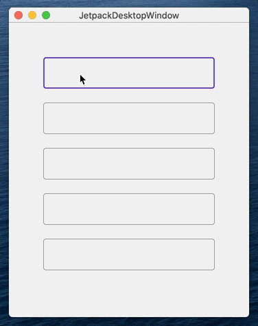
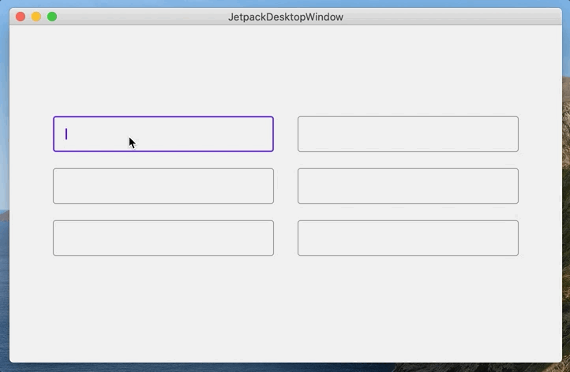

# Tabbing navigation and keyboard focus

## What is covered

In this tutorial, we will show you how to use tabbing navigation between components via keyboard shortcuts `tab` and `shift + tab`.

## Simple example

To move focus between UI components using keyboard shortcuts in a composition, you need to create a `FocusRequester` link and apply the `Modifier.focusOrder` modifier to each component you want to navigate.

- `FocusRequester` sends requests to change focus.
- `Modifier.focusOrder` is used to specify a custom focus traversal order.

In the example below, we simply create a `FocusRequester` list and create text fields for each `FocusRequester` in the list. Each text field sends a focus request to the previous and next text field in the list when using the `shift + tab` or `tab` keyboard shortcut. 

```kotlin
import androidx.compose.desktop.Window
import androidx.compose.foundation.layout.Box
import androidx.compose.foundation.layout.Column
import androidx.compose.foundation.layout.fillMaxSize
import androidx.compose.foundation.layout.height
import androidx.compose.foundation.layout.padding
import androidx.compose.foundation.layout.Spacer
import androidx.compose.material.OutlinedTextField
import androidx.compose.runtime.mutableStateOf
import androidx.compose.runtime.remember
import androidx.compose.ui.ExperimentalComposeUiApi
import androidx.compose.ui.focus.FocusRequester
import androidx.compose.ui.focus.focusOrder
import androidx.compose.ui.Alignment
import androidx.compose.ui.Modifier
import androidx.compose.ui.unit.dp
import androidx.compose.ui.unit.IntSize

@OptIn(ExperimentalComposeUiApi::class)
fun main() = Window(size = IntSize(350, 450)) {
    val itemsList = remember { List(5) { FocusRequester() } }
    Box(
        modifier = Modifier.fillMaxSize(),
        contentAlignment = Alignment.Center
    ) {
        Column(
            modifier = Modifier.padding(50.dp)
        ) {
            itemsList.forEachIndexed { index, item ->
                val text = remember { mutableStateOf("") }
                OutlinedTextField(
                    value = text.value,
                    singleLine = true,
                    onValueChange = { text.value = it },
                    modifier = Modifier.height(46.dp).focusOrder(item) {
                        next = if (index + 1 == itemsList.size) itemsList.first() else itemsList[index + 1]
                        previous = if (index - 1 < 0) itemsList.last() else itemsList[index - 1]
                    }
                )
                Spacer(modifier = Modifier.height(20.dp))
            }
        }
    }
}
```


## Tabbing navigation with auto ordering

```kotlin
import androidx.compose.desktop.Window
import androidx.compose.foundation.layout.Box
import androidx.compose.foundation.layout.Column
import androidx.compose.foundation.layout.Row
import androidx.compose.foundation.layout.fillMaxSize
import androidx.compose.foundation.layout.height
import androidx.compose.foundation.layout.padding
import androidx.compose.foundation.layout.Spacer
import androidx.compose.material.OutlinedTextField
import androidx.compose.runtime.Composable
import androidx.compose.runtime.mutableStateOf
import androidx.compose.runtime.remember
import androidx.compose.ui.ExperimentalComposeUiApi
import androidx.compose.ui.focus.FocusRequester
import androidx.compose.ui.focus.focusOrder
import androidx.compose.ui.Alignment
import androidx.compose.ui.Modifier
import androidx.compose.ui.unit.dp
import androidx.compose.ui.unit.IntSize

class FocusGroup {
    private val list = mutableListOf(FocusRequester())
    private var current = 0
    
    fun register(isTail: Boolean = false): FocusRequester {
        if (!isTail) {
            list.add(FocusRequester())
        }
        return list[current++]
    }

    fun next(): FocusRequester {
        return if (current >= list.size) list.last() else list[current]
    }

    fun previous(): FocusRequester {
        return if (current - 2 < 0) list.first() else list[current - 2]
    }
}

@OptIn(ExperimentalComposeUiApi::class)
fun main() = Window(size = IntSize(700, 450)) {

    val group1 = remember { FocusGroup() }
    val group2 = remember { FocusGroup() }

    Box(
        modifier = Modifier.fillMaxSize(),
        contentAlignment = Alignment.Center
    ) {
        Row {
            Column(modifier = Modifier.padding(15.dp)) {
                FocusableTextField(focusGroup = group1)
                FocusableTextField(focusGroup = group1)
                FocusableTextField(focusGroup = group1, isTail = true)
            }
            Column(modifier = Modifier.padding(15.dp)) {
                FocusableTextField(focusGroup = group2)
                FocusableTextField(focusGroup = group2)
                FocusableTextField(focusGroup = group2, isTail = true)
            }
        }
    }
}

@Composable
fun FocusableTextField(focusGroup: FocusGroup, isTail: Boolean = false) {
    val text = remember { mutableStateOf("") }
    
    val currentItem = remember { focusGroup.register(isTail) }
    val nextItem = remember { focusGroup.next() }
    val previousItem = remember { focusGroup.previous() }

    OutlinedTextField(
        value = text.value,
        singleLine = true,
        onValueChange = { text.value = it },
        modifier = Modifier.height(46.dp).focusOrder(currentItem) {
            next = nextItem
            previous = previousItem
        }
    )
    Spacer(modifier = Modifier.height(20.dp))
}
```

