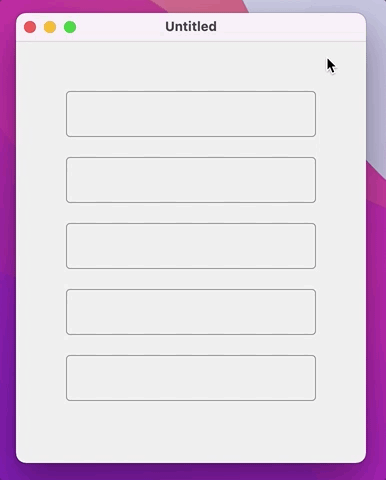
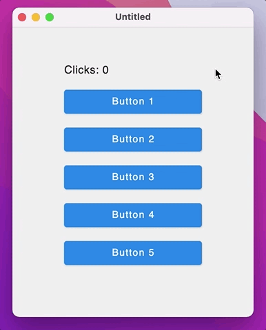
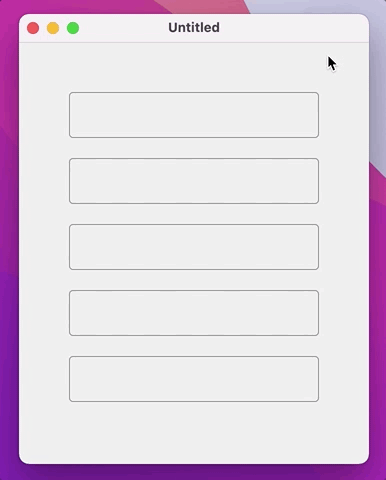
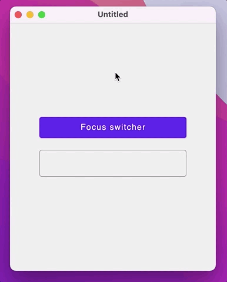

# Tabbing navigation and keyboard focus

## What is covered

In this tutorial, we will show you how to use tabbing navigation between components via keyboard shortcuts `tab` and `shift + tab`.

## Default `Next/Previous` tabbing navigation

By default, `Next/Previous` tabbed navigation moves focus in composition order (in order of appearance), to see how this works, we can use some of the components that are already focusable by default: `TextField`, `OutlinedTextField`, `BasicTextField`, components with `Modifier.clickable` (`Button`, `IconButton`, `MenuItem`).

```kotlin
import androidx.compose.ui.window.application
import androidx.compose.ui.window.Window
import androidx.compose.ui.window.WindowState
import androidx.compose.foundation.layout.Box
import androidx.compose.foundation.layout.Column
import androidx.compose.foundation.layout.fillMaxSize
import androidx.compose.foundation.layout.height
import androidx.compose.foundation.layout.padding
import androidx.compose.foundation.layout.Spacer
import androidx.compose.material.OutlinedTextField
import androidx.compose.runtime.mutableStateOf
import androidx.compose.runtime.remember
import androidx.compose.ui.Alignment
import androidx.compose.ui.Modifier
import androidx.compose.ui.unit.DpSize
import androidx.compose.ui.unit.dp

fun main() = application {
    Window(
        state = WindowState(size = DpSize(350.dp, 500.dp)),
        onCloseRequest = ::exitApplication
    ) {
        Box(
            modifier = Modifier.fillMaxSize(),
            contentAlignment = Alignment.Center
        ) {
            Column(
                modifier = Modifier.padding(50.dp)
            ) {
                for (x in 1..5) {
                    val text = remember { mutableStateOf("") }
                    OutlinedTextField(
                        value = text.value,
                        singleLine = true,
                        onValueChange = { text.value = it }
                    )
                    Spacer(modifier = Modifier.height(20.dp))
                }
            }
        }
    }
}
```



To make a non-focusable component focusable, you need to apply `Modifier.focusable()` modifier to the component.

```kotlin
import androidx.compose.foundation.background
import androidx.compose.ui.window.application
import androidx.compose.ui.window.Window
import androidx.compose.ui.window.WindowState
import androidx.compose.material.MaterialTheme
import androidx.compose.material.Text
import androidx.compose.foundation.focusable
import androidx.compose.foundation.interaction.collectIsFocusedAsState
import androidx.compose.foundation.interaction.MutableInteractionSource
import androidx.compose.foundation.layout.Box
import androidx.compose.foundation.layout.Column
import androidx.compose.foundation.layout.fillMaxSize
import androidx.compose.foundation.layout.height
import androidx.compose.foundation.layout.padding
import androidx.compose.foundation.layout.size
import androidx.compose.foundation.layout.Spacer
import androidx.compose.foundation.shape.RoundedCornerShape
import androidx.compose.runtime.Composable
import androidx.compose.runtime.mutableStateOf
import androidx.compose.runtime.remember
import androidx.compose.ui.Alignment
import androidx.compose.ui.graphics.Color
import androidx.compose.ui.graphics.lerp
import androidx.compose.ui.ExperimentalComposeUiApi
import androidx.compose.ui.Modifier
import androidx.compose.ui.draw.clip
import androidx.compose.ui.input.key.*
import androidx.compose.ui.input.pointer.PointerEventType
import androidx.compose.ui.input.pointer.onPointerEvent
import androidx.compose.ui.unit.dp
import androidx.compose.ui.unit.IntSize
import androidx.compose.ui.unit.DpSize

fun main() = application {
    Window(
        state = WindowState(size = DpSize(350.dp, 450.dp)),
        onCloseRequest = ::exitApplication
    ) {
        MaterialTheme(
            colors = MaterialTheme.colors.copy(
                primary = Color(10, 132, 232),
                secondary = Color(150, 232, 150)
            )
        ) {
            val clicks = remember { mutableStateOf(0) }
            Box(
                modifier = Modifier.fillMaxSize(),
                contentAlignment = Alignment.Center
            ) {
                Column(
                    modifier = Modifier.padding(40.dp)
                ) {
                    Text(text = "Clicks: ${clicks.value}")
                    Spacer(modifier = Modifier.height(20.dp))
                    for (x in 1..5) {
                        FocusableBox("Button $x", { clicks.value++ })
                        Spacer(modifier = Modifier.height(20.dp))
                    }
                }
            }
        }
    }
}

@OptIn(ExperimentalComposeUiApi::class)
@Composable
fun FocusableBox(
    text: String = "",
    onClick: () -> Unit = {},
    size: IntSize = IntSize(200, 35)
) {
    val keyPressedState = remember { mutableStateOf(false) }
    val interactionSource = remember { MutableInteractionSource() }
    val backgroundColor = if (interactionSource.collectIsFocusedAsState().value) {
        if (keyPressedState.value)
            lerp(MaterialTheme.colors.secondary, Color(64, 64, 64), 0.3f)
        else
            MaterialTheme.colors.secondary
    } else {
        MaterialTheme.colors.primary
    }
    Box(
        modifier = Modifier
            .clip(RoundedCornerShape(4.dp))
            .background(backgroundColor)
            .size(size.width.dp, size.height.dp)
            .onPointerEvent(PointerEventType.Press) { onClick() }
            .onPreviewKeyEvent {
                if (
                    it.key == Key.Enter ||
                    it.key == Key.Spacebar
                ) {
                    when (it.type) {
                        KeyEventType.KeyDown -> {
                            keyPressedState.value = true
                        }
                        KeyEventType.KeyUp -> {
                            keyPressedState.value = false
                            onClick.invoke()
                        }
                    }
                }
                false
            }
            .focusable(interactionSource = interactionSource),
        contentAlignment = Alignment.Center
    ) {
        Text(text = text, color = Color.White)
    }
}
```



## Custom ordering
To move focus in custom order we need to create a `FocusRequester` and apply the `Modifier.focusOrder` modifier to each component you want to navigate.

- `FocusRequester` sends requests to change focus.
- `Modifier.focusOrder` is used to specify a custom focus traversal order.

In the example below, we simply create a `FocusRequester` list and create text fields for each `FocusRequester` in the list. Each text field sends a focus request to the previous and next text field in the list when using the `shift + tab` or `tab` keyboard shortcut in reverse order.

```kotlin
import androidx.compose.ui.window.application
import androidx.compose.ui.window.Window
import androidx.compose.ui.window.WindowState
import androidx.compose.foundation.layout.Box
import androidx.compose.foundation.layout.Column
import androidx.compose.foundation.layout.fillMaxSize
import androidx.compose.foundation.layout.height
import androidx.compose.foundation.layout.padding
import androidx.compose.foundation.layout.Spacer
import androidx.compose.material.OutlinedTextField
import androidx.compose.runtime.mutableStateOf
import androidx.compose.runtime.remember
import androidx.compose.ui.focus.FocusRequester
import androidx.compose.ui.focus.focusOrder
import androidx.compose.ui.Alignment
import androidx.compose.ui.Modifier
import androidx.compose.ui.unit.DpSize
import androidx.compose.ui.unit.dp

fun main() = application {
    Window(
        state = WindowState(size = DpSize(350.dp, 500.dp)),
        onCloseRequest = ::exitApplication
    ) {
        val itemsList = remember { List(5) { FocusRequester() } }
        Box(
            modifier = Modifier.fillMaxSize(),
            contentAlignment = Alignment.Center
        ) {
            Column(
                modifier = Modifier.padding(50.dp)
            ) {
                itemsList.forEachIndexed { index, item ->
                    val text = remember { mutableStateOf("") }
                    OutlinedTextField(
                        value = text.value,
                        singleLine = true,
                        onValueChange = { text.value = it },
                        modifier = Modifier.focusOrder(item) {
                            // reverse order
                            next = if (index - 1 < 0) itemsList.last() else itemsList[index - 1]
                            previous = if (index + 1 == itemsList.size) itemsList.first() else itemsList[index + 1]
                        }
                    )
                    Spacer(modifier = Modifier.height(20.dp))
                }
            }
        }
    }
}
```



## Making component focused

To make a component focused, we need to create a `FocusRequester` and apply the `Modifier.focusRequester` modifier to the component you want to focus on. With `FocusRequester`, we can request focus, as in the example below:

```kotlin
import androidx.compose.ui.window.application
import androidx.compose.ui.window.Window
import androidx.compose.ui.window.WindowState
import androidx.compose.ui.window.WindowSize
import androidx.compose.foundation.focusable
import androidx.compose.foundation.layout.Box
import androidx.compose.foundation.layout.Column
import androidx.compose.foundation.layout.fillMaxSize
import androidx.compose.foundation.layout.fillMaxWidth
import androidx.compose.foundation.layout.height
import androidx.compose.foundation.layout.padding
import androidx.compose.foundation.layout.Spacer
import androidx.compose.material.Button
import androidx.compose.material.OutlinedTextField
import androidx.compose.material.Text
import androidx.compose.runtime.mutableStateOf
import androidx.compose.runtime.remember
import androidx.compose.ui.focus.FocusRequester
import androidx.compose.ui.focus.focusRequester
import androidx.compose.ui.Alignment
import androidx.compose.ui.Modifier
import androidx.compose.ui.unit.dp

fun main() = application {
    Window(
        state = WindowState(size = WindowSize(350.dp, 450.dp)),
        onCloseRequest = ::exitApplication
    ) {
        val buttonFocusRequester = remember { FocusRequester() }
        val textFieldFocusRequester = remember { FocusRequester() }
        val focusState = remember { mutableStateOf(false) }
        val text = remember { mutableStateOf("") }
        Box(
            modifier = Modifier.fillMaxSize(),
            contentAlignment = Alignment.Center
        ) {
            Column(
                modifier = Modifier.padding(50.dp)
            ) {
                Button(
                    onClick = {
                        focusState.value = !focusState.value
                        if (focusState.value) {
                            textFieldFocusRequester.requestFocus()
                        } else {
                            buttonFocusRequester.requestFocus()
                        }
                    },
                    modifier = Modifier.fillMaxWidth()
                        .focusRequester(buttonFocusRequester)
                        .focusable()
                ) {
                    Text(text = "Focus switcher")
                }
                Spacer(modifier = Modifier.height(20.dp))
                OutlinedTextField(
                    value = text.value,
                    singleLine = true,
                    onValueChange = { text.value = it },
                    modifier = Modifier
                        .focusRequester(textFieldFocusRequester)
                )
            }
        }
    }
}
```



## Known problems

### Tab key navigation doesn't work in a multiline TextField
``` Kotlin
Column {
    repeat(5) {
        var text by remember { mutableStateOf("Hello, World!") }

        OutlinedTextField(
            value = text,
            singleLine = false, // Pay attention here! Also, by default, singleLine is false.
            onValueChange = { text = it },
            modifier = Modifier.padding(8.dp)
        )
    }
}
```
When the user presses the 'Tab' key, the focus doesn't switch to the next focusable component. Instead the Tab character is added.

#### A possible workaround

This workaround is mentioned in [Issues/109](https://github.com/JetBrains/compose-multiplatform/issues/109#issuecomment-1161705265).
Write a custom Modifier.moveFocusOnTab:
```Kotlin
import androidx.compose.foundation.layout.Column
import androidx.compose.foundation.layout.padding
import androidx.compose.material.OutlinedTextField
import androidx.compose.runtime.getValue
import androidx.compose.runtime.mutableStateOf
import androidx.compose.runtime.remember
import androidx.compose.runtime.setValue
import androidx.compose.ui.ExperimentalComposeUiApi
import androidx.compose.ui.Modifier
import androidx.compose.ui.composed
import androidx.compose.ui.focus.FocusDirection
import androidx.compose.ui.input.key.*
import androidx.compose.ui.platform.LocalFocusManager
import androidx.compose.ui.unit.dp
import androidx.compose.ui.window.singleWindowApplication

fun main() = singleWindowApplication {
    Column {
        repeat(5) {
            var text by remember { mutableStateOf("Hello, World!") }

            OutlinedTextField(
                value = text,
                singleLine = false, // Pay attention here! Also, by default, singleLine is false.
                onValueChange = { text = it },
                modifier = Modifier.padding(8.dp).moveFocusOnTab()
            )
        }
    }
}

@OptIn(ExperimentalComposeUiApi::class)
fun Modifier.moveFocusOnTab() = composed {
    val focusManager = LocalFocusManager.current
    onPreviewKeyEvent {
        if (it.type == KeyEventType.KeyDown && it.key == Key.Tab) {
            focusManager.moveFocus(
                if (it.isShiftPressed) FocusDirection.Previous else FocusDirection.Next
            )
            true
        } else {
            false
        }
    }
}
```
