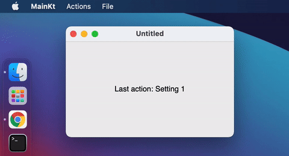

# Menu, tray, notifications

## What is covered

In this tutorial, we'll show you how to work with the system tray, send system notifications, and create a menu bar using Compose for Desktop.

## Tray

You can add an application icon to the system tray. You can also send notifications to the user using the system tray. There are 3 types of notifications:

1. notify - simple notification
2. warn - warning notification
3. error - error notification

```kotlin
import androidx.compose.foundation.layout.Box
import androidx.compose.foundation.layout.fillMaxSize
import androidx.compose.material.Text
import androidx.compose.runtime.getValue
import androidx.compose.runtime.mutableStateOf
import androidx.compose.runtime.remember
import androidx.compose.runtime.setValue
import androidx.compose.ui.Alignment
import androidx.compose.ui.Modifier
import androidx.compose.ui.geometry.Offset
import androidx.compose.ui.geometry.Size
import androidx.compose.ui.graphics.Color
import androidx.compose.ui.graphics.drawscope.DrawScope
import androidx.compose.ui.graphics.painter.Painter
import androidx.compose.ui.window.Tray
import androidx.compose.ui.window.Window
import androidx.compose.ui.window.application
import androidx.compose.ui.window.rememberNotification
import androidx.compose.ui.window.rememberTrayState

fun main() = application {
    var count by remember { mutableStateOf(0) }
    var isOpen by remember { mutableStateOf(true) }

    if (isOpen) {
        val trayState = rememberTrayState()
        val notification = rememberNotification("Notification", "Message from MyApp!")

        Tray(
            state = trayState,
            icon = TrayIcon,
            menu = {
                Item(
                    "Increment value",
                    onClick = {
                        count++
                    }
                )
                Item(
                    "Send notification",
                    onClick = {
                        trayState.sendNotification(notification)
                    }
                )
                Item(
                    "Exit",
                    onClick = {
                        isOpen = false
                    }
                )
            }
        )

        Window(
            onCloseRequest = {
                isOpen = false
            },
            icon = MyAppIcon
        ) {
            // content
            Box(
                modifier = Modifier.fillMaxSize(),
                contentAlignment = Alignment.Center
            ) {
                Text(text = "Value: $count")
            }
        }
    }
}

object MyAppIcon : Painter() {
    override val intrinsicSize = Size(256f, 256f)

    override fun DrawScope.onDraw() {
        drawOval(Color.Green, Offset(size.width / 4, 0f), Size(size.width / 2f, size.height))
        drawOval(Color.Blue, Offset(0f, size.height / 4), Size(size.width, size.height / 2f))
        drawOval(Color.Red, Offset(size.width / 4, size.height / 4), Size(size.width / 2f, size.height / 2f))
    }
}

object TrayIcon : Painter() {
    override val intrinsicSize = Size(256f, 256f)

    override fun DrawScope.onDraw() {
        drawOval(Color(0xFFFFA500))
    }
}
```


Please note, that it is possible to create a Tray application without Window: 

```kotlin
import androidx.compose.ui.geometry.Size
import androidx.compose.ui.graphics.Color
import androidx.compose.ui.graphics.drawscope.DrawScope
import androidx.compose.ui.graphics.painter.Painter
import androidx.compose.ui.window.Tray
import androidx.compose.ui.window.application

fun main() = application {
    Tray(
        icon = TrayIcon,
        menu = {
            Item(
                "Exit",
                onClick = ::exitApplication
            )
        }
    )
}

object TrayIcon : Painter() {
    override val intrinsicSize = Size(256f, 256f)

    override fun DrawScope.onDraw() {
        drawOval(Color(0xFFFFA500))
    }
}
```

## MenuBar

MenuBar is used to create and customize the menu bar for a particular window.

```kotlin
import androidx.compose.foundation.layout.Box
import androidx.compose.foundation.layout.fillMaxSize
import androidx.compose.material.Text
import androidx.compose.runtime.getValue
import androidx.compose.runtime.mutableStateOf
import androidx.compose.runtime.remember
import androidx.compose.runtime.setValue
import androidx.compose.ui.Alignment
import androidx.compose.ui.ExperimentalComposeUiApi
import androidx.compose.ui.Modifier
import androidx.compose.ui.geometry.Size
import androidx.compose.ui.graphics.Color
import androidx.compose.ui.graphics.drawscope.DrawScope
import androidx.compose.ui.graphics.painter.Painter
import androidx.compose.ui.input.key.Key
import androidx.compose.ui.input.key.KeyShortcut
import androidx.compose.ui.window.MenuBar
import androidx.compose.ui.window.Window
import androidx.compose.ui.window.application

@OptIn(ExperimentalComposeUiApi::class)
fun main() = application {
    var action by remember { mutableStateOf("Last action: None") }
    var isOpen by remember { mutableStateOf(true) }

    if (isOpen) {
        var isSubmenuShowing by remember { mutableStateOf(false) }

        Window(onCloseRequest = { isOpen = false }) {
            MenuBar {
                Menu("File", mnemonic = 'F') {
                    Item("Copy", onClick = { action = "Last action: Copy" }, shortcut = KeyShortcut(Key.C, ctrl = true))
                    Item("Paste", onClick = { action = "Last action: Paste" }, shortcut = KeyShortcut(Key.V, ctrl = true))
                }
                Menu("Actions", mnemonic = 'A') {
                    CheckboxItem(
                        "Advanced settings",
                        checked = isSubmenuShowing,
                        onCheckedChange = {
                            isSubmenuShowing = !isSubmenuShowing
                        }
                    )
                    if (isSubmenuShowing) {
                        Menu("Settings") {
                            Item("Setting 1", onClick = { action = "Last action: Setting 1" })
                            Item("Setting 2", onClick = { action = "Last action: Setting 2" })
                        }
                    }
                    Separator()
                    Item("About", icon = AboutIcon, onClick = { action = "Last action: About" })
                    Item("Exit", onClick = { isOpen = false }, shortcut = KeyShortcut(Key.Escape), mnemonic = 'E')
                }
            }

            Box(
                modifier = Modifier.fillMaxSize(),
                contentAlignment = Alignment.Center
            ) {
                Text(text = action)
            }
        }
    }
}

object AboutIcon : Painter() {
    override val intrinsicSize = Size(256f, 256f)

    override fun DrawScope.onDraw() {
        drawOval(Color(0xFFFFA500))
    }
}
```


