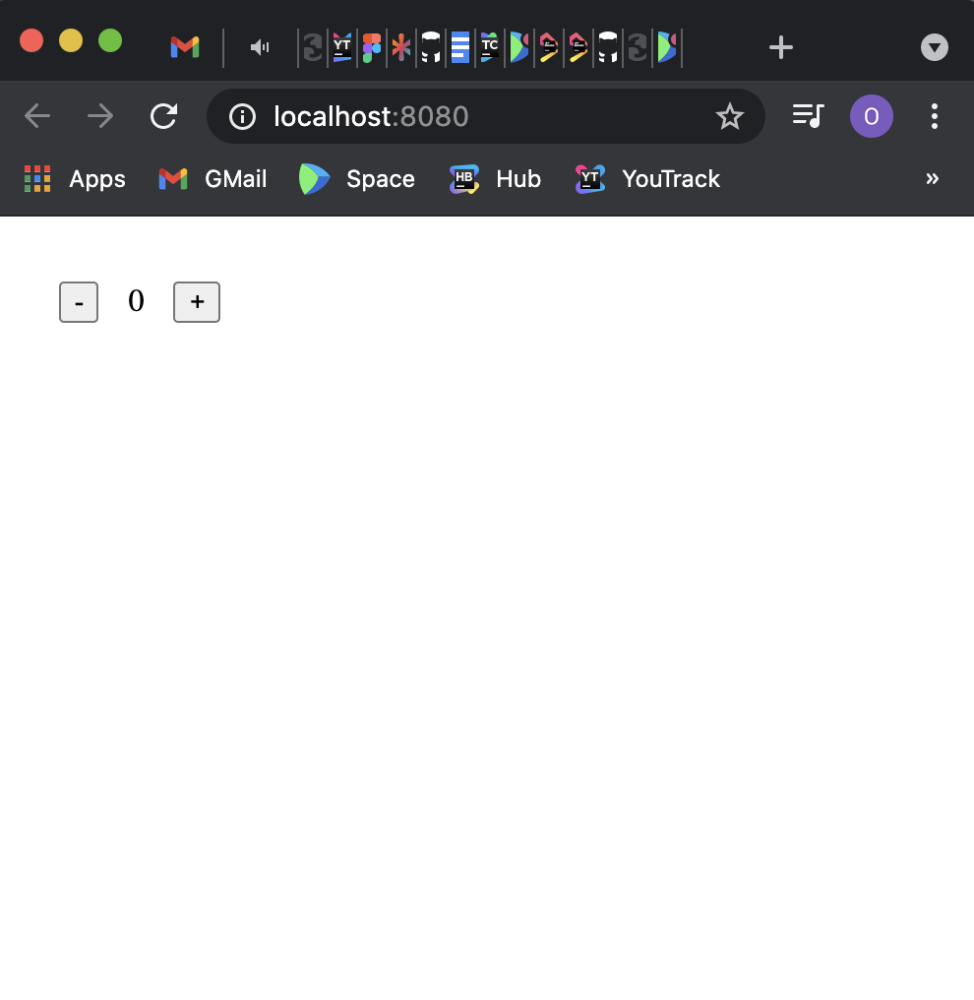

# Getting Started With Compose for Web

**The API is not finalized, and breaking changes can be expected**

## Introduction

In this tutorial, we will create a simple web UI application using the Compose UI framework.


## Prerequisites

You need to have the following software installed before you begin:
* JDK 11 or later
* IntelliJ IDEA Community Edition or Ultimate Edition 2020.2 or later (you can use other editors, but for this tutorial we assume you are using IntelliJ IDEA)


## Creating a new project

If you don't want to create the project manually, you can [download the example here](https://github.com/JetBrains/compose-jb/tree/master/examples/web-getting-started)

The project wizard doesn't support Compose for web projects yet, so we need to perform the following steps:

#### 1. Create a Kotlin Multiplatform project:
- Select `Gradle` on the left menu
- Tick `Kotlin DSL build script`
- Tick `Kotlin/Multiplatform`


#### 2. Update `settings.gradle.kts`:
``` kotlin
pluginManagement {
    repositories {
        gradlePluginPortal()
        maven("https://maven.pkg.jetbrains.space/public/p/compose/dev")
    }
}
```

#### 3. Update `build.gradle.kts`:
``` kotlin
// Add compose gradle plugin
plugins {
    kotlin("multiplatform") version "1.5.21"
    id("org.jetbrains.compose") version "0.5.0-build270"
}

// Add maven repositories
repositories {
    mavenCentral()
    maven("https://maven.pkg.jetbrains.space/public/p/compose/dev")
    google()
}

// Enable JS(IR) target and add dependencies
kotlin {
    js(IR) {
        browser()
        binaries.executable()
    }
    sourceSets {
        val jsMain by getting {
            dependencies {
                implementation(compose.web.core)
                implementation(compose.runtime)
            }
        }
    }
}
```

#### 5. Add the following directories to the project:
- src/jsMain/kotlin
- src/jsMain/resources

#### 6. Add the `index.html` file to the `resources`:
```html
<!DOCTYPE html>
<html lang="en">
<head>
    <meta charset="UTF-8">
    <title>Sample</title>
</head>
<body>
  <div id="root"></div>
  <script src="REPLACE_WITH_YOUR_MODULE_NAME.js"></script>
</body>
</html>
```

#### 7. Add the `Main.kt` file:
```kotlin
import androidx.compose.runtime.mutableStateOf
import androidx.compose.runtime.getValue
import androidx.compose.runtime.setValue
import androidx.compose.runtime.Composable
import org.jetbrains.compose.web.attributes.*
import org.jetbrains.compose.web.css.*
import org.jetbrains.compose.web.dom.*
import org.jetbrains.compose.web.renderComposable

fun main() {
    var count: Int by mutableStateOf(0)

    renderComposable(rootElementId = "root") {
        Div({ style { padding(25.px) } }) {
            Button(attrs = {
                onClick { count -= 1 }
            }) {
                Text("-")
            }

            Span({ style { padding(15.px) } }) {
                Text("$count")
            }

            Button(attrs = {
                onClick { count += 1 }
            }) {
                Text("+")
            }
        }
    }
}
```

## Running the project

Use the command line to run:

```shell
./gradlew jsBrowserRun
```

Or run it from the IDE:


The browser will open `localhost:8080`:


