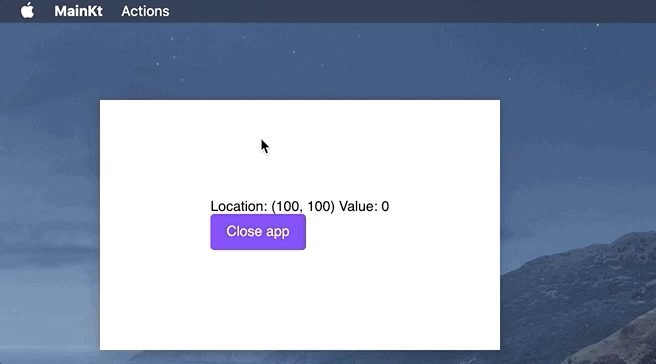
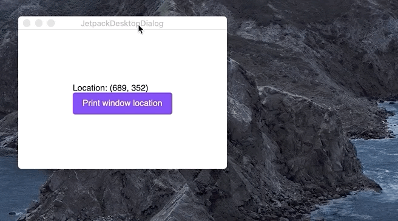
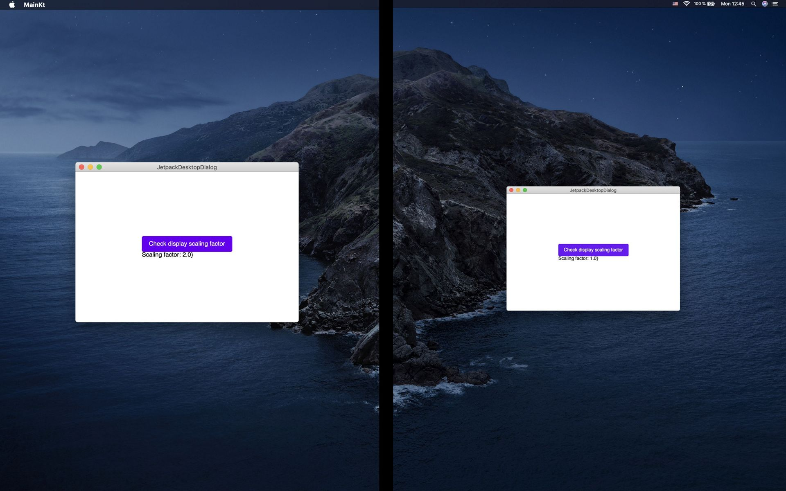

# OS windows management

## What is covered

In this tutorial we will show you how to work with windows using Compose for Desktop.

## Windows creation

The main class for creating windows is AppWindow. The easiest way to create and launch a new window is to use an instance of the AppWindow class and call its method `show()`. You can see an example below:

```kotlin
import androidx.compose.desktop.AppWindow
import javax.swing.SwingUtilities.invokeLater

fun main() = invokeLater {
    AppWindow().show {
        // content
    }
}
```

Note that AppWindow should be created in AWT Event Thread. Instead of calling invokeLater explicitly you can use Window DSL:
```kotlin
import androidx.compose.desktop.Window

fun main() {
    Window {
        // content
    }
}
```

There are two types of window – modal and regular. Below are the functions for creating each type of window:

1. Window – regular window type.
2. Dialog – modal window type. Such a window locks its parent window until the user completes working with it and closes the modal window.

You can see an example of both types of window below.

```kotlin
import androidx.compose.desktop.Window
import androidx.compose.foundation.Text
import androidx.compose.material.Button
import androidx.compose.runtime.mutableStateOf
import androidx.compose.runtime.remember
import androidx.compose.ui.window.Dialog

fun main() {
    Window {
        val dialogState = remember { mutableStateOf(false) }

        Button(onClick = { dialogState.value = true }) {
            Text(text = "Open dialog")
        }

        if (dialogState.value) {
            Dialog(
                onDismissEvent = { dialogState.value = false }
            ) {
                // dialog's content
            }
        }
    }
}
```

## Window attributes

Each window has 9 parameters, all of them could be omitted and have default values:

1. title – window title
2. size – initial window size
3. location – initial window position
4. centered – set the window to the center of the display
5. icon – window icon
6. menuBar – window context menu
7. undecorated – disable native border and title bar of the window
8. events – window events
9. onDismissEvent – event when removing the window content from a composition

An example of using window parameters in the creation step:

```kotlin
import androidx.compose.desktop.AppManager
import androidx.compose.desktop.Window
import androidx.compose.desktop.WindowEvents
import androidx.compose.foundation.Text
import androidx.compose.foundation.layout.Box
import androidx.compose.foundation.layout.Column
import androidx.compose.foundation.layout.fillMaxSize
import androidx.compose.material.Button
import androidx.compose.runtime.mutableStateOf
import androidx.compose.ui.Alignment
import androidx.compose.ui.input.key.Key
import androidx.compose.ui.Modifier
import androidx.compose.ui.unit.IntOffset
import androidx.compose.ui.unit.IntSize
import androidx.compose.ui.window.MenuItem
import androidx.compose.ui.window.KeyStroke
import androidx.compose.ui.window.Menu
import androidx.compose.ui.window.MenuBar
import java.awt.Color
import java.awt.Graphics2D
import java.awt.image.BufferedImage

fun main() {
    val count = mutableStateOf(0)
    val windowPos = mutableStateOf(IntOffset.Zero)

    Window(
        title = "MyApp",
        size = IntSize(400, 250),
        location = IntOffset(100, 100),
        centered = false, // true - by default
        icon = getMyAppIcon(),
        menuBar = MenuBar(
            Menu(
                name = "Actions",
                MenuItem(
                    name = "Increment value",
                    onClick = {
                        count.value++
                    },
                    shortcut = KeyStroke(Key.I)
                ),
                MenuItem(
                    name = "Exit",
                    onClick = { AppManager.exit() },
                    shortcut = KeyStroke(Key.X)
                )
            )
        ),
        undecorated = true, // false - by default
        events = WindowEvents(
            onRelocate = { location ->
                windowPos.value = location
            }
        )
    ) {
        // content
        Box(
            modifier = Modifier.fillMaxSize(),
            alignment = Alignment.Center
        ) {
            Column {
                Text(text = "Location: ${windowPos.value} Value: ${count.value}")
                Button(
                    onClick = {
                        AppManager.exit()
                    }
                ) {
                    Text(text = "Close app")
                }
            }
        }
    }
}

fun getMyAppIcon() : BufferedImage {
    val size = 256
    val image = BufferedImage(size, size, BufferedImage.TYPE_INT_ARGB)
    val graphics = image.createGraphics()
    graphics.setColor(Color.orange)
    graphics.fillOval(0, 0, size, size)
    graphics.dispose()
    return image
}
```



## Window properties

AppWindow parameters correspond to the following properties:

1. title – window title
2. width – window width
3. height – window height
4. x – position of the left top corner of the window along the X axis
5. y – position of the left top corner of the window along the Y axis
6. icon – window icon image
7. events – window events

To get the properties of a window, it is enough to have a link to the current or specific window. There are two ways to get the current focused window:

1. Using the global environment:

```kotlin
import androidx.compose.desktop.AppWindowAmbient
import androidx.compose.desktop.Window
import androidx.compose.foundation.Text
import androidx.compose.foundation.layout.Box
import androidx.compose.foundation.layout.Column
import androidx.compose.foundation.layout.fillMaxSize
import androidx.compose.material.Button
import androidx.compose.runtime.mutableStateOf
import androidx.compose.ui.Alignment
import androidx.compose.ui.Modifier
import androidx.compose.ui.unit.IntOffset

fun main() {
    val windowPos = mutableStateOf(IntOffset.Zero)
    
    Window {
        val current = AppWindowAmbient.current
        
        // content
        Box(
            modifier = Modifier.fillMaxSize(),
            alignment = Alignment.Center
        ) {
            Column {
                Text(text = "Location: ${windowPos.value}")
                Button(
                    onClick = {
                        if (current != null) {
                            windowPos.value = IntOffset(current.x, current.y)
                        }
                    }
                ) {
                    Text(text = "Print window location")
                }
            }
        }
    }
}
```

2. Using AppManager:

```kotlin
import androidx.compose.desktop.AppManager
import androidx.compose.desktop.Window
import androidx.compose.foundation.Text
import androidx.compose.foundation.layout.Box
import androidx.compose.foundation.layout.Column
import androidx.compose.foundation.layout.fillMaxSize
import androidx.compose.material.Button
import androidx.compose.runtime.mutableStateOf
import androidx.compose.ui.Alignment
import androidx.compose.ui.Modifier
import androidx.compose.ui.unit.IntOffset

fun main() {
    val windowPos = mutableStateOf(IntOffset.Zero)

    Window {
        // content
        Box(
            modifier = Modifier.fillMaxSize(),
            alignment = Alignment.Center
        ) {
            Column {
                Text(text = "Location: ${windowPos.value}")
                Button(
                    onClick = {
                        val current = AppManager.focusedWindow
                        if (current != null) {
                            windowPos.value = IntOffset(current.x, current.y)
                        }
                    }
                ) {
                    Text(text = "Print window location")
                }
            }
        }
    }
}
```



Using the following methods, you can change the properties of the AppWindow:

1. setTitle(title: String) – window title
2. setSize(width: Int, height: Int) – window size
3. setLocation(x: Int, y: Int) – window position
4. setWindowCentered() – set the window to the center of the display
5. setIcon(image: BufferedImage?) – window icon

```kotlin
import androidx.compose.desktop.AppWindowAmbient
import androidx.compose.desktop.Window
import androidx.compose.foundation.Text
import androidx.compose.material.Button

fun main() {
    Window {
        val current = AppWindowAmbient.current

        // content
        Button(
            onClick = {
                if (current != null) {
                    current.setWindowCentered()
                }
            }
        ) {
            Text(text = "Center the window")
        }
    }
}
```


## Window events

Events can be defined using the events parameter in the window creation step or redefine using the events property at runtime.
Actions can be assigned to the following window events:

1. onOpen – event during window opening
2. onClose – event during window closing
3. onMinimize – event during window minimizing
4. onMaximize – event during window maximizing
5. onRestore – event during restoring window size after window minimize/maximize
6. onFocusGet – event when window gets focus
7. onFocusLost – event when window loses focus
8. onResize – event on window resize (argument is window size as IntSize)
9. onRelocate – event of the window reposition on display (argument is window position as IntOffset)

```kotlin
import androidx.compose.desktop.Window
import androidx.compose.desktop.WindowEvents
import androidx.compose.foundation.Text
import androidx.compose.foundation.layout.Box
import androidx.compose.foundation.layout.fillMaxSize
import androidx.compose.material.Button
import androidx.compose.runtime.mutableStateOf
import androidx.compose.ui.Alignment
import androidx.compose.ui.Modifier
import androidx.compose.ui.unit.IntSize

fun main() {
    val windowSize = mutableStateOf(IntSize.Zero)
    val focused = mutableStateOf(false)
    
    Window(
        events = WindowEvents(
            onFocusGet = { focused.value = true },
            onFocusLost = { focused.value = false },
            onResize = { size ->
                windowSize.value = size
            }
        )
    ) {
        // content
        Box(
            modifier = Modifier.fillMaxSize(),
            alignment = Alignment.Center
        ) {
            Text(text = "Size: ${windowSize.value} Focused: ${focused.value}")
        }
    }
}
```


## AppManager

The AppManager singleton is used to customize the behavior of the entire application. Its main features:

1. Description of common application events
```kotlin
AppManager.setEvents(
    onAppStart = { println("onAppStart") }, // invoked before the first window is created
    onAppExit = { println("onAppExit") } // invoked after all windows are closed
)
```
2. Customization of common application context menu
```kotlin
AppManager.setMenu(
    getCommonAppMenuBar() // custom function that returns MenuBar
)
```
3. Access to the application windows list
```kotlin
val windows = AppManager.windows
```
4. Getting the current focused window
```kotlin
val current = AppManager.focusedWindow
```
5. Application exit
```kotlin
AppManager.exit() // closes all windows
```

## Access to Swing components

Compose for Desktop is tightly integrated with Swing at the top-level windows layer. For more detailed customization, you can access the JFrame class:

```kotlin
import androidx.compose.desktop.AppManager
import androidx.compose.desktop.Window
import androidx.compose.foundation.Text
import androidx.compose.foundation.layout.Box
import androidx.compose.foundation.layout.Column
import androidx.compose.foundation.layout.fillMaxSize
import androidx.compose.material.Button
import androidx.compose.runtime.mutableStateOf
import androidx.compose.ui.Alignment
import androidx.compose.ui.Modifier

fun main() {
    val scaleFactor = mutableStateOf(0.0)
    Window {
        // content
        Box(
            modifier = Modifier.fillMaxSize(),
            alignment = Alignment.Center
        ) {
            Column {
                Button(
                    onClick = {
                        val current = AppManager.focusedWindow
                        if (current != null) {
                            val jFrame = current.window
                            // do whatever you want with it
                            scaleFactor.value = jFrame.graphicsConfiguration.defaultTransform.scaleX
                        }
                    }
                ) {
                    Text(text = "Check display scaling factor")
                }
                Text(text = "Scaling factor: ${scaleFactor.value}}")
            }
        }
    }
}
```


