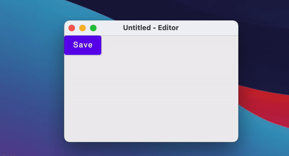
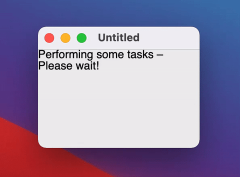
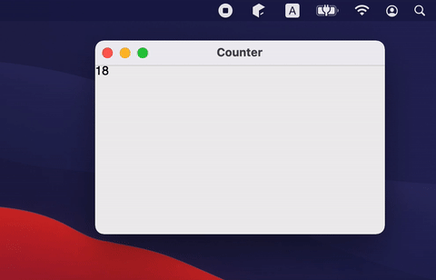

# Top level windows management

## What is covered

In this tutorial, we will show you how to work with windows using Compose for Desktop.

We represent the window state in a shape suitable for Compose-style state manipulations and automatically map it to the operating system window state.

Top-level windows can be conditionally created in other composable functions and their window manager state can also be manipulated using states produced by the `rememberWindowState()` function.

## Open and close windows

The main function for creating windows is `Window`. This function should be used in a Composable scope. The easiest way to create a Composable scope is to use the `application` function:

```kotlin
import androidx.compose.ui.window.Window
import androidx.compose.ui.window.application

fun main() = application {
    Window(onCloseRequest = ::exitApplication) {
        // Content
    }
}
```

`Window` is a Composable function, meaning you can change its properties in a declarative way:
```kotlin
import androidx.compose.material.Button
import androidx.compose.material.Text
import androidx.compose.runtime.getValue
import androidx.compose.runtime.mutableStateOf
import androidx.compose.runtime.remember
import androidx.compose.runtime.setValue
import androidx.compose.ui.window.Window
import androidx.compose.ui.window.application

fun main() = application {
    var fileName by remember { mutableStateOf("Untitled") }

    Window(onCloseRequest = ::exitApplication, title = "$fileName - Editor") {
        Button(onClick = { fileName = "note.txt" }) {
            Text("Save")
        }
    }
}
```


You can also close/open windows using a simple `if` statement.

When the `Window` leaves the composition (`isPerformingTask` becomes `false`) – the native window automatically closes.

```kotlin
import androidx.compose.material.Text
import androidx.compose.runtime.LaunchedEffect
import androidx.compose.runtime.getValue
import androidx.compose.runtime.mutableStateOf
import androidx.compose.runtime.remember
import androidx.compose.runtime.setValue
import androidx.compose.ui.window.Window
import androidx.compose.ui.window.application
import kotlinx.coroutines.delay

fun main() = application {
    var isPerformingTask by remember { mutableStateOf(true) }

    LaunchedEffect(Unit) {
        delay(2000) // Do some heavy lifting
        isPerformingTask = false
    }

    if (isPerformingTask) {
        Window(onCloseRequest = ::exitApplication) {
            Text("Performing some tasks. Please wait!")
        }
    } else {
        Window(onCloseRequest = ::exitApplication) {
            Text("Hello, World!")
        }
    }
}
```


If the window requires some custom logic on close (for example, to show a dialog), you can override the close action using `onCloseRequest`.

Instead of the imperative approach to closing the window (`window.close()`) we use a declarative approach - closing the window in response to a change of the state (`isOpen = false`)..
```kotlin
import androidx.compose.material.Button
import androidx.compose.material.Text
import androidx.compose.runtime.getValue
import androidx.compose.runtime.mutableStateOf
import androidx.compose.runtime.remember
import androidx.compose.runtime.setValue
import androidx.compose.ui.window.Dialog
import androidx.compose.ui.window.Window
import androidx.compose.ui.window.application

fun main() = application {
    var isOpen by remember { mutableStateOf(true) }
    var isAskingToClose by remember { mutableStateOf(false) }

    if (isOpen) {
        Window(
            onCloseRequest = { isAskingToClose = true }
        ) {
            if (isAskingToClose) {
                Dialog(
                    onCloseRequest = { isAskingToClose = false },
                    title = "Close the document without saving?",
                ) {
                    Button(
                        onClick = { isOpen = false }
                    ) {
                        Text("Yes")
                    }
                }
            }
        }
    }
}
```


If you don't need to close the window and just need to hide it (for example to the tray), you can change the `windowState.isVisible` state:
```kotlin
import androidx.compose.material.Text
import androidx.compose.runtime.LaunchedEffect
import androidx.compose.runtime.getValue
import androidx.compose.runtime.mutableStateOf
import androidx.compose.runtime.remember
import androidx.compose.runtime.setValue
import androidx.compose.ui.geometry.Size
import androidx.compose.ui.graphics.Color
import androidx.compose.ui.graphics.drawscope.DrawScope
import androidx.compose.ui.graphics.painter.Painter
import androidx.compose.ui.window.Tray
import androidx.compose.ui.window.Window
import androidx.compose.ui.window.application
import kotlinx.coroutines.delay

fun main() = application {
    var isVisible by remember { mutableStateOf(true) }

    Window(
        onCloseRequest = { isVisible = false },
        visible = isVisible,
        title = "Counter",
    ) {
        var counter by remember { mutableStateOf(0) }
        LaunchedEffect(Unit) {
            while (true) {
                counter++
                delay(1000)
            }
        }
        Text(counter.toString())
    }

    if (!isVisible) {
        Tray(
            TrayIcon,
            hint = "Counter",
            onAction = { isVisible = true },
            menu = {
                Item("Exit", onClick = ::exitApplication)
            },
        )
    }
}

object TrayIcon : Painter() {
    override val intrinsicSize = Size(256f, 256f)

    override fun DrawScope.onDraw() {
        drawOval(Color(0xFFFFA500))
    }
}
```


If an application has multiple windows, then it is better to put its state into a separate class and open/close window in response to `mutableStateListOf` changes (see [notepad example](https://github.com/JetBrains/compose-jb/tree/master/examples/notepad) for more complex use cases):
```kotlin
import androidx.compose.runtime.Composable
import androidx.compose.runtime.key
import androidx.compose.runtime.mutableStateListOf
import androidx.compose.runtime.remember
import androidx.compose.ui.window.ApplicationScope
import androidx.compose.ui.window.MenuBar
import androidx.compose.ui.window.Window
import androidx.compose.ui.window.application

fun main() = application {
    val applicationState = remember { MyApplicationState() }

    for (window in applicationState.windows) {
        key(window) {
            MyWindow(window)
        }
    }
}

@Composable
private fun ApplicationScope.MyWindow(
    state: MyWindowState
) = Window(onCloseRequest = state::close, title = state.title) {
    MenuBar {
        Menu("File") {
            Item("New window", onClick = state.openNewWindow)
            Item("Exit", onClick = state.exit)
        }
    }
}

private class MyApplicationState {
    val windows = mutableStateListOf<MyWindowState>()

    init {
        windows += MyWindowState("Initial window")
    }

    fun openNewWindow() {
        windows += MyWindowState("Window ${windows.size}")
    }

    fun exit() {
        windows.clear()
    }

    private fun MyWindowState(
        title: String
    ) = MyWindowState(
        title,
        openNewWindow = ::openNewWindow,
        exit = ::exit,
        windows::remove
    )
}

private class MyWindowState(
    val title: String,
    val openNewWindow: () -> Unit,
    val exit: () -> Unit,
    private val close: (MyWindowState) -> Unit
) {
    fun close() = close(this)
}
```


## Changing the state (maximized, minimized, fullscreen, size, position) of the window.

Some states of the native window are moved into a separate API class, `WindowState`. You can change its properties in callbacks or observe it in Composable's.
When some state is changed (window size or position), Composable function will be automatically recomposed.

```kotlin
import androidx.compose.foundation.clickable
import androidx.compose.foundation.layout.Column
import androidx.compose.foundation.layout.Row
import androidx.compose.material.Checkbox
import androidx.compose.material.Text
import androidx.compose.ui.Alignment
import androidx.compose.ui.Modifier
import androidx.compose.ui.unit.dp
import androidx.compose.ui.window.Window
import androidx.compose.ui.window.WindowPlacement
import androidx.compose.ui.window.WindowPosition
import androidx.compose.ui.window.application
import androidx.compose.ui.window.rememberWindowState

fun main() = application {
    val state = rememberWindowState(placement = WindowPlacement.Maximized)

    Window(onCloseRequest = ::exitApplication, state) {
        Column {
            Row(verticalAlignment = Alignment.CenterVertically) {
                Checkbox(
                    state.placement == WindowPlacement.Fullscreen,
                    {
                        state.placement = if (it) {
                            WindowPlacement.Fullscreen
                        } else {
                            WindowPlacement.Floating
                        }
                    }
                )
                Text("isFullscreen")
            }

            Row(verticalAlignment = Alignment.CenterVertically) {
                Checkbox(
                    state.placement == WindowPlacement.Maximized,
                    {
                        state.placement = if (it) {
                            WindowPlacement.Maximized
                        } else {
                            WindowPlacement.Floating
                        }
                    }
                )
                Text("isMaximized")
            }

            Row(verticalAlignment = Alignment.CenterVertically) {
                Checkbox(state.isMinimized, { state.isMinimized = !state.isMinimized })
                Text("isMinimized")
            }

            Text(
                "Position ${state.position}",
                Modifier.clickable {
                    val position = state.position
                    if (position is WindowPosition.Absolute) {
                        state.position = position.copy(x = state.position.x + 10.dp)
                    }
                }
            )

            Text(
                "Size ${state.size}",
                Modifier.clickable {
                    state.size = state.size.copy(width = state.size.width + 10.dp)
                }
            )
        }
    }
}
```


## Listening the state of the window
Reading the state in composition is useful when you need to update UI, but there are cases when you need to react to the state changes and send a value to another non-composable level of your application (write it to the database, for example):

```kotlin
import androidx.compose.runtime.LaunchedEffect
import androidx.compose.runtime.snapshotFlow
import androidx.compose.ui.window.Window
import androidx.compose.ui.window.WindowPosition
import androidx.compose.ui.window.WindowSize
import androidx.compose.ui.window.application
import androidx.compose.ui.window.rememberWindowState
import kotlinx.coroutines.flow.filterNot
import kotlinx.coroutines.flow.launchIn
import kotlinx.coroutines.flow.onEach

fun main() = application {
    val state = rememberWindowState()

    Window(onCloseRequest = ::exitApplication, state) {
        // Content

        LaunchedEffect(state) {
            snapshotFlow { state.size }
                .onEach(::onWindowResize)
                .launchIn(this)

            snapshotFlow { state.position }
                .filterNot { it.isSpecified }
                .onEach(::onWindowRelocate)
                .launchIn(this)
        }
    }
}

private fun onWindowResize(size: WindowSize) {
    println("onWindowResize $size")
}

private fun onWindowRelocate(position: WindowPosition) {
    println("onWindowRelocate $position")
}
```

## Dialogs
There are two types of window – modal and regular. Below are the functions for creating each:

1. Window – regular window type.
2. Dialog – modal window type. This type locks its parent window until the user is finished working with it and closes the modal window.

You can see an example of both types of window below.

```kotlin
import androidx.compose.material.Button
import androidx.compose.material.Text
import androidx.compose.runtime.getValue
import androidx.compose.runtime.mutableStateOf
import androidx.compose.runtime.remember
import androidx.compose.runtime.setValue
import androidx.compose.ui.Alignment
import androidx.compose.ui.window.Dialog
import androidx.compose.ui.window.DialogState
import androidx.compose.ui.window.Window
import androidx.compose.ui.window.WindowPosition
import androidx.compose.ui.window.application

fun main() = application {
    Window(
        onCloseRequest = ::exitApplication,
    ) {
        var isDialogOpen by remember { mutableStateOf(false) }

        Button(onClick = { isDialogOpen = true }) {
            Text(text = "Open dialog")
        }

        if (isDialogOpen) {
            Dialog(
                onCloseRequest = { isDialogOpen = false },
                state = DialogState(position = WindowPosition(Alignment.Center))
            ) {
                // Dialog's content
            }
        }
    }
}
```

## Swing interoperability
Because Compose for Desktop uses Swing under the hood, it is possible to create a window using Swing directly:
```kotlin
import androidx.compose.ui.awt.ComposeWindow
import java.awt.Dimension
import javax.swing.JFrame
import javax.swing.SwingUtilities

fun main() = SwingUtilities.invokeLater {
    ComposeWindow().apply {
        size = Dimension(300, 300)
        defaultCloseOperation = JFrame.DISPOSE_ON_CLOSE
        setContent {
            // Content
        }
        isVisible = true
    }
}
```

You can also access ComposeWindow in the Composable `Window` scope:
```kotlin
import androidx.compose.runtime.LaunchedEffect
import androidx.compose.ui.window.Window
import androidx.compose.ui.window.application
import java.awt.datatransfer.DataFlavor
import java.awt.dnd.DnDConstants
import java.awt.dnd.DropTarget
import java.awt.dnd.DropTargetAdapter
import java.awt.dnd.DropTargetDropEvent

fun main() = application {
    Window(onCloseRequest = ::exitApplication) {
        LaunchedEffect(Unit) {
            window.dropTarget = DropTarget().apply {
                addDropTargetListener(object : DropTargetAdapter() {
                    override fun drop(event: DropTargetDropEvent) {
                        event.acceptDrop(DnDConstants.ACTION_COPY);
                        val fileName = event.transferable.getTransferData(DataFlavor.javaFileListFlavor)
                        println(fileName)
                    }
                })
            }
        }
    }
}
```

If you need a dialog that is implemented in Swing, you can wrap it into a Composable function:
```kotlin
import androidx.compose.runtime.Composable
import androidx.compose.runtime.getValue
import androidx.compose.runtime.mutableStateOf
import androidx.compose.runtime.remember
import androidx.compose.runtime.setValue
import androidx.compose.ui.window.AwtWindow
import androidx.compose.ui.window.application
import java.awt.FileDialog
import java.awt.Frame

fun main() = application {
    var isOpen by remember { mutableStateOf(true) }

    if (isOpen) {
        FileDialog(
            onCloseRequest = {
                isOpen = false
                println("Result $it")
            }
        )
    }
}

@Composable
private fun FileDialog(
    parent: Frame? = null,
    onCloseRequest: (result: String?) -> Unit
) = AwtWindow(
    create = {
        object : FileDialog(parent, "Choose a file", LOAD) {
            override fun setVisible(value: Boolean) {
                super.setVisible(value)
                if (value) {
                    onCloseRequest(file)
                }
            }
        }
    },
    dispose = FileDialog::dispose
)
```